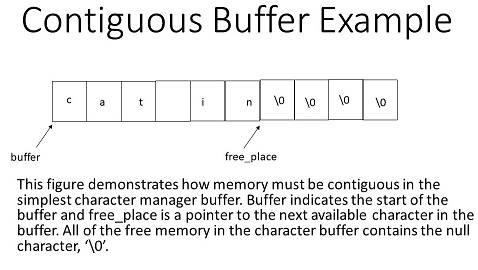
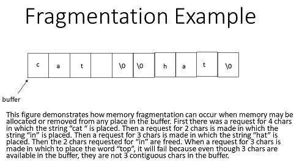

# Homework 1


- Assigned: August 17, 2020 PST
- Due: September 04, 2020 at 11:59 PST
- Directory name in your github repository for this homework (case sensitive): `hw1`
   - Skeleton code for this assignment is available in [`resources/hw1/`]({{ site.data.urls.github }}/resources/).
   - Once you have cloned your `hw-username` repo, copy the `hw1/` directory into it from `resources`.


## Objective

In this assignment we will review recursion and memory management by writing a simple character storage manager ourselves.
In doing so, we will improve our practice of pointers and develop greater appreciation for what the C++ language and the operating system provide for us in terms of memory management.
We will also practicing using dynamic memory allocation by using dynamically allocated arrays.

## General Advice

Going forward, we will refer to your homework repository as `hw-username`. 
Note that you would replace the `username` part with your actual USC username, and you can verify this by finding the repository on Github.

### Repository Reminders

1. Never clone one repository inside another.
   If you have a work folder `cs104` and clone your personal repo `hw-username` under it (i.e., `cs104/hw-username`), whenever you want to clone some other repository (such as `resources`), you'll need to do it back up in the `cs104` folder or another location, **not** in the `hw-username` folder.
2. Your repository may not be ready immediately but be sure to create your GitHub account and fill out the GitHub information form linked to at the end of [lab 1]({{ site.baseurl }}/labs/lab1/).

- [ ] Agree that you'll never clone a repository into another.

### Skeleton Code

On many occasions we will want to distribute skeleton code, tests, and other pertinent files.
To do this, we have made a separate repository, [`resources`]({{ site.data.urls.github }}/resources/), under the CSCI 104 Github organization.
You should clone this repository to your laptop and `git pull` regularly to check for updates;
even we sometimes make mistakes, and when we do, we will fix them as quickly as possible, but you'll only get the fixes when you pull.

```shell
git clone {{ site.data.urls.github_ssh }}/resources.git
```

Again, be sure you don't clone this repo into your `hw-username` repo, but at some higher-up point like in a `cs104` folder on your machine.
One way to copy the `hw1` files from resources could be to navigate to the directory containing both repositories and run:

```shell
cp -r resources/hw1/ hw-username/hw1/
```

- [ ] Clone `resources` into your CSCI 104 work directory.
- [ ] Clone your `hw-username` next to it if you haven't already.
- [ ] Copy `resources/hw1/` to `hw-username/hw1/`.

### Using Valgrind

Carefully review the lecture topics related to memory management and allocation, classes, operator overloading, and copy constructors/assignment operators.
On later assignments **you will lose points if you have memory leaks**, so be sure to run `valgrind` once you think your code is working.
Remember that using C++ smart pointers as we discussed in lecture can help you with memory management and preventing memory leaks.

For example, if you were to compile `program` that takes two arguments:

```
$ ./program input.txt output.txt
```

The corresponding Valgrind command would be:

```
$ valgrind --tool=memcheck --leak-check=yes ./program input.txt output.txt
```

For more information on Valgrind, take a look at the [Valgrind wiki page]({{ site.baseurl }}/wiki/valgrind).

### Command Line Arguments

In order to read parameters as command line arguments in C++, you need to use a slightly different syntax for your `main` function:
 
```c++
int main (int argc, char* argv[]) {
    // Your code here
}
```

When your program is called at the command line, `argc` will then contain the total number of arguments that the program was given, and `argv` will be an array of the arguments the program was passed.

- The argument at `argv[0]` is always the name of your program.
- Consequently, `argv[1]` is the first argument passed to the program.

The operating system will assign the values of `argc` and `argv`, and you can just access them inside your program.


## 1. Paren Balance (15%)

In this problem you will implement `are_paren_balanced`, which, given an expression, will return `true` if and only if it is properly parenthesized.
An expression is properly parenthesized if a left parentheses such as `(` and  `[` have a matching right parentheses.
Symbols such as `+`, `-`, `*`, `/`, and numbers may be ignored.

- Expression strings will only contain parentheses, `+`, `-`, `*`, `/`, spaces, or numbers.
- Your implementation must be recursive.
- Your solution may use helper functions. 

Consider the following examples of inputs that should return true and false.
Note that the expression don't have to be valid mathematically:

```
// are_paren_balanced returns true
(7 + 8)  
[7 * (6 + 8)]  
7+8  
(7+/8/1+*4) ** (5+-6) * (--1-5)

// are_paren_balanced returns false
[7+8
[7+8)
([7*5]+(6+8)(15))+5+6)
[(5+3])
```

### Design

Remember that **a helper function can be used to implement a recursive function** by passing extra parameters to the recursive calls that help solve the problem.
If you choose to use a helper function, here are some things to consider:

- What parameters may be helpful to pass?
- How might you keep track of where the recursion is evaluating in the expression string?
- How might you keep track of what parentheses must be matched?
- Should the parameters be **passed by C++ reference** so that the variable is shared across calls or will **passing by value** suffice (do not use pointers, they are not necessary)?

Don't be afraid to look at the code to get you thinking about these problems.
We've left some extra bits to get you started.

- [ ] Check out `paren_balance/main.cpp` in the `hw1` you copied from `resources`.

### Specifications

Your implementation should be completed in `main.cpp`, which we have provided for you in the `hw1/paren_balanced/` directory in the [`resources`]({{ site.data.urls.github }}/resources/) repository.
Please copy the `hw1/` directory into your `hw-username` repository and only make changes where indicated.
**You may not use STL containers classes nor include any additional libraries**.
Here are some tips on how to compile and run your program to test it from inside the `hw1/paren_balanced` directory in your homework repository:

```shell
# Use g++ to compile, use -Wall to get all warnings
g++ -Wall main.cpp -o paren

# Use quotes when passing arguments to your program that contain spaces or special characters
./paren "[7 * (6 + 8)]"
./paren "[7+8"
```

- [ ] Implement `main.cpp` in `hw1/paren_balanced`.


## 2. Rational Numbers (30%)

To practice implementing classes and applying operator overloading, implement a `Rational` number class.
Rational numbers are ones that can be represented as a fraction where there is an integer numerator, `n`, and an integer denominator, `d`: `n/d`.

Operations that apply to rational numbers include the basic arithmetic operators, comparison operators, and some assignment operators.
You will be asked to **implement a subset of these operators**.  

In addition to typical C++ operators, we will support integer exponentiation using the `^` operator.
In many programming languages this is the bitwise-XOR operation, but it will be repurposed for our `Rational` class.
As an example: `(2/7)^2 == 4/49`.
Note that the integer exponent can be negative and should work appropriately.
As an example, `(2/7)^-2 == 49/4`.

To determine what operations are required to be implemented:

1. Find `rational.h` in the `hw1/rational/` directory of your homework repository that you copied with the rest of `hw1/` from resources.
2. Implement all prototyped functions in the class declaration.  
2. **Add all appropriate functions to support the code written in `rational_test.cpp`**.
   You can check that you've done so by making sure that `rational_test.cpp` will compile, run, and produce the expected output given in `rational_test.exp`.  

You may wish to test your code for correctness in cases not present in `rational_test.cpp`, but we will not require any additional operators or methods besides those used in `rational_test.cpp`.
To reiterate, **no other operations must be supported beyond those exercised by `rational_test.cpp`**.

- [ ] Read through the comments and examples in `rational.h` and `rational.cpp`.
- [ ] Read `rational_test.cpp` to get some idea of the additional operators needed.

### Specifications

- The default constructor should produce a Rational number of `0/1`.
- A Rational number can be constructed from any combination of positive and negative numerator and denominator, but should follow traditional mathematical rules.
  Consider how you want to deal with the sign.
  When outputting a negative fraction, the negative sign, `-`, should appear before the fraction (e.g. `-1/2`).
- When extracting a Rational number via `operator>>`, you may expect the format ` n / d ` with any amount of whitespace (including none) separating the numerator, `/`, and denominator (e.g. `-1/ 2`, `1 / 2`, `1 /-2`).
- We will never input a rational with just the whole number (e.g. we will enter `2/1` and not just `2`).
- For a negative numerator or denominator, you do not have to handle whitespace between the negative sign and the integer value, you may assume the integer will immediately follow the negative sign.
- If, as you extract the components of a `Rational`, the stream fails or you don't find the appropriate format, you should set the referenced `Rational` to the **value of a default constructed Rational (i.e. `0/1`)**.
- Any time a resulting Rational number results in 0 (i.e. numerator = 0), you must store the denominator as `1`.
  We have provided a normalization helper function: `void Rational::normalize();` to perform that check and update and you may call it as needed.
- Remember that any rational number may be reduced to a canonical form such that the numerator and denominator do not share any factors except `1`.
  You must implement a private member function, `reduce`, in order to keep your rational number in a canonical form.
  If you add `1/4` and `1/4` and print the result, we expect to see `1/2` and not `2/4`. 

**You may use the `<numeric>` library function `std::gcd` to help you**.
Note that if at least one of the arguments to this function is negative the returned value is negative and your code should handle this case.
Additionally, you may use functions from `<cmath>`, `<cstdlib>`, and `<numeric>` as necessary.

- [ ] Implement prototyped functions in `hw1/rational/rational.h` in your `hw-username`.
- [ ] Implement functions required for `rational_test.cpp`.

### Testing

We recommend you use `diff` to ensure the output of `rational_test` matches the contents of `rational_test.exp`.
You can do so by using the following commands:

```shell
# Compile rational_test
g++ -Wall -std=c++17 rational.cpp rational_test.cpp -o rational_test

# Run the rational_test binary and write the result to an output file 
./rational_test > rational_test.out

# Compare the expected and output files
diff rational_test.out rational_test.exp
```

Running the final command will result in a line-by-line comparison of the results your program output and what we expect.
However, there are other cases that we will test for grading beyond those given in `rational_test.exp`.
In 104 it is your responsibility to test your code thoroughly, thinking through potential corner cases and stress cases.
Please spend some time thinking about what could break your code, writing more test cases and ensuring they work as expected.

- [ ] Check that `rational_test.cpp` compiles and runs correctly.
- [ ] Compare the output of your solution.
- [ ] Ponder edge cases and perhaps therein the meaning of life.


## 3. Character Manager (55%)

In this problem you will create your own memory manager that will be able to store and find characters for a user or client program.
As we move forward in the class we want to rely more on C++ and the operating system to manage memory for us.
However, this exercise will give a glimpse into what underlies some of the abstractions that are provided to manage memory.


### Contiguous Storage

The memory will be stored in a single array of `BUFFER_SIZE` characters.
`BUFFER_SIZE` is defined in `manager.h`, which is in the `character_manager` directory you copied with `resources/hw1`.
Taking a quick look at `manager.h`, you'll also see an `AbstractCharacterManager`.
You'll learn more about the `virtual` stuff later, but the gist of this class is that the character managers you implement in this homework will override the methods defined under `AbstractCharacterManager`.

We'll start with the `SimpleCharacterManager` in `simple.h`.
As specified by `AbstractCharacterManager`, which we're inheriting from, you will need to implement the following two functions:

1. `char* alloc_chars(int n)` will return a pointer to a memory address in the buffer that can hold `n` characters.
   If there is not enough space left in the buffer, return `nullptr`.
2. `void free_chars(char *)`, function given a pointer into the buffer, will free all at that address until the end of the buffer.
   If the pointer is `nullptr` or an address not in the buffer, this function should do nothing.
   **This is not the ideal way to free memory**; it is only to help us learn an easier way to manage memory to start.

Let's consider a program that utilizes the simple memory manager:

```c++
SimpleCharacterManager manager;

// Request space for two characters
char* c1 = manager.alloc_chars(2);

// Check that it was granted, write "hi"
if (c1 != nullptr) {
    c1[0] = 'h';
    c1[1] = 'i';
}

// Request space for three more characters
char* c2 = manager.alloc_chars(3);

// Free by writing 0 from c1 to the end of the buffer
manager.free_chars(c1); 
```

Skeleton code is given in the `simple.h` and `simple.cpp`.
You will finish the unimplemented methods.

- [ ] Read through `simple.h` and `simple.cpp` to get your bearings.

#### Specifications

- If a character has not been allocated to the user, then it should contain the null character, `\0`.
- When a simple memory manager is instantiated, all characters in the buffer will be set to the null character before anything has been allocated to a user.
- All characters in the buffer should be set to the null character after they have been freed by a call to `free_chars`.
  You may include `<algorithm>` and use `std::fill` to help you.
  To do so, `std:fill(start, end,'\0');` given a pointer to a character start and pointer to a character end will overwrite all the characters starting with the character addressed by start and ending at the character addressed by end with the null character.

In this part of the problem, all characters are stored contiguously in memory.
When memory is requested by your program, you will assign it the smallest address available (i.e. smallest available array index), unless there is not enough remaining space in the buffer.
If memory is freed, it will be freed from the address requested until the end of the buffer.
This is illustrated below:

<div class="showcase">
    
</div>

- [ ] Implement `SimpleCharacterManager::alloc_chars`.
- [ ] Implement `SimpleCharacterManager::free_chars`.

#### Testing

A small driver program that utilizes your memory manager is provided in `simple_test.cpp`.
The program should do the following if your memory manager is working correctly.
First it should store the phrase: `Hello world!\n` one character at a time, storing whitespace and punctuation also.
Then print the phrase.
Then release the memory for `world!\n` and finally obtain memory to store the phrase `moon! Bye.\n`.
This program should work only using your memory manager to do this and not using `malloc`, `new`, `free`, `delete`, or C++ strings.

You may modify this program as needed to help test your code.
In order to actually run it, use `g++` in your Docker shell or VM terminal:

```shell
# Use -Wall to get a wider array of warnings. Use -std=c++17 to ensure you have
# access to modern C++ utilities. Finally, use -g to produce debug symbols.
g++ -Wall -std=c++17 -g simple.cpp simple_test.cpp -o simple_test

# If compilation succeeds, you can run the resultant binary:
./simple_test
```

- To help debug your program, draw what the stack memory of the driver program looks like.
  Draw what it should look like if your manager is working properly and then compare to what may be happening with your manager.
- You can also use tools we've provided in your development environment.
  [GDB]({{ site.baseurl }}/wiki/gdb/) allows you to step through during execution, and [Valgrind]({{ site.baseurl }}/wiki/valgrind) checks for leaked memory.
  However, **it's totally okay if you don't understand how these tools work**; we'll have labs on them later in the semester.
- This storage manager is very problematic.
  Consider how it is possible to overwrite part of the buffer that the user still has a pointer to (and may try to access via that pointer).
  **This is not a problem with your implementation, it is inherent in the design provided**.
  Try to test this case in the driver program.

- [ ] Compile your program with the test harness.
- [ ] Work through the comments in the test harness.

### Improving Flexibility

Being unable to selectively remove a few characters in the middle of our program stack is not ideal.
To fix the identified problems, we will need to keep careful track of each of our pointers.
We will implement a `FlexibleCharacterManager`.
The `FlexibleCharacterManager` will also have access to the convenience methods in the `AbstractCharacterManager`.
This means the `FlexibleCharacterManager` also has a large buffer of characters to manage.
Once again, all unallocated characters in the buffer should be `'\0'`.

We will now allow the user to delete characters in the middle of our buffer while leaving the rest of the characters after intact.
Therefore, we will need to keep careful track of which characters are allocated; we cannot merely keep track of the last character in use.
In addition, we will need to keep careful track of how many characters are assigned by any given `alloc_chars` function call.
When you call `alloc_chars`, you will need to create a `CharacterBlock`, defined in the skeleton code, which will keep track of both the address and number of characters in what we allocate.
Let's look at our `CharacterBlock` struct more carefully:

```c++
typedef struct CharacterBlock {

    // The starting index of the block we're allocating in the buffer
    char* address;

    // The number of characters allocated to the memory block
    size_t size;

} CharacterBlock;
```

Your flexible manager should keep track of all of the memory allocated in array of `CharacterBlock`s.
That means when there is a call to `alloc_chars`, your flexible char manager should do the following:

1. As with the simple manager, find a location in the buffer of characters that has enough characters for the request.
   Return a pointer to that address in the buffer or `nullptr` if the request cannot be satisfied.
2. If there is space in the character buffer to grant the request, create a `CharacterBlock` that keeps track of the location and number of characters allocated.

The `FlexibleCharacterManager` should store all the `CharacterBlock`s in a dynamically allocated array called `blocks`.
That array should be managed by a `unique_ptr` to an array of `CharacterBlock`s with starting size 2.

- The constructor creates an array of `CharacterBlock`s of size `2`.
  That is the minimum size of this array.
- If the number of active requests for memory from the character buffer equals the size of the array of `CharacterBlock`s, `blocks_size`, then double the size of `blocks`.
- Unless the `blocks` array is size `2`, if the number of `CharacterBlock`s in use by active memory requests is less than half the `blocks_size`, halve the size of the `blocks` array.

Remember there are two different arrays:

1. As with the simple manager there is the `buffer` array of `BUFFER_SIZE` characters that is statically allocated as a data member of the manager class.  
2. For the flexible memory manager, there is also a dynamically allocated array,`blocks`, storing `CharacterBlock` structs that keep track of memory allocated in the `buffer`.

Skeleton code for this part is provided in `flexible.h` and `flexible.cpp`.
We have provided driver code for testing your memory manager in `flexible_test.cpp`.
You will need to implement the same functions as in the first part, but now the memory can be assigned from any place in your buffer as long as there is space.
As a consequence it will be possible to delete individual pointers from memory.

- [ ] Read through `flexible.h` and `flexible.cpp`.
      The comments will help you understand the provided code.

#### Specifications

As before, `char* alloc_chars(size_t n)` will return a pointer to memory location in the character buffer that can hold `n` characters.
For determining from where to allocate memory, implement a ***first fit strategy***. 
There are two critical parts to implementing this with the `blocks` array:

1. Check if it's possible to allocate the memory.
   At every position in the `buffer`, check and see if there's enough space to allocate the request amount of space.
   Be sure to check if you're overlapping any existing `CharacterBlock`s in addition to whether you have enough space before the end of the buffer.
2. Create a new `CharacterBlock` and insert it into the `blocks` array so the physical locations of the `CharacterBlock`s are in sorted order by address from lowest to highest.
   **The address in the buffer returned should be the address closest to the starting address of the buffer that can fit the requested characters**.
   If this is not possible, return `nullptr`.

Similarly, `void free_chars(char *)` will still free all memory at the given address that had been allocated in an `alloc_chars` call.
**It will not free all memory left in the buffer, only the memory allocated at the given address from a single `alloc_char` call**.
For example, if a call `alloc_chars(10)` was made and returned `address1`, then a call to `free_chars(address1)` would free `10` characters from buffer starting at `address1`, overwriting the contents with `'\0'`.
If the pointer given as an argument to `free_chars` is not a valid address in the buffer range or has not been requested from `alloc_chars`, then nothing will be done.
In order to know what memory addresses are valid, you must manage the memory blocks in use.

- [ ] Implement a way to manage `CharacterBlock` objects.
- [ ] Implement `FlexibleCharacterManager::alloc_chars`.
- [ ] Implement `FlexibleCharacterManager::free_chars`.
- [ ] Compile and test your program with `flexible_test.cpp` similarly to `simple_test.cpp`.
- [ ] Work through the comments in `flexible_test.cpp`.

### An Aside

Your character storage manager will end up having very similar behavior to `new char[int]` and `delete` with the exception of running out of memory faster.
There is one major problem with this implementation.
We may have enough space in the buffer, but it is not all contiguous, so when a request for more memory comes, the implementation will not find enough space.
This is called fragmentation and it is illustrated below:

<div class="showcase">
    
</div>

Given the following requests for memory and free memory and words placed in the space, diagram what the fragmentation looks like in a buffer of 20 characters using our "first fit" algorithm.
This is a good exercise to visualize the first fit algorithm. 
Can you create test cases for your own code to create fragmentation?
Once again this is not a problem in your implementation.
It is an inherent problem with memory management in general. 

```
Request 3 chars in which to place the string "in "
Request 7 chars in which to place the string "French "
Request 7 chars in which to place the string "chapeau"
Remove the 3 chars allocated for "in "
Request 3 chars in which to place the string "top"
Remove the 7 chars allocated for "French "
Request 8 chars in which to place the string "sombrero"
Request 3 chars in which to place the string "hat"
```


## Submitting

Once you're finished you can submit your code on the [Curricula]({{ site.baseurl }}/submit/assignment/hw1) submission page.
Be sure to carefully read and follow the instructions there.

- [ ] Submit your code.
