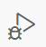
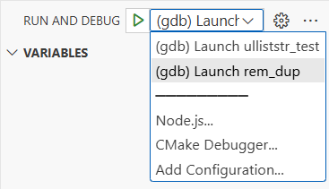

## {{page.title}}


+ Due: See [homework page]({{site.url}}/homework/index.html)
+ Written portion: Submitted on Gradescope
+ Coding portion: Use Github Classroom link given at the start of the Coding portion of this page. 

### Updates

* 2026-01-14: Written portion is officially released. Coding portion to be release tomorrow.

## Written Portion




### Problem {{ part.number }} - {{ part.title }} ({{part.points}}%)






## Coding Portion

### Github Classroom URL

**Signup link to create your HW1 repo:** [signup link]({{page.github_starter_url}})


### A Few Notes on Repositories

1. Never clone one repo into another.  If you have a folder named `cs104-repos` from your Lab 0 stup and you clone your HW1 repo provided by Github Classroom  under it (i.e. `cs104-repos/hw1-ttrojan`) then whenever you want to clone some other repo, you need to do it back up in the `cs104-repos` folder or other location; NOT in the `hw1-ttrojan` folder.
1. Each coding homework will be started via Github Classroom via a customized startup link (usually listed at the top of the homework).  To `clone` it and then push files to it, you'll need to have setup your SSH keys as described in the Lab 0 writeup on the [Labs Page]({{site.url}}/labs/index.html). If you've followed those steps, used the Github Classroom sign up link (following any directions it indicates) and still cannot access your repository, you can then make a private post on the [class Q&A]({{site.data.urls.piazza}}) or visit TA office hours. In any Q&A post, be sure to include your USC username and github username for reference.


### Clone your HW Repo

- In your coding environment setup in `lab0`, navigate to your `cs104-repos` area (e.g. `cd cs104-repos`).
- Clone your repo:
  
  ```bash
  git clone git@github.com:{{ site.data.urls.github_org }}/<your_{{page.hwpath}}_repo>

- In the VS Code editor, choose `File..Open Folder` and then find and open that folder (i.e. `cs104-repos/<your_hw1_repo>`)


---



### Problem {{ part.number }} - {{ part.title }} ({{part.points}}%)






### Testing

We strongly recommend you test your code yourself, considering what inputs would be good to exercise the features of your code and its handling of various cases.  Consider also what you **EXPECT** your code to do for each of the input scenarios you come up with. Then run your code to see if your **ACTUAL** code results in the what you **EXPECT**.  Debug and fix any issues as much as possible before moving on to the automated tests. Its faster to debug a test scenario you've come up with (since you understand it) rather than understand OUR scenarios if something doesn't work. Use our automated tests only after you've debugged your code well.

#### Debugging with your Own Tests

For the test cases (`main()` functions in `ulliststr_test.cpp` and `rem_dup.cpp`) we have provided VS Code debugger configs in `.vscode/launch.json` under your repo folder.

Click the debug view icon in your VSCode setup:



Then at the top of the view, use the drop-down box to choose which configuration (program) you want to debug.



Then click the **green-arrow** next to the drop down to start debugging.  **Be sure to set breakpoints first**.

For programs that require command line arguments, you can alter which arguments to use by editing the `.vscode/launch.json` file. For the `remdup` test, change the input file you want to provide when you debug by modifying `input.txt` to a different filename or the output file name.

```json
        {
            "name": "(gdb) Launch rem_dup",
            "type": "cppdbg",
            "request": "launch",
            "program": "${workspaceFolder}/rem_dup",
            "args": [
                "input.txt",
                "output.txt"
            ],
```


#### Automated Test Code

We will release the automated tests separately from the starter code and your Git repo (**usually a few days after the assignment is released**).  Since you will have already created your homework assignment repo, we generally release these tests by simply placing them in the [`resources`]({{site.data.urls.github}}/resources ) repo in subfolders like `hw1_tests`, `hw2_tests`, etc. just like your labs.   If you successfully completed `lab0`, you should already have cloned the  `resources` repo.  But if not, you should go to your `cs104-repos` clone this repository to your laptop (**but, again, only if you have not already done this as part of lab0**) 

```
$ git clone git@github.com:{{ site.data.urls.github_org }}/resources
```

Again, be sure you don't clone this repo into some other repo but at some higher up point like in your `cs104` or `cs104-repos` folder on your laptop.  

When we announce the release of the tests, you can then manually copy (in your OS's GUI or at the command line) the test files from `resources/{{page.hwpath}}_tests` to your homework repo from Github classroom and add/commit/push the new files.

For example if you are in the folder containing both the `resources` and `hw1-ttrojan` folders/repos, you could enter the following command at the terminal:

```bash
$ cp -rf resources/{{page.hwpath}}_tests hw1-ttrojan/
```

Again be sure to replace `hw1-ttrojan` with **your repo's name**.

**Once you have done this, follow these [instructions]({{site.baseurl/homework/cmake_automated_tests.html) for running the automated tests**.


## Submission Files

Ensure you add/commit/push all your source code files and `Makefile`. Do **NOT** commit/push any test suite folder/files that we provide from the `resources` repo.  When we grade your code, we will move a fresh copy of the `{{page.hwpath}}_tests` folder into your repo, `cd` to that test folder, and run

```
cmake .
make grade
```

Your code must pass the tests to receive credit. You can essentially do this step yourself to ensure you pushed everything you needed and the correct verisons by following the instructions below.




