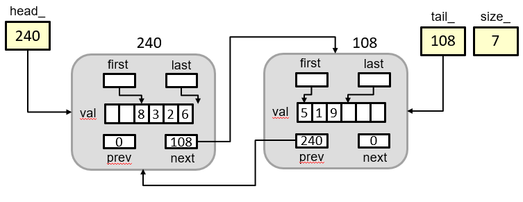

## HW1: Programming Assignment

+ Due: Friday, September 13th, 11:59pm PST
+ To access the written portion of this assignment, click [here](..)
+ The GitHub Classroom link for this assignment is: [here](..)
    - Since this is your first time, you would need to pick an identifier (please choose your email!). If you cannot find it, you can press skip for now and make a private post on Piazza with your GitHub username and USC email.
    - You will turn in all Programming Assignments by pushing code to repositories like this.
+ **We will NOT provide a test suite before the due date for this homework**.  You will need to test the coding questions yourself with your own test programs. This should cause you to a.) appreciate the importance of testing, b.) consider the kinds of test cases you should write (i.e. if none of your test cases exercise a particular set of code in your implementation then you probably need to write more tests), c.) What common tasks related to testing would be useful to reuse and why there are testing frameworks like the one we will use in this class, `gtest`. (Don't worry, we'll cover `gtest` in lab soon!) 
   

## General Advice

Going forward, we will refer to your homework repository as `pa1-username`. 
Note that you would replace the `username` part with your actual GitHub username, and you can verify this by finding the repository on Github.

### Repository Reminders

1. Never clone one repository inside another.
   If you have a work folder `cs104` and clone your personal repo `pa1-username` under it (i.e., `cs104/pa1-username`), whenever you want to clone some other repository (such as `resources`), you'll need to do it back up in the `cs104` folder or another location, **not** in the `pa1-username` folder.
2. Your repository may not be ready immediately but be sure to create your GitHub account and fill out the GitHub information form linked to at the end of [lab 1]({{ site.baseurl }}/labs/lab1/).

### GitHub Actions

We are using a Continuous Integration tool named GitHub Actions, which will automatically compile and run your code (along with a provided test suite if available) every time you perform a `git push` to your programming assignment repositories. This usually takes up to a few minutes but can vary based on program runtime.
+ You can access Actions reports by going to your `pa1-username` repository, clicking on the `Actions` tab, then click the text of the commit you want to see the report of.
    - Once the Actions is finished, `Summary` will display useful information.
    - You can also click on `build` on the left to see output in real-time and a detailed log of everything that happened. Specially within `build`, you want to view `Build and run tests`
+ On this particular assignment, Actions will show a summary with the normal and Valgrind output of your two test files (if written with normal C++ or GTEST). It will also show any compile errors and warnings.
+ Functionality for this is from the `.github` folder. You won't need to interact with this folder unless you are curious or told to do so by staff.

### Skeleton Code

On many occasions we will want to distribute skeleton code, tests, and other pertinent files.
To do this, we have included files in `pa1-username`.
You should clone this repository to your laptop and regularly check Piazza for updates;
even we sometimes make mistakes, and when we do, we will fix them as quickly as possible, but you'll only get the fixes when you follow our instructions.

```shell
git clone {{ site.data.urls.github_ssh }}/pa1-username.git
```

Again, be sure you don't clone this repo into your `resources` repo, but at some higher-up point like in a `cs104` folder on your machine.

- [ ] Clone `resources` into your CSCI 104 work directory.
- [ ] Clone your `pa1-username` next to it if you haven't already.

### Using Valgrind

If you were to compile `program` that takes two arguments:

```
$ ./program input.txt output.txt
```

The corresponding Valgrind command would be:

```
$ valgrind --tool=memcheck --leak-check=yes ./program input.txt output.txt
```

Scroll through the output and look for invalid reads, writes, and the heap usage summary at the end. However, please note, that just as a doctor can only diagnose you based on the symptoms or the info you provide, valgrind can only check for errors based on what the test code exercises. If the test code never triggers code to test a function and there are memory leaks or invalid access in that function, valgrind will say no errors occurred. You are only as good as what your tests exercise, so it helps to write tests that will trigger each line of code in your class (this is often referred to as *code coverage*).

### Command Line Arguments

In order to read parameters as command line arguments in C++, you need to use a slightly different syntax for your `main` function:

```c++
int main (int argc, char* argv[]) {
    // Your code here
}
```

When your program is called at the command line, `argc` will then contain the total number of arguments that the program was given, and `argv` will be an array of the arguments the program was passed.

- The argument at `argv[0]` is always the name of your program.
- Consequently, `argv[1]` is the first argument passed to the program.

The operating system will assign the values of `argc` and `argv`, and you can just access them inside your program.

**NOTE:** We recommend you don't use additional command line arguments this assignment on `split_test.cpp` and `ulliststr_test.cpp` since it won't work with the current GitHub Actions script.

### Problem 1 (Linked Lists, Recursion, 15%)

Write a **recursive** function in `split.cpp` to split the elements of a sorted (in increasing order), singly-linked lists of integers into two sorted, singly-linked lists, where the first list contains all items with an odd value, and the second list contains all items with an even value.  The original list should **not** be preserved (see below).  Your function must be recursive - you will get **NO** credit if you use `for`, `while`,  `do while`, or `goto`. You may always use helper functions, but the same restrictions apply to these functions as to the main function.

You should use the following `Node` type:

```c++
struct Node {
    int value;
    Node *next;
};
```

Here is the function you should implement:

```c++
void split (Node*& in, Node*& odds, Node*& evens);
```

These are prototyped in `split.h` for you which you can `#include` to your `split.cpp` and test file.  **You MAY NOT change the definitions provided in this file.**

Empty lists are represented by `NULL` . You may assume that `odds` and `evens` are both `NULL` when `split` is called from the main function.

When your split function terminates, `in` should be set to `NULL` (the original list is not preserved), `odds` should point to the head of a linked list containing all items where `value` is an odd integer, and `evens` should point to the head of a linked list containing all items where `value` is an even integer. Obviously, your solution must not leak memory. **Use `valgrind` to verify correct memory handling and cleanup.**

Hint: by far the easiest way to make this work is to not `delete` or `new` nodes, but just to change the pointers.

While we will only test your `split` function, you will probably want to write some `main` code to actually test it.  To do this, create a file `split_test.cpp` where you will `#include "split.h"` to bring in the prototype and `Node` definition.  Then you can write a `main` that instantiates and fills some linked list cases (you'll need to write these) and then calls `split` to test its behavior.

If you get an error `NULL is not defined in this scope` when compiling `split.cpp` or your test file, try adding `#include <cstddef>` to your `.cpp` file where you are using `NULL`.

 Your submission should be in a file called `split.cpp`, and it should only contain your implementation of the function and **NO `main()`**. 

### Problem 2 (Unrolled Linked List, 35%)
We have provided you an incomplete implementation of an unrolled doubly-linked list in the `pa1-username` repo.

#### Understanding an Unrolled Linked List

An unrolled linked list, is a normal linked list (doubly-linked in this case) but each node/item does not store a single data value but an array of values.  The head and tail nodes of the linked list may have arrays that are not fully occupied so we keep `first` and `last` index to indicate where the first actual data item exists in the array (this index is *inclusive*) and the last data item exists (this index is *exclusive* and points to one **beyond** the last value).  These arrays provide better underlying memory performance in most computers (due to caching effects that you'll learn about in CS 356 or EE 457) and can be more space efficient.

<div class="showcase">
    
</div>

In the image above we see each Item struct has a `next` and `prev` pointer as would be typical in a doubly-linked list.  Then, rather than a single value, it will contain an array of a fixed size where multiple items can be placed.  To track which items are used a pair of indices is used of the form: `[first, last)` where `first` is inclusive and is the index of the first used item and `last` is the index 1 beyond the last used index.  This approach allows more natural iteration and allows computing the number of items in the range through simple subtraction (i.e. `last-first`).  As an example, `first=last=0` indicates no items are used and `first=0 and last=10` indicates the 10 elements are occupied (from indices `0..9`).

To track the head `Item`, tail `Item`, and size of the linked list (i.e. number of strings stored in the entire list), the `head_`, `tail_` and `size_` members of the ULListStr class are used, respectively.

The unrolled list we implement will store `string`s.  For the sake of this homework, we will only ask you to implement the ability to add or remove a value from the front or back of the list (and not in the middle of the list). Each of these operations should run in time O(1).  Pushing to the front or back should **NOT require moving any values**.  When pushing to the front, only allocate a new `Item` if the current head `Item` has no room before the `first` Item.  When removing an item, **only deallocate** an `Item` when the number of used values in its array reaches 0.  This means there should not be "empty" nodes in the list...when no more array entries of an `Item` are used, deallocate the `Item`.

1. You need to examine the code provided in `ulliststr.h` and `ulliststr.cpp` and add the implementations for `push_back`, `push_front`, `pop_back`, `pop_front`, `back`, `front` and `getValAtLoc` in `ulliststr.cpp`. 
    - Below is an example sequence of options:
      
      ```c++
      ULListStr dat;
      dat.push_back(7);
      dat.push_front(8);
      dat.push_back(9);
      cout << dat.get(0) << " " << dat.get(1) << " " << dat.get(2) << endl;
      // prints: 8 7 9
      cout << dat.size() << end;  // prints 3 since there are 3 strings stored
      ```
    - Here is a [video explanation](http://ee.usc.edu/~redekopp/Streaming/cs104/cs104-unrolled-ll/cs104-unrolled-ll.html) for some of the possible implementation approaches.
    - **Do NOT change** any of the public member function signatures or private data members, though you may add additional member functions or data members if you deem them useful.  
    - `getValAtLoc` is a private helper function which will return a pointer to the `i`-th value in the entire list (not just in a single Item's array) and is used in several other member functions.  If a non-existent location is provided to `getValAtLoc`, it should return `NULL`. 
    - As you implement these member functions **be sure to meet the RUNTIME requirements**.  Failure to do so may lead to **minimal** (less-than half) credit being awarded.
    - Any comments provided in the skeleton file act as requirements that you must meet.

2. After completing the functions above, you should write a separate program name, `ulliststr_test.cpp`, to test your implementation.  Please note that these tests **will** be graded (and hence you should not copy or share them with your classmates).  You should allocate one of your `ULListStr` items and make calls to `push_back`, `push_front`, `pop_back`, `pop_front`, `back` and `front` that will exercise the various cases you've coded in the functions.  For example, if you have a case in `push_back` for when the list is empty and a separate case for when it has one or more items, then you should make a call to `push_back` when the list is empty and when it has one or more items.  It is important that when you write code, you test it thoroughly, ensuring each line of code in the `ULListStr` class is triggered at some point.  You need to think about how you can test whether it worked or failed as well. In this case, calls to `get`, `size`, and others can help give you visibility as to whether your code worked or failed. 

3. Ensure your solution does not access memory incorrectly or leak memory. **Use `valgrind` to verify correct memory handling and cleanup.**

4. Ensure you do not change the filenames of the skeleton we give you and that your test file is named `ulliststr_test.cpp` and submit it with your other files.  Do **NOT** place a `main` function in the class file: `ulliststr.cpp` (it should be in your test file: `ulliststr_test.cpp`). Your test code will be graded based on the quality and thoroughness of your tests.  Obviously, your own `ULListStr` class should pass your own tests.

5. To compile a program of multiple files you must list **ALL** the `.cpp` files in the `g++` command line AND **NEVER** compile a `.h` file on the `g++` command line.  Thus, your compilation commmand would look like: 

```bash
g++ -g -Wall ulliststr.cpp ulliststr_test.cpp -o ullistr_test
```

### Finishing Up
### Completion Checklist

Use `git status` to make sure that there are no modified source code files that need to be submitted. If there are, use `git add` and `git commit` to commit those changes. Then use `git push` to push those changes to Github.
+ If you have files you don't want to push (like garbage .o files), you can use a `.gitignore` file and push that instead

WAIT! You aren’t done yet. Complete the sections below to ensure you’ve committed all your code.

### GitHub Actions Summary

+ Make sure to check the Actions summary of your latest commit and that it matches your expectations based on what you saw on your local machine.
+ Make sure there are no compilation errors and warnings, along with no Valgrind errors.
+ By default, we will grade your latest commit so if you are satisfied with your Actions report, you are done! If you want an earlier commit to be graded, you must fill out the `Submit the SHA` form found on the [home page](https://bytes.usc.edu/cs104/) before the late deadline.

### Commit then Re-clone your Repository (Optional)

If you want extra peace of mind on your submission or GitHub Actions isn't working for some reason, try doing the following:

1. In your terminal, `cd` to the folder that has your `resources` and `pa1-username` (i.e. `cs104`)
2. Create a `verify-hw1` directory: `$ mkdir verify-hw1`
3. Go into that directory: `$ cd verify-hw1`
4. Clone your hw_username repo: `$ git clone git@github.com:usc-csci104-fall2024/pa1-username.git`
5. Go into your hw1 folder `$ cd pa1-username`
6. Switch over to a docker shell, navigate to the same `verify-hw1/pa1-username` folder.
7. Recompile and rerun your programs and tests to ensure that what you submitted works.
