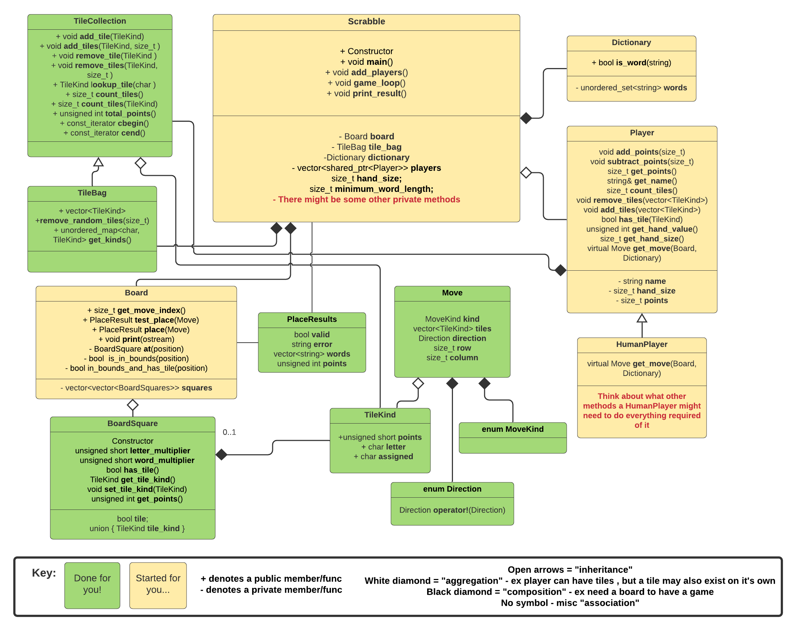

# Scrabble Part 1


- Assigned: September 18, 2020 PST
- Due: October 04, 2020 at 23:59 PST
- Directory name in your github repository for this homework (case sensitive): `hw3`
   - Skeleton code for this assignment is available in [`resources/hw3/`]({{ site.data.urls.github }}/resources/).
   - Once you have cloned your `hw-username` repo, copy the `hw3/` directory into it from `resources`.


## 1. Scrabble (100%)

Each semester we have a project that spans two homeworks.
The first part will be in homework three, and it will be expanded upon in homework five.
**Solutions for the project are not provided**, so make sure you: 

- Complete homework 3.
- Keep your code neat and well structured.

This semester's project will be scrabble!

Scrabble (and its clones like "Words with Friends") is a game for typically 2-4 players, in which the players take turns placing tiles on a board, forming correct words, and gaining points for their words.
The rules can be found at the [Scrabble Pages](http://www.scrabblepages.com/scrabble/rules/), but a pretty much complete version is also given below.
In a few cases, we deviate from the official Scrabble rules to make your programming task slightly easier.

Here is how the two parts build on each other:

- In homework 3, you will write a Scrabble game to be played between 1-8 human players.
  It will be played through the console with `std::cin` and `std::cout` for interaction.
- In homework 5, you will add computer players with specific search strategies, thereby allowing a single human player (or more) to play against the computer.

You will not have to worry about how homework 5 will be incorporated.
In fact, we are giving much of the design for homework 3 to you so that homework 5 will not require significant changes to your previous code. 

### Rules of Scrabble

As mentioned above, the Scrabble rules are mostly described on the [Scrabble Pages](http://www.scrabblepages.com/scrabble/rules/).
If you don't know scrabble that's okay, here's a summary, including few minor changes for our particular assignment.

#### Letters, Hands, Board

- There is an alphabet (in English: a-z, but we want to keep it generic so your game easily ports to other languages).
  For each letter, there is a given number of tiles of that letter, and a given score for that letter.
- There is also a given number of blank tiles.
  Blank tiles can be used as any one letter, but once played, the letter cannot change.
- The letters are kept in a "bag" (in real life): players will draw tiles from the bag, which means that they get a uniformly random set from the remaining tiles.
- Each player maintains a hand of `hand_size` tiles which they use to form words.
  In English, typically we have `hand_size = 7`, but we allow flexibility; for instance, German Scrabble usually has `hand_size = 8`.
- The board is a rectangle of squares.
  One of these squares is the start square, usually the middle one.
  A subset of squares may be bonus squares, meaning that they multiply the value of a letter or of a word (see the scoring section below).
  The standard Scrabble board is a 15x15 square, but again, we will want to keep it generic here.
- All of these generic quantities (language, dictionary, how many of what kinds of tiles, points per tile, board size and layout, etc) will be configured via files of a standard format. 

#### Moves

There are three kinds of moves.
When you **place a word**, you use anywhere from 1 to `hand_size` of your tiles and place them either horizontally or vertically in a line on the board.
You then draw tiles from the bag equal to the number of tiles you played.

- Your tiles, together with tiles that may already be on the board, must form a single contiguous horizontal or vertical line - no gaps allowed.
- You cannot place a tile on top of another previously placed tile.
- Except for the first move of the game, at least one of the placed tiles must be adjacent (horizontally or vertically) to a previously placed tile.
- For the first move of the game, one of your tiles must be on the start square.
- Each maximal sequence (meaning that on both ends, it is bordered by an empty square or the end of the board) of two or more letters that is formed by your placement of tiles (notice that there could be multiple) must be a legal word according to the dictionary (see below).
  Sequences are read left to right, and top to bottom.
  Single letters are not considered words.
- The moment you place a word including one or more blank tiles, those blank tiles are assigned letters (by you), which they keep for the rest of the game.

Instead of placing a word, you may **exchange anywhere from 1 to `hand_size`** of your tiles with the bag.
When you do this, you first return the tiles, and then you draw the same number of tiles from the bag to replace them (possibly getting some of the same tiles back).
This ends your move.

Lastly, **you may pass your turn** and not do anything. 

#### Dictionary and Legal Words

We provide you with a dictionary file containing all legal words. This will be a standard English dictionary, but again, any should work.
Words are legal if and only if they are in the dictionary.
The program should not let a user play an illegal word (this is slightly different than tournament Scrabble rules).

#### Scoring

You will get the sum of scores of all the maximal words that are formed by your new tiles.
By "maximal", we mean that they are bordered on both sides by empty squares or the end of the board; if you put down "hello", you don't also get the scores for "hell", "he", "lo", and "ell".
The score of a word is computed as the sum of all letter scores in the word, multiplied by the product of all applicable word bonuses.

- The score of a letter that was already on the board is exactly the score as printed on the letter. 
  The score of a letter that you placed **this turn** is the score printed on the letter times the bonus letter multiplier of the spot you placed it on.
  If there's no bonus letter multiplier given, this factor is 1.
- On your turn, you may have placed tiles on one (or in rare cases more) tiles that have word multiplier bonuses.
  In scoring a word, the multipliers under all tiles you placed **as part of this word** are multiplied up and applied to the letter score of the word, after you've already applied letter bonuses.
  For example, if a player places the word "cat" such that 'c' is on a double letter square and 't' is on a double word square, the score would be calculated by first doubling the 3 points for 'c', adding the single points for 'a' and 't' for a subtotal of 8 and then doubling that for a move total of 16 points. 
- If you use `hand_size` (i.e., the maximum possible) letters in one turn, you get a bonus of 50 points in addition to all the points that your word(s) earned.
  In the game given as part of the configuration in resources, the maximum number of tiles in a player's hand is seven tiles, so a player would need to use all seven tiles to get these bonus points.
  It is not possible to earn these points if a player has fewer than maximum possible number of tiles.
- For some examples illustrating this scoring, scroll to the bottom of [this page](https://www.eecs.northwestern.edu/%7Erobby/uc-courses/22001-2008-winter/scrabble.html) or see the [Hasbro Scoring Examples](http://scrabble.hasbro.com/en-us/rules) (click on "scoring" and scroll down).

#### Start, Process, and End of Game

- First, the program should ask you about who's playing via `std::cin`.
- Play proceeds in turn by player order.
- The game ends in one of two ways:
    - Play finishes once a player runs out of letters when all tiles have already been taken from the bag.
    - Play can also finish if every single player passes their turn without any other moves occurring in that span.
- When the game ends, each other player subtracts from their scores the sum of points of all tiles that they have in their hands.
  If the game ended because a player ran out of tiles, that player gets to add the sum of all other players' tiles to his/her score.
- Many Scrabble players apply a maximum time per move, but we will ignore that, at least for now.

We provide you with a main function in `main.cpp`.
It's totally finished for you!
Most of the work will be done though a Scrabble class, along with a number of other classes. More on that later. 
We also provide you with a standard set of config files.
At the command line, your program should run with `./scrabble config/config.txt` 

### Game Interaction

Here, we will describe how the interaction between the user and the game should go.
You have liberty in choosing exactly what the game **outputs** as it is being played.
Functions that handle graphical output like the solution are provided for you, and we have also provided examples of colored text output that can make your game feel similar to the solution.
However, after the game is finished, **we have provided you with a function to output the final scores that you must use. This function is called `print_result()`, lives in the `Scrabble` class, and is already called for you at the end of `game_loop`**.

Similarly, much of the **input** code is finished, there are spots you will need to fill in.
Since one of the ways we will test your code is by using input files, **you must use the format of input files we have provided**.
In order for us to test your code, your input semantics while the game is being played **must** match that of the solution, including:

- When the game is started, the user should be queried about the number of players.
  In response, the user enters a number between 1 and 8 (inclusive).
  After the number of players is entered, the game should query for the names of all players.
  Each name will be entered as a string, and may contain white space.
- After all names have been entered, players will be queried in order for their moves.
  The game starts with player 1, then player 2, and so on.
- When it is a player's turn, the game should show the player in a convenient form the current state of the board, the tiles the player has, and the current score of the game.
  It should then query the player for his/her turn.
  The player can enter one of the three following moves (commands could be in upper or lower case, shown in uppercase):
    - `PASS`: the player simply passes his/her turn.
    - `EXCHANGE <string of tiles>`: the player wishes to discard these tiles back into the bag, drawing the same number of new tiles to replace them.
      The tiles will all be letters (no distinction between upper or lower case), or the character `?` for a blank tile.
      The string will contain at least one letter.
    - `PLACE <dir> <row> <column> <string of tiles>`: the player wishes to place a word on the board.
      The first tile will be placed in the given row and column (where counting starts at 1, not 0).
      Row 1 is the top row of the board, and column 1 is the leftmost column of the board.
      If `<dir>` is `-`, then the tiles will be placed horizontally, and if `<dir>` is `|`, then the tiles will be placed vertically.
      The string of tiles should be tiles from the player's hand (no spaces), in the order in which they are to be placed.
      If the player wishes to use a blank tile, he/she uses `?`, immediately followed by the character to be used for the blank.
      Note that if the player wants to start a word using an already placed letter or letters, then the user chooses `<row>` and `<column>` according to the first letter they place, not the first letter of the word.
- Once a player makes a legal move, the word is permanently placed on the board.
  You should show the player the results of their move (words formed, points earned, new letters picked up, etc.), and wait until they press return (hint: use `std::cin.ignore()`) to continue.
  Then, play moves on to the next player.

Below are some examples for this command format.
When the player gives a legal command, this command should be immediately executed.
**Do not ask the player for a confirmation here as this will cause your code to fail our testing cases**.
Of course, some commands may be illegal.
Below, we will tell you which errors you must handle, and which you can ignore if you want (although many are pretty much handled for you).
When a user makes an error, you should tell them what went wrong, and ask them for another move.

At the end of the game, the final scores of all players should be shown, including the winner (or winners, if there was a tie).
Don't wait for any kind of input to terminate the program after the last move.
For our automated testing to work, you should **call the function`print_result()` provided in `scrabble.h` and `scrabble.cpp`**.

#### Examples of Commands

Here are a few examples of what you would enter, and what the effects would be.

- `PASS`: pass the turn.
- `EXCHANGE aa?`: put two tiles of the letter `a` and a blank tile back into the bag and draw three new tiles.
- `PLACE | 3 3 CAKE`: put the tiles `C`, `A`, `K`, `E` down in order, starting at row 3, column 3, going down.
- `PLACE - 5 1 POE?MON`: imagining that the previous move (CAKE) has been executed, and no other relevant tiles are around:
   place a horizontal word starting in row 5, column 1 (left border of the board), placing the tile `P` there, `O` in row 5, column 2, `E` in row 5, column 4, placing a blank tile that is interpreted as an `M` in row 5, column 5, and so on.
   This forms the word `POKEMON` with the `K` that was already there at row 5, column 3.

Notice that when placing tiles, you do **not** specify the tiles that your word will also be using which are already on the board, only the ones you are adding (in order).

#### Errors in Commands

Obviously, there are many errors that a user could make.
Here is a sample list of many errors that are possible.
There are some that you are required to handle.
The other ones will not lose you points if you don't handle them, but you are, of course, welcome to handle them anyway, so you enjoy your own game more.
The errors your solution must handle and that will be tested formally are as follows:

- User is proposing to place/discard tiles he/she does not have, or does not have enough copies (e.g., trying to use two `A` tiles when having only one).
- User is trying to place a word starting at a position that is already occupied by a tile.
- One or more of the tiles placed would be out of bounds of the board.
- One or more of the words formed by placing the tiles are not in the dictionary.
- A user is trying to make a first move that does not use the start square.
- A user is trying to make a move (other than the first move) that does not have at least one tile adjacent to a previously placed tile.
- A user enters a move such that the row or column is invalid such as out of bounds of the board.
- A user enters a move that is invalid because the letters specified in the `<string of tiles>` exceeds the board dimensions.

Errors that we will not formally test (although the solution provided does handle them):

- User types a non-existing command (like `PASS` or `DISCARD`).
- User enters the wrong number of arguments for a command.
- User enters a character other than `-` or `|` for the direction.
- User enters a non-numerical (or floating point) value for the row or column.
- User enters 0 tiles to discard or place.
- User enters tiles that are not letters or `?`.
- User ends a `PLACE` command with a `?` (not indicating what letter the `?` should represent).

When an error occurs, you should tell the user what went wrong, and prompt them for another move.

#### Files and Formats

Since there are quite a few parts here that should be "configurable" by the user (such as language, board layout, etc.), you will be interacting with several files.
There may also be some configuration options later on.
In order to avoid having to give a huge number of command line arguments, we will have one master configuration file which lists all the other files.

As a general rule for this problem, we will provide sensible input files to your program.
For instance, you don't need to worry about us testing your game with tile sets that have more tiles than there are spaces on the board, or providing file names to files that don't exist, etc.

##### Configuration File

The code we provide handles most of the configuration for you so the following is information rather instruction. 
The configuration file will tell you the names of the tile file, the board file, and the dictionary file, as well as the number of tiles in each player's hand.
We may later add other options to this.
Here is an example of what the file might look like:

```
hand_size: 7
minimum_word_length: 2
seed: 54
tile_bag: config/english-tile-bag.txt
dictionary: config/english-dictionary.txt
board: config/standard-board.txt
```

We promise you that (for now) each line will begin with one of the listed keywords.
There could be extra spaces between the colon and the value.
The items could occur in arbitrary order, i.e., "hand_size" doesn't have to be on the first line.
There could also be empty lines.
There won't be multiple different occurrences of the same item, e.g., we won't give you two different "board" lines.
After "hand_size" and "seed", there will always be a valid number (though there may be an arbitrary amount of white space separating them). 

The config file parser is finished for you through a `ScrabbleConfig` class, instantiated by the `Scrabble` class.
However you still may need to understand it to work with it and expand it in homework 5.
We are trying to make your parsing job as easy as possible here, so if you're in doubt, you can probably assume that things are well-formed (though feel free to ask).
You don't have to have separate subdirectories; this was just given as an example.

##### Tile Set File

The tile bag file will consist of multiple lines, each of which will be of the form:

```
letter points number_of_tiles
```

Here, we will not have any extra whitespace, except possibly at the end of the line.
The single character is a letter on the tile (or a `?` for the blank tile).
The point number will always be a non-negative integer, and gives the number of points for playing this tile.
The `number_of_tiles` is always a positive integer, and tells you how many copies of this tile there are.
We will never give you a tile bag containing upper- and lower-case versions of the same character.

An example file might look like this:

```
a 1 6
b 3 2
? 0 2
c 3 2
...
```    

So you don't have to type it up yourself, we are providing you with a file for the standard English tile bag.
If you want to create tile bagss for other languages, you can find frequencies on the [Wikipedia page for scrabble distributions](https://en.wikipedia.org/wiki/Scrabble_letter_distributions).

##### Dictionary File

The dictionary file will consist of multiple lines, each a single word in all lowercase letters, consisting only of letters that also appear in the tile set.
Each word will be at most 30 characters long.
There may be white space after the word on a line, but not before it.
For your convenience, we are providing you with an English word list.
While our example file has the words in alphabetical order and in lowercase, we do not guarantee that this will be the case for all dictionaries we test your code on.
A skeleton of the dictionary parser is provided in `dictionary.cpp`.

##### Board File

The board file will start with a line of two positive integers `x` and `y`, the width and height of the board.
On the next line will be two positive integers `sx` and `sy`, **the 1-indexed x and y coordinates of the starting location**.
We will make sure that `0 < sx <= x` and `0 < sy <= y`.
Rows are numbered from top to bottom and columns from left to right.
*Rows and columns are numbered starting 1 and not 0 for user accessibility*, though we recommend that you immediately convert to and use 0-indexing internally.

After that, we will have `y` rows of exactly `x` characters each.
Each character will be one of the following:

- `.` indicating a normal square with no bonus.
-  A single digit `2` or `3`.
   This indicates a letter "bonus" multiplying the value of the letter placed on this square by the given number.
-  A single character `d` or `t`.
   This will indicate a word "bonus", multiplying the value of the word by 2 (for `d`, or double) or by 3 (for `t` or triple).

No other characters will occur. For your convenience, we are providing you with the standard Scrabble board.

#### Code Design

This is a pretty substantial project, and the first part in particular may look a bit intimidating since there are so many parts to it.
However, it can be naturally broken down into smaller components, each of which should be quite manageable.
We **strongly** recommend that before writing any code at all, you spend a few hours thinking about your code organization, exploring the code provided, considering how the classes can work together, what functions/members are missing from each class, where information gets displayed, etc. 

Check out this UML inspired diagram of the provided skeleton:

<div class="showcase">
    <a href="./assets/UML.png">
        
    </a>
</div>

Please implement the public interfaces of each class as specified.
Unless otherwise marked in the code, you are welcome to make any changes to the internal implementations of each class (private data members, containers, and functions).
While not recommended, you are also welcome to add classes if you think it will help as long as you also use and fully implement the class headers we provided.
For the classes in green provided for you, it is sufficient to understand the library files and how to use the coded provided.
You can study the implementations to enrich your understanding.

Important note: Functions in header files with comments indicating their use in testing need to be implemented and word as specified. 
There are a few classes we have already implemented for you that require no modification.
Others require you to implement them. 

- `Scrabble`: this is the primary class that binds everything together.
- `Board`: this class contains the state of the game board.
  Among other things, it must be able to determine if a move will result in valid placements and be able to place moves on the board.
  Internally, this `Board` uses a class `Position` that encodes a position (row, and col) and has methods for comparison and for translating position based on a direction and distance. 
- `BoardSqure`: a `Board` is made up of a collection of `BoardSquare`s.
  Each `BoardSquare` must know if they contain some kind of score multiplier, if a tile has been placed on the square, and be able to return said tile. 
- `PlaceResult`: this struct encodes the result of doing a placement on the board.
  It indicates whether the move is valid, what words would be generated, how many points the move would be worth (not counting end of game bonuses or bonuses for clearing one's hand), or if not valid, what error message to display. 
- `Player`: this abstract base class creates the skeleton of a player.
  It deals with things such as name, points, and tiles in the player's hand.
  It's pure virtual function `get_move` allows derived classes to determine how to create a `Move` object.
  `get_move` must return a `Move` that can be successfully executed.
  In this assignment there is just one derived class: `HumanPlayer`. 
- `HumanPlayer`: this encapsulates how a human being playing the game would interact with the game.
  This means that the `get_move` function must query the user for input and parse that input into a move.
  Since `get_move` should only return valid moves, this method should use the `Board` and `Dictionary` to check that the move is legal. 
- `Dictionary`: this class encapsulates the idea of a dictionary.
  It's primary function `is_word` checks whether a word is legal.
  It should be able to do this in faster than `O(n)` time (do not iterate through every element in the dictionary to find a matching word).
- `TileKind`: you will notice that `TileKind` gets passed all over the place.
  This struct encodes a tile.
  It has a character letter, a number of points it is worth, and an assigned `char` that represents the character assigned by a user when placing a blank ('?') tile.
  We don't bother passing `TileKind`s by reference since they're smaller than pointers.
- `Move`: the `Move` struct encodes a scrabble move.
  It contains an enum `MoveKind` for either `PASS`, `EXCHANGE`, or `PLACE`, an enum `Direction` for either `ACROSS` or `DOWN`, two unsigned integers for the row and column position of the move (0-based), and a vector of `TileKind` to store the tiles used for the move. 
- `TileCollection`: this class includes an efficient way of storing collections of `TileKind`.
  We recommend looking through the different methods provided.
  These include methods for adding tiles, removing tiles, counting tiles, finding a tile by letter, and others.
  We even provide a `const_iterator` accessible using the methods `cbegin` and `cend`.
  It is important to be able to understand how to use this class. 
- `TileBag`: This class inherets from `TileCollection`. In addition to the public interface of `TileCollection`, this class has a method for drawing random tiles from the collection. It also has a method `get_kinds` that returns a map from char letter to `TileKind`. You may or may not find that useful.  

You should think carefully about the data structures you need here.
Are there good uses of `map`s, `set`s, `vector`s, or `list`s?
You are most definitely encouraged to use STL implementations of data structures in this project.
We provide many for you but it is still useful to think about what datastructures were chosen and why. 

- [ ] Come up with a checklist for completing Scrabble.
- [ ] Complete scrabble!

Some of your classes may be difficult to test in isolation, but for many of them, it will be pretty easy to write some tests (GTest) to test if the class does what it is supposed to.
For instance, does your checking of words with a dictionary give the right answer?
Do you manage to draw random sets of tiles from the tile bag, and return tiles to it?
Can you display a state of the board and add tiles to it?
Does it return correctly what words are formed?
Each of these can easily be tested without having the whole game written, and you might find it (1) less intimidating to develop your classes one at a time, and (2) much more efficient for your debugging.

- [ ] Use GTests to verify parts of your code.
- [ ] Try testing example inputs.

#### Using Exceptions

In order to handle error conditions, we have provided for you the following exception classes in `exceptions.h`:

- `FileException`: this exception should be used whenever there is an error condition in handling input files or input from a human for the game.
  These exceptions can be thrown in order to end the game if the error is such that the game cannot proceed.
  An error message should be printed to standard error (i.e. `std::cerr`) and the game should exit with an error code (i.e. 1).
  For example if the the user enters an invalid number of players or if a configuration file cannot be found or opened, an `FileException` can be thrown and the game can end.
- `MoveException`: this exception can be used internally by your program to keep track of errors with moves.
  They should not end the game and should be handled in such a way that prevent the board from being modified by an illegal move and so that a valid move can be entered by the user.
  These are for your use and should not print any error messages to standard error.
- `CommandException`: this exception should be used in order to convey error messages when the user enters an invalid command or move.
  These exceptions should be handled such that an error message on the problem with the command is printed to the player using standard error (i.e. cerr).
  The game should continue and the player should be prompted to enter a valid move.

*Please remember to use **try catch blocks** to handle errors, so that your program does not abruptly abort*.

#### Testing and Grading

Your project will be graded based on the outcomes of two sets of test.
The first will be unit tests, written GTest (just like labs).
The second will tests will be examine the final outcome of your game after a full play through. 

The GTests will be provided for you in `scrabble_test.cpp` so your grade here should be no surprise.
These can be compiled with GDB and are a helpful debugging tool!
Note these tests may change by the time final grading happens. 
You can run the tests from the test directory by running `make`.

The second set of tests are not provided, but a sample of the format is called `input/example.txt`.
These tests mimic a user typing on `std::cin`.
The sample given is simple; feel free to modify it and look for error cases (again, the config file will be seeded with a fixed value, so nothing is really "random").
Make sure the moves in your input files actually cause the game to end!
You can run them by executing:

```
cat input/example.txt | ./scrabble <configuration-file-name>
```

Finally, we provide a working executable for you, so that can help with error case handling.
The example executable will be called `./solution`.

Good luck!


## Submitting

Once you've finished, check that all of the code you're submitting is consistently formatted.
The `README.md` in your homework repository provides instructions for using `clang-format` to do so automatically.
You can then submit your code on the [Curricula submission page]({{ site.baseurl }}/submit/course/usc-csci104-fall2020/hw3).
Be sure to carefully read and follow the instructions there.

- [ ] Format your code using `clang-format`.
- [ ] Submit your code.
