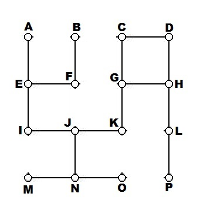

# HW3: Written Assignment

+ Due: Friday, February 5th, 11:59pm PST
+ You will submit this homework through Blackboard, by uploading your answers.  Please submit with a common file extension (such as .jpg, or .pdf)
+ To access the programming portion of this assignment, click [here](./programming/)

### Problem 1 (Heaps, 10%)

For the following pen-and-paper exercise, please solve it by hand and only use online visualization tools to verify your work.

For each of the following two arrays that are interpreted as binary (2-ary) "min-heaps", state whether they are in fact correct binary min-heaps or violate a property. If one is a correct min-heap, then show what it looks like after you insert the key "2", and then show it again after you now remove the minimum (after having inserted "2"). You don't have to show the intermediate steps, but if you don't show them and the final answer is wrong, we will not be able to give you a lot of partial credit.

If one of the two heaps we gave you is not a correct binary min-heap, then point out everything that is wrong with it. In that case, you don't need to insert "2" or remove anything.

- [1, 4, 3, 7, 10, 6, 5, 9, 8, 11]
- [1, 6, 3, 9, 7, 4, 5, 8, 10]

Your answer should not be in array form like ours, but instead be drawn as a tree, either for the trees you want us to see, or by annotating the mistakes in the tree(s) we gave you.

### Problem 2 (A*, 10%)

    

You are given the above graph, and want to find the shortest path from node A to node P, using **A* Search**.  Your algorithm has the following properties:

- It uses Manhattan distance as its heuristic (the h-value)
- If two nodes look equally good, it breaks ties by selecting the node with a smaller heuristic (or, equivalently, the node with the largest distance travelled)
- If two nodes are still tied, it break ties by choosing the node which comes first alphabetically.

For each of the nodes, specify the g-value and h-value when they are discovered.  Then, specify the order in which nodes are explored, stopping once P is explored.

### Problem 3 (Runtime, 10%)

In an implementation of Dijkstra's algorithm, suppose that instead of using a Min-Heap, you used something called a **Binomial Queue**.  While you have no idea how such a thing is implemented, you do know it has the following runtimes:

- Insert = &Theta;(1)
- DeleteMin = &Theta;(log n)
- FindMin = &Theta;(log n)
- Update = &Theta;(log n)

Does this change the worst-case runtime of Dijkstra's algorithm?  Thoroughly explain your answer by carefully analyzing the runtime using a Binomial Queue.

## Programming Assignment

To access the programming portion of this assignment, click [here](./programming/)
