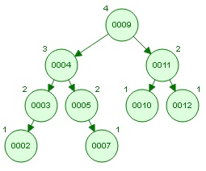

# HW4: Written Assignment

+ Due: Friday, March 19th, 11:59pm PST
+ You will submit this homework through Blackboard, by uploading your answers.  Please submit with a common file extension (such as .jpg, or .pdf)
+ To access the programming portion of this assignment, click [here](./programming/)

### Problem 1 (AVL Trees, 10%)

Consider the following initial configuration of an AVL Tree:

Draw the tree representation of the AVL tree after each of the following operations, using the method presented in class (when deleting, always promote a value from the right subtree...your successor).  Your operations are done in **sequence**, so your tree should have 9 values in it when you're done. Make sure to clearly indicate each of your final answers.

- Remove 10
- Insert 13
- Insert 6
- Remove 9
- Insert 14
- Remove 11

We highly recommend you try to solve these by hand before using any tools to verify your answers.

## Programming Assignment

To access the programming portion of this assignment, click [here](./programming/)
