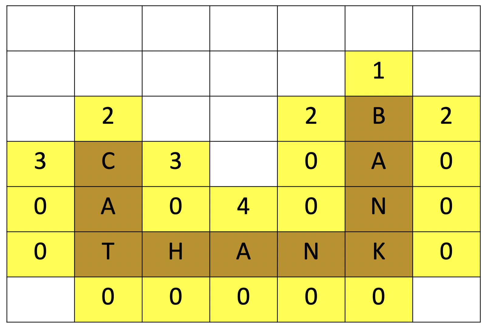
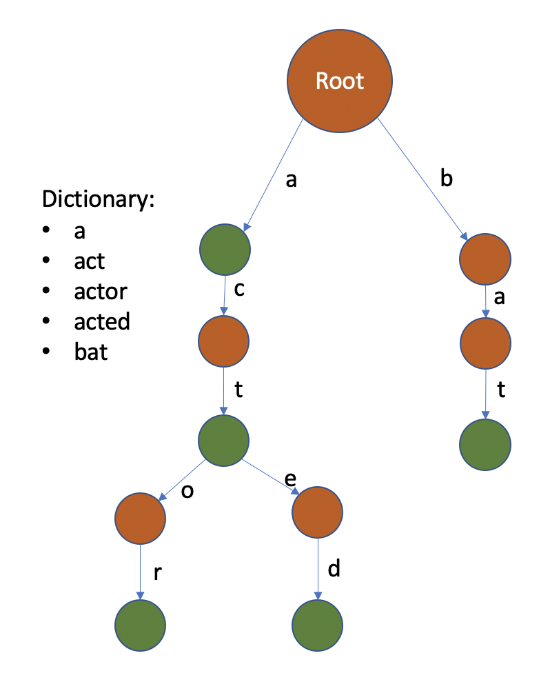

## Homework 5 (Part 2 of  Scrabble Project)

+ Due: Friday, October 30, 11:59pm
+ Directory name in your github repository for this homework (case sensitive): `hw5`.
  + New skeleton code is available at `resources/hw5`.

### Overview

This is the second part of your project. As mentioned in the context of HW3, it requires you to implement a Scrabble AI so that you can play against computer-controlled opponents. Your AI should always return a move that gives the maximum possible score. 

For this part of the project, you will use your solution to HW3 as your starting code base.

### Backtracking Algorithm

We will use a backtracking algorithm to find all possible moves. This could also be done with a brute force search - but that would be very slow. Backtracking reduces run time by recognizing when there are no more valid ways to make a move out of the current letters on the board and in the hand, and "backtracking" to try a new combination. 

You will need to write code to determine moves for computer-controlled players. We want you to implement an algorithm derived from the one by Appel and Jacobson presented in [The world's fastest Scrabble program](https://www.cs.cmu.edu/afs/cs/academic/class/15451-s06/www/lectures/scrabble.pdf) (as of its publication in 1988). We give you the citation only for completeness and for your own enrichment as we will explain what is necessary to implement from that work in the assignment description.

The basics of this algorithm can be broken into finding Anchors (defined below), finding all prefixes for the Anchor, for each prefix finding all possible endings. 

Your AI will produce a collection of legal moves. From among these moves, it should choose the best move to play. You can choose the best move after all combinations are found (recommended), or if you find a move while searching that you are confident in you can cut off the search early. Ties between equally highly scoring moves may be broken by placing the word would appear first in the dictionary arbitrarily. *Your AI only needs to be concerned with optimizing the current move, not several moves in advance.*

Your code will be visually inspected to make sure it is not a brute force approach and tested on large hand sizes. If you use a brute force search expect a visual inspection deduction, as well as possible failed test cases due to timeouts.  Another thing that could slow down the search is having lots of blanks tiles in the computer AI's hand (26 possibilities per blank). We will not test with more than two blank tiles at once.

The homework can be broken up into four steps (from easiest to hardest)
1. Modifying add player and game loop
1. Implementing anchors 
1. Modifying the dictionary to use a *trie* represented as a tree
1. Implementing the algorithm 

### 1. Player Types

After supplying the player name (e.g. Tommie), the program should ask if that player is a computer (y/n). "y" indicates computer. "n" indicates human. If  users do not specify, the default player should be a human player. 

We will provide skeleton code for a new ComputerPlayer class, which inherits from the Player class. ComputerPlayer will implement it's own get_move() function, so (almost) nothing in scrabble's game loop should need to change. 

The only thing that will need to change in `Scrabble::game_loop` is you will need to change the PASS condition that ends the game. The game should end after all of the **human players** PASS sequentially. Note that computer players can pass, but only if no moves are found. Also note infinite loops can be a problem in a game with only computer players - your code will only be tested in games with at least one human player. Feel free to add any sort functions or members to scrabble or player to achieve this such as a virtual function `Player::is_human()` (along with definitiions in ComputerPlayer and HumanPlayer) plus a `Scrabble.num_human_players` counter. __You must modify your implementations of `scrabble.h` and `scrabble.cpp` from HW3 in order to implement these changes for HW5.__ No `scrabble.h` or `scrabble.cpp` will be provided in the resources directory.

We will supply a reference solution similar to the one from HW3. Your I/O scheme must exactly match the reference solution.

### 2. Anchors

Anchor squares are empty squares on the board adjacent to a tile that has already been placed. Note that the start square is also considered an anchor square if it is open (first turn). Every playable move must place a tile in at least one anchor square. On a computer-controlled player's turn, your AI should consider all possible "Anchors" for the word it is going to play. 

Functionality for finding anchors should go in the `Board` class. You are required to add this **public** inner struct to the Board class in `board.h` : 

```
struct Anchor {
    Position position;
    Direction direction;
    size_t limit;

    Anchor(Position p, Direction d, size_t l) : 
    position(p), direction(d), limit(l) {}
};
```

You are also required to add this this **public** function to `Board` :

```
std::vector<Anchor> get_anchors() const;
```

*Careful with these additions - they will both be used for grading! You are free to add any public or private helpers. A new board.h file is provided in resources for reference.* 


An Anchor is defined by a *position* on the board (anchor square), a *direction* to place tiles in, and the number of non-occupied, non-anchor squares preceding the anchor square, called the *limit*. This limit is the maximum prefix size to look at before placing a tile at the anchor square. 


Fig 1. Anchor squares are highlighted and the numbers represent the limit in the ACROSS direction.



Fig 2. Anchor squares are highlighted and the numbers represent the limit in the DOWN direction.

### 3. Tries

Instead of writing a whole new class to represent a trie, we will re-implement `Dictionary` as a trie. The public interface (existing function headers) to the dictionary will not change, so it will still work with code we already implemented. However, the implementation of public functions will change. 

You can find new `dictionary.h` and `dictionary.cpp` files in resources. You can add any public or private helpers, but do not change the function headers provided, they are used for grading.

The algorithm you are implementing relies on a data structure known as a Trie. We will discuss tries more independently later in the term. However, for this assignment it is sufficient to know that *a trie is represented as a tree*. The nodes of the tree representing the trie are defined in the following struct:

```
struct TrieNode {
    bool is_final = false;
    std::map<char, std::shared_ptr<TrieNode>> nexts;
};
```

The paths of the trees that represent the trie represent prefix strings that are stored at the nodes.  Each node represents the series of letters or prefix string on the path of edges required to reach it and its children are the continuations of the prefix string that could form words (eventually).  A node can is marked `is_final == true` if the prefix used to reach that node is a valid word. 

A node marked `is_final == false` if the sequence used to reach it does not represent a valid word on it's own, but is a prefix of a longer valid word. The tree will allows us to terminate searches that could not possibly result in a legal word. 

One thing to note is that a Trie can be implemented multiple ways that we will discuss later in ther term.  For example, each node could have a single `char` letter instead of a `map`. The way we are asking you to implement yours is with a `map` because it is more efficient for this use case (and easier to work with).  (Notice this does not affect the runtime of the trie in terms of the size of the dictionary because we know that this map will run in logarithmic time in the size of the alphabet. For English this is log(26).)

Let's consider the trie in Figure 3 below. The root node represents the empty string as a prefix. The left child of the root node follows a path with the letter a. That means that the root node's map will have as a key the letter 'a' with a value pointing to a node. The left child node will represent the prefix string "a". Since the word "a" is in the dictionary, the left child's node will have its boolean is_final set to true. Notice that all valid words end with a node that has is_final set to true are colored green in the figure below. 

Now let's consider the right child of the root node. It follows a path with the letter b. The root node's map will have as a key the letter 'b' with a value pointing to a node. Since "b" is not a string in the dictionary, the right child node will have its boolean is_final set to false. 

Let's keep looking past "b". Notice that the "b" node has a child node that traverses a path for the letter 'a'. That means the node will have in its map a key 'a' and a value pointing to a node. This child node, a grandchild of the root, represents the string "ba". The "ba" node's is_final boolean is set to false since "ba" is not a word in the dictionary. 

Finally this grandchild node will have in its map a key value pair where the key is 't' and value is a pointer to its child node. The great grandchild node will have an empty map since it has no children and is a leaf node. It will have its boolean for is_final set to true because the word "bat" is in the dictionary. Notice that nodes representing valid words in the dictionary, i.e. with is_final set to true, can be leaf nodes or internal nodes.



Fig 3. A trie is shown. Any edge not present means a word cannot be formed by using that letter. For example, we know that no word can be formed with the prefix "acb" because there is no edge from "ac" with the label "b".

The file `dictionary.h` is finished for you, and functions pertaining to building the dictionary are also finished in `dictionary.cpp`. Your task is to write functions to look up words or prefixes in the dictionary. (This is an example of tree traversal.) 

### 4. Algorithm

A header file for the computer player is provided in  `computer_player.h`. The function `ComputerPlayer::get_move()` is where the algorithm should be implemented. This function will be used for testing, so do not change the header or its signature.

The reference paper only uses the terms left/right without loss of generality since this can equally correspond to up/down. We do the same here. 

#### Prefix/Left Part

The algorithm you are implementing relies on two recursive functions. The first one is called `left_part`. This function finds all possible starting prefixes for an anchor of size less than or equal to the anchor's limit. It does this by searching through the dictionary trie, building possible prefixes based on the tiles still available. For every prefix that can be made, it should call `extend_right` with that prefix.

***Note: You are not required to use recursion if you can think of another way to implement the search algorithm.*** 

#### Postfix/Extend Right

Similar to `left_part`, `extend_right` should search through the dictionary trie and build possible moves. Unlike `left_part`, it must account for other tiles being in the way. 
As your implementation searces through the possible words for moves, if the dictionary trie node is marked as a real word, i.e. is_final is set to true, you should add word as a move to your list of possible moves. You can evaluate the best move as you do the search or after accumulating all the possible moves.

### An Example of Tracing Left Part and Extend Right for a Single Anchor

Suppose the current configuration of the board is as in Figure 1 and the Computer Player has the tiles <a, q, k, s> in its hand. Let's consider what should be generated for the anchor square with limit 1 above "CAT". Since the limit is 1, the left part should generate partial moves for each tile in its hand: that is a partial move starting with a, m_a, a partial move starting with q, m_q, a partial move starting with k, m_k, and a partial_move starting with s, m_s. After each of those partial moves are generated, the extend right function should generate more partial moves. One partial move to extend right will start from the anchor square itself. The other partial moves will be from the partial moves from the function left part. For example starting from the partial move, m_a, the computer player will generate partial moves for each of the remaining tiles in its hand. That means it will generate a partial move for q, m_aq, and a partial move for k, m_ak, and s, m_as. How does the computer player know that such moves can be generated? The computer player will use the dictionary trie and check if there exists an edge between a and k in the trie and a and q in the trie, and a and s in the trie.

Now let's consider what will happen with extend right with the partial move from left part with q in front, m_q. The computer player will check for an edge between q and a in the dictionary trie and create a partial move extending the q move, m_qa. What happens for the remaining tiles k and s? Well there are no edges in the trie between q and k or q and s, so the computer player will not extend those partial moves. The computer player will do the same for the moves m_s and m_k.

Let's now consider what happens with the partial moves generated as part of extend right starting from trying to place a to the left of the anchor. Extend right will be called again from the move, m_aq. However as we saw above with q there is no path in the trie from the root to a to q to k and no path in the trie from the root to a to q to s, so those moves cannot be extended. Let's consider the partial move, m_as. There is no path in the trie from the root to a to s to q, so that move cannot be extended. However there is a path in the trie from the root to a to s to k, so that move can be extended right, m_ask. This move cannot be extended right further (since there is no path from the root to a to s to k to q in the trie) and can be added to the possible moves to be considerd for the best move.

This process is done for each anchor square. Try extending right the moves above and what may happen at other anchor squares. It is best to consider how your computer player is searching the paths on the trie for each move possible with the tiles in its hand. Once the computer player has considered all possible moves on the board, it will select the move that is a valid word in the trie and that yields the highest score.

You can check out [this recording](https://usc.zoom.us/rec/share/8V-pahekVUQJbbWM5_ZwQ7r-cSoQSuTGlNrZQySBGgu_NkTnpJ8JT9hx7ACqkvE.ql_TN2XidG0XhuXj) for a more in depth explanation of how the search algorithm works.

#### Anchors with limit = 0

If an anchor's limit is 0, that means there is no prefix, and thus, no call to `left_part`. The preceeding square must be either out of bounds, another anchor square, or an already placed tile. You must check if there are tiles preceeding it and then call `extend_right` using those tiles as the prefix. 

#### Selecting a move

Once you have found a set of all possible moves, you must select the one that will result in the max points. If no possible moves were found, you can return a pass move (although this edge case will not be tested). Remember to account for 50 point max length move bonuses - however this 50 point bonus need not be represeted in the point value of the move returned by get_move. If your original implementation expects the 50 point bonus to be applied to the move returned by get_move() that is fine too. 

#### Key Differences vs Reference Citation Algorithm

If you do read the reference citation, we want to highlight a few key differences in this section. First, we do not require you to cross-check words as you are searching. You can check the true validity of the "legal moves" returned by the algorithm prior to choosing the best one. So you can ignore any references to cross-checks in the paper. 

As stated above, we are using the dictionary trie instead of the directed acyclic word graph (DAWG) used in the reference paper. An acyclic graph is a graph with no cycles like a tree. The paper was written when memory constraints were more significant. The DAWG is a more compressed version of the dictionary trie where nodes that always act the same way are merged. This brings the memory requirements for storing the English dictionary from about ~1 MB to ~200 KB. Since this is barely a blip for modern computers, we are not requiring you to implement it. 

*Tip: You can speed up your Scrabble program by not overusing the `find_prefix` function, and instead directly traversing the dictionary trie.* 

### Testing and Grading

For this assignment since your code builds on work for HW3 you have two choices for the code base you use to start this second part of the project:
- Extend your HW3 submission including any additional debugging you have done on it. We will provide all of the HW3 test cases with HW5 as we are still grading your HW3 submissions and will release scores while you are working on HW5.
- You can obtain some HW3 reference solutions source code files for a 10 point deduction on HW5. In making your request for HW3 reference solution source code files, you will need to accept a 10 point deduction on HW5 and acknowledge that you understand that sharing or distributing any reference code would be considered an academic integrity violation and a violation of course policy. You may request source code via [this form.](https://forms.gle/Udt2zQaRf8oy2TTS8) Your email and timestamp will automatically be recorded and we recommend that you have a copy of your request responses sent to you. We will send out source code once per day to all who have submitted their requests before 5 pm PDT.

Your project will be graded in a similar way to HW3 - by a combined score from 
- GTest unit tests and
- A series of full run tests, where only the final scores will be graded

GTests will be provided just like in lab 3 - navigate to the tests folder to compile and run the tests written in `scrabble_test.cpp`. This will also produce a `scrabble_test` executable, which you can debug with `gdb ./scrabble_test`

A sample of the second set of tests will be provided, called `input/example.txt`. These tests mimic a user typing on `std::cin`. The sample given is simple; feel free to modify it and look for error cases (again, the config file will be seeded with a fixed value, so nothing is really "random"). Make sure the moves in your input files actually cause the game to end! You can run them by executing:

`cat input/example.txt | ./scrabble <configuration-file-name>`

Finally, we provide a working executable for you, so that can help with error case handling. The example executable will be called ./solution.

Good luck!



### Citations
Andrew W. Appel and Guy J. Jacobson. 1988. The world's fastest Scrabble program. Commun. ACM 31, 5 (May 1988), 572–578. 
DOI:https://doi.org/10.1145/42411.42420

## Submitting

Once you've finished, check that all of the code you're submitting is consistently formatted.
The `README.md` in your homework repository provides instructions for using `clang-format` to do so automatically.
You can then submit your code on the [Curricula submission page]({{ site.baseurl }}/submit/course/usc-csci104-fall2020/hw5).
Be sure to carefully read and follow the instructions there.

- [ ] Format your code using `clang-format`.
- [ ] Submit your code.
