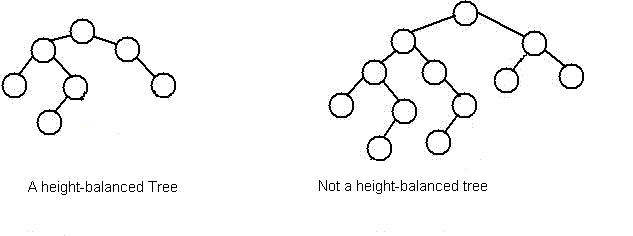

## BST and AVL Trees

A Binary Search Tree is a specific type of binary tree. In a BST, left children (the left subtree) hold values that are *less than* the parent's value, and right children (the right subtree) hold values *greater than* the parent's value. 

### BSTs

The **Binary Search Tree Property** (BST) states that all nodes in the left subtree must have key values less than or equal to the root and all of the nodes in the right subtree must have key values greater than the root. Usually, if key values are distinct, we do not worry about equality. BSTs exist to enable (potentially) fast searches. 

+ For a BST, what is special about operating on elements using an in-order traversal? If we were printing integers using this traversal, what would the output look like? 

+ Why do we say potentially? Can someone think of an example in which the search is really slow, even if we have a valid BST?

Our search function will simply return true or false depending on whether or not our search parameter exists in the tree. Another reasonable return value of a search function could be an iterator pointing to the found element (see std::map find).

To search for key `X` in a BST, we compare *X* to the current node.

  - If the current node is null, `X` must not reside in the tree.
  - If `X`is equal to the current node, simply return the current node.
  - If it is less than the current node, we check the left subtree.
  - Else, it must be greater than the current node, so we check the right subtree.

#### Example

Take a look at this example:


Operation: `find(6)` // We begin at the root 

Let's walk through this.

Now, here's an example where we try to find a node that does not exist in the tree:

Operation: `find(0)` // We begin at the root 

Let's walk through this one too.

The best-case runtime for searching a value `X` in a BST with *N* elements is `O(logN)`. What is the worst-case runtime?

### What's a balanced Binary Tree?

A balanced  binary trees is a tree that ensures that the height of each subtree differs by no more than 1 node. When binary trees maintain balance, the binary tree keeps its height logarithmic in n where n is the total number of nodes in the tree for a sequence of insertions and deletions. This structure provide efficient implementations for abstract data structures. 

A tree is considered balanced if it conforms to the **Height-Balancing Property**: A node in a tree is height-balanced if the heights of its subtrees differ by no more than 1. 

As we will see in a few weeks, most operations on a BST take time directly proportional to the height of the tree, so we want to keep the height balanced.

Here is an example of balanced vs. non balanced trees.

<div style="text-align:center"> </div>

### How can we maintain these properties at the same time?

We will study these details more carefully in the next section. However, this is a good preview to start familiarizing yourself with these ideas. The BST property is maintained by smart insertion and deletion. In an insert, you traverse the tree based on the key to be inserted. Once you encounter a situation where you can't traverse any further, you know that the key can be placed there. Because we are traversing based on the key value, we are inherently upholding the BST property.
 
The same thing can be said about a deletion in a BST. This is done by choosing which node to promote. Either the predecessor, if the node has two children, or the child if the node has 1 child. By doing this, the BST property is being maintained.

A BST that maintains its balance throughout all insertions and deletions is called a  self-balancing BST. These types of trees that auto-balance or self balance inherently with the insertion are called Self-Balancing Binary Search Trees. Examples are:

1. Splay Trees
2. AVL Trees
3. Red Black Trees
4. B-Trees
5. 2-3 Trees

For all of these self-balancing binary search trees, the height-balancing property is upheld by the nature of an insert or remove. The best way to do so is with rotation, or series of rotations. 

### AVL Trees

An AVL tree is a type of balanced Binary Search Tree that uses the height of substrees and rotations to maintain balance.

#### Rotations

A rotation changes the local structure of a binary tree without changing its ordering. This means that in between rotations, the BST property is still maintained.

Rotations can be broken up into left and right rotations which are just inversions of eachother.

<div style="text-align:center"></div>

Rotaions make up the foundation of the AVL tree. In your homework, you will need to implement these rotations in a variety of scenarios. There are 4 combinations of rotations: left-left, left-right, right-left, right-right. Sometimes, these rotations are referred to as "zig zig" or "zig zag", or something similar. The point is, during these sequences of rotations, the tree becomes more balanced than it was before.

__If longer subtrees are left and then left__

```
T1, T2, T3 and T4 are subtrees.
         z                                      y 
        / \                                   /   \
       y   T4      Right Rotate (z)          x      z
      / \          - - - - - - - - ->      /  \    /  \ 
     x   T3                               T1  T2  T3  T4
    / \
  T1   T2
```

__If longer subtrees are left and then right__

```
     z                               z                           x
    / \                            /   \                        /  \ 
   y   T4  Left Rotate (y)        x    T4  Right Rotate(z)    y      z
  / \      - - - - - - - - ->    /  \      - - - - - - - ->  / \    / \
T1   x                          y    T3                    T1  T2 T3  T4
    / \                        / \
  T2   T3                    T1   T2
```

__If longer subtrees are right and then right__

```
  z                                y
 /  \                            /   \ 
T1   y     Left Rotate(z)       z      x
    /  \   - - - - - - - ->    / \    / \
   T2   x                     T1  T2 T3  T4
       / \
     T3  T4
```

__If longer subtrees are right and then left__

```
   z                            z                            x
  / \                          / \                          /  \ 
T1   y   Right Rotate (y)    T1   x      Left Rotate(z)   z      y
    / \  - - - - - - - - ->     /  \   - - - - - - - ->  / \    / \
   x   T4                      T2   y                  T1  T2  T3  T4
  / \                              /  \
T2   T3                           T3   T4
```

By using combinations of rotations during insertion and removal, we are able to maintain consistent balance throughout the lifetime of the tree.

#### Inserting

During insertion, we start by inserting the value at its correct location as a normal BST would. Then, we traverse up the tree, evaluating the local height of each node and fixing that portion if the height of the left and right subtrees differ by 2 or more. We only need to traverse up the tree from the inserted node because the subtree containing the new node is the only subtree where height can change and we need to rotate.

We fix the tree beginning with the newly inserted node.

#### Removing

During removal, we remove as normal and then proceed to fix the tree by traversing up, starting with the parent of the deleted node. In the case that we are swapping with the predecessor, you continue to delete the same node until you cannot swap any further, and then begin fixing the tree in the same fashion.

We fix the tree beginning with the parent of the deleted node.

### Checkoff

#### 1. Range Sum

Given the root of a binary tree, determine if the binary tree is height balanced. A binary tree is balanced if and only if both of its subtrees are height-balanced and have the same height.

- [ ] Implement `isBalanced` in `bst.cpp`

### 2. AVL Insertion & Removal

Take some time to confirm your understanding by showing the tree after each of the following operations in a file named `lab8.txt` (or whatever file format you can show your CP). 

__Initial Tree__

```
                13
        +--------+---+
        10          15
    +---+---+        +--+
    5       11          16
+---+---+
4       8
```
+ Insert 14
+ Insert 3 
+ Remove 3
+ Remove 4

- [ ] Show what the tree looks like after each of the above operations. Operations should happen sequentially (ie, Insert 3 happens after Insert 14). 


### Check off

- [ ] Use `make` to run tests. Show a TA/CP your passed tests and AVL tree to get checked off! 
