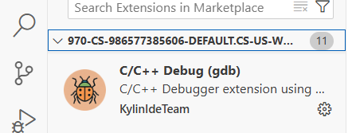

# C++ Setup Using Google Cloud Shell (VS Code-style Cloud Editor)

*Note: This guide was create in part with the help of chatGPT, OpenAI (1/7/2026)*.

> **Audience:** CS104 Students  
> **Goal:** Build, debug, and memory-check C++ programs using a browser-based Linux environment  
> **Platform:** Google Cloud Shell / Cloud Editor (free)

---

## 1. Open Google Cloud Shell Editor

1. Go to [https://ide.cloud.google.com](https://ide.cloud.google.com)
2. Sign in with a Google account
3. Click **Open Editor** (VS Code–style interface)

You now have:
- A Linux terminal
- A web-based VS Code editor
- A persistent home directory

---

## 2. Customize the Environment (1 Time setup)

Each time Cloud Shell restarts, it creates a **new VM**. While it saves your home directory and files it does not save the necessary compiler toolchain and other utilities. Thus, you must specify what utilities to install each time it starts by creating a file called:

```
.customize_environment
```

### Create the file

In the Cloud Shell terminal at the bottom of the screen (click `View..Terminal` if you do not see a Terminal), run:

```bash
nano ~/.customize_environment
```

Paste in the following contents **exactly** (you may need to right-click in the terminal area).

```sh
echo "Sourcing CS104 tools" 
sudo apt install -y \
  cmake \
  valgrind \
  pkg-config \
  unzip \
  libgtest-dev

cd /usr/src/gtest
sudo cmake .
sudo make
sudo cp lib/*.a /usr/lib

cd $HOME
mkdir -p ~/.cloudshell
touch ~/.cloudshell/no-apt-get-warning

git config --global user.email "ttrojan@usc.edu"
git config --global user.name "Tommy Trojan"
```

Using only your ARROW keys, backspace and delete, change `ttrojan` to your USC email username and change `Tommy Trojan` to your name.
Save and exit (`Ctrl+o`, `Enter`, `Ctrl+x`).

---

### Make it executable
```bash
chmod +x ~/.customize_environment
```

---

### Apply the customization
To apply the customization immediately, run:

```bash
source ~/.customize_environment
```

Alternatively, the file will be automatically sourced on your next Cloud Shell restart.

⚠️ This may take several minutes the first time.  Type `Y` or hit `Enter` to answer any questions/prompts.

---

## 3. Verify Installed Tools

```bash
g++ --version
gdb --version
cmake --version
valgrind --version
```


---

## 4. CS104 folder and CMake Starter Project (Multi-file, In-Source Build)

Here is the final folder structure and files you will now create:

### Folder Structure

```
cs104-repos/
└──hello-cmake/
   ├── CMakeLists.txt
   ├── .vscode/
   │   └── launch.json
   └── src/
      ├── main.cpp
      ├── greeter.cpp
      └── greeter.h
```

We recommend making a `cs104`  or `cs104-repos` (you can name it what you like, but avoid spaces in the name) folder under your HOME folder.

To do so, use these commands at the prompt.

```bash
cd $HOME
mkdir cs104-repos
cd cs104-repos
```

> **Important Note**: *Each time you want to clone a new repo or work on your coding homeworks or labs, you can navigate to the appropriate repo folder by starting a terminal and using the command `cd ~/cs104-repos/<repo_name>`.

Now you'll create the folders needed for the test example, `hello-cmake`. Enter the commands:

Create the test folders:

```bash
mkdir -p hello-cmake/src hello-cmake/.vscode
cd hello-cmake
```

Create the necessary files in the specified folders.  **Ensure you click on the appropriate folder before creating a new file in VSCode**.   The button to create a new file looks like:


---

### `CMakeLists.txt`
```cmake
cmake_minimum_required(VERSION 3.16)
project(hello LANGUAGES CXX)

set(CMAKE_CXX_STANDARD 17)
set(CMAKE_CXX_STANDARD_REQUIRED ON)

add_executable(hello
    src/main.cpp
    src/greeter.cpp
)
```

---

### `src/greeter.h`
```cpp
#pragma once
#include <string>

std::string make_greeting(const std::string& name);
```

---

### `src/greeter.cpp`
```cpp
#include "greeter.h"
using namespace std;

string make_greeting(const string& name) {
    return "Hello, " + name + " from CMake + WSL!";
}
```

---

### `src/main.cpp`
```cpp
#include <iostream>
#include <string>
#include "greeter.h"
using namespace std;

int main(int argc, char* argv[]) {
    if (argc < 2) {
        cout << "Usage: " << argv[0] << " <name>" << endl;
        return 1;
    }

    string name = argv[1];
    cout << make_greeting(name) << endl;
    return 0;
}
```

After creating these files you folder structure should look like this:


---

## 5. Build and Run (In-Source)


At the terminal in the lower pane (you may need to click `View..Terminal`)
```bash
cmake .
make
./hello Alice
```
---

You should see the program run and greet Alice!

## 6. Valgrind (Memory Checking)

Now run with valgrind.  You should see the same output as before but with the additional Valgrind banner and debug output.

```bash
valgrind --tool=memcheck ./hello Alice
```


---

## 7. Debugging with Cloud Editor (VS Code GUI)

To use the integrated debugging GUI front end of VSCode is most easily accomplished with a `launch.json` file in a `.vscode` subfolder.  For VSCode to automatically find and use this configuration file, you must point VSCode to the top-level project folder where the `.vscode` subfolder resides.  Regardless of where your terminal indicates it is, VSCode must be opened to the specific project folder.  

So, choose `File..Open Folder` and choose the `hello-cmake` folder your downloaded and click `OK`.  

- Open the Extensions view (Ctrl+Shift+X)
- Search for "C/C++ Debug (gdb)" or simply "C/C++ Debugger"
- Install the extension authored by **KylinIDETeam** (or any C/C++ GDB extension available in the marketplace)
- Reload the editor when prompted



Note: Cloud Shell Editor's extension marketplace is limited compared to desktop VS Code; if you cannot install an extension there, use the terminal-based `gdb` workflow (see Troubleshooting below) or consider setting up a native C++ compiler toolchain on your laptop.

Create `.vscode/launch.json` by first running these commands at the terminal (assuming your are in your `hello-cmake` folder at the terminal):

```bash
touch .vscode/launch.json
```

Your file tree should now look like:


Then open the `launch.json` in the editor and paste in these contents and save the file.

```json
{
  "version": "0.2.0",
  "configurations": [
    {
      "name": "Debug hello (gdb)",
      "type": "cppdbg",
      "request": "launch",
      "program": "${workspaceFolder}/hello",
      "args": ["Alice"],
      "stopAtEntry": false,
      "cwd": "${workspaceFolder}",
      "environment": [],
      "externalConsole": false,
      "MIMode": "gdb",
      "setupCommands": [
        {
          "description": "Enable pretty-printing",
          "text": "-enable-pretty-printing",
          "ignoreFailures": true
        }
      ]
    }
  ]
}

```

### Debug Steps

1. Open `main.cpp`
2. Click left of a line number to set a breakpoint
3. Press **Run..Start Debugging**

---

## 8. Summary and Reminders

- Your **home directory persists**, but the **VM may reset**
- Rerun the following commands if tools are missing

```bash
cd $HOME
source ~/.customize_environment
```

- This environment should match our autograder's exactly

---

You can now develop, debug, and memory-check C++ programs **entirely in your browser**.
