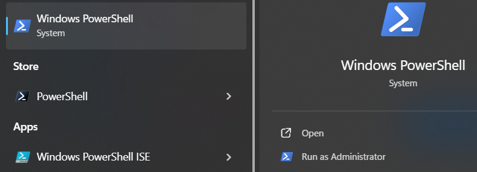
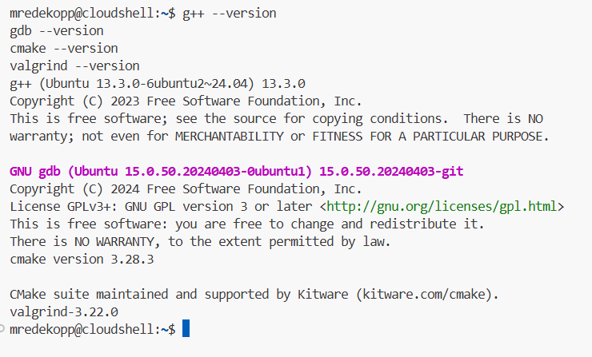
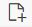
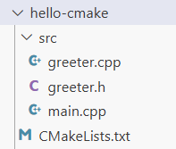
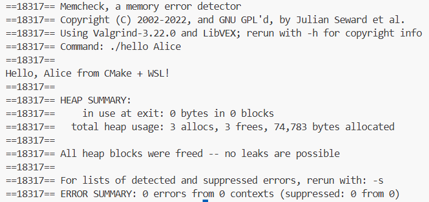
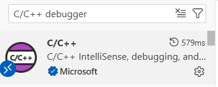
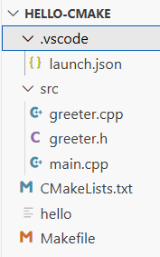

# C++ Setup Using Windows WSL (VS Code + WSL / Ubuntu)

*Note: This guide was create in part with the help of chatGPT, OpenAI (1/7/2026)*.

> **Audience:** CS104 Students  
> **Goal:** Build, debug, and memory-check C++ programs using a Windows-based Linux environment
> **Platform:** Windows Subsystem for Linux (WSL – Ubuntu)

---

## 1. Install Visual Studio Code (Windows)

If you do NOT have VS Code installed on your Windows laptop: 

1. Go to [https://code.visualstudio.com](https://code.visualstudio.com)
2. Download **VS Code for Windows**
3. Install with default options

Enable command-line launch:
- Open VS Code
- Press **Ctrl + Shift + P**
- Run: `Shell Command: Install 'code' command in PATH`

---

## 2. Install WSL (Ubuntu Linux) and Configure Toolchain

### 2a. Install WSL

Open **PowerShell as Administrator** and run:



At the prompt, run:

```powershell
wsl --install
```

This will:
- Enable WSL
- Install **Ubuntu**
- Prompt you to reboot (potentially)

---

### 2b. Set Up Ubuntu (First Launch)

After reboot, go to the Start Menu and:
1. Open **Ubuntu** (from the Start Menu)
2. Choose a **Linux username and password**
  - We strongly recommend you use the same username as your USC username (i.e. if your @usc.edu email is `ttrojan@usc.edu`, then we recommend making your WSL username `ttrojan`).

---

### 2c. Update Linux Packages

In the Ubuntu terminal:

```bash
sudo apt update
sudo apt upgrade -y
```

---

### 2d. Install C++ Development Tools

```bash
sudo apt install -y \
  build-essential \
  gdb \
  cmake \
  valgrind \
  unzip \
  libgtest-dev \

cd /usr/src/gtest
sudo cmake .
sudo make
sudo cp lib/*.a /usr/lib
cd ~

python3 -m pip install xmltodict
```

## 3. Verify Installation and Setup WSL Extension
### 3a. Verify Installed Tools
```bash
g++ --version
gdb --version
cmake --version
valgrind --version
```


---

### 3b. Install VS Code WSL Extension

In **VS Code (Windows)**:
1. Open Extensions
2. Install **WSL** (Microsoft)

---

### 3c. Open Your Project in WSL

From Ubuntu:

```bash
code .
```

---

## 4. CMake Starter Project (Multi-file, In-Source Build)

Here is the final folder structure and files you will now create:

### Folder Structure

```
cs104-repos/
└──hello-cmake/
   ├── CMakeLists.txt
   ├── .vscode/
   │   └── launch.json
   └── src/
      ├── main.cpp
      ├── greeter.cpp
      └── greeter.h
```

We recommend making a `cs104`  or `cs104-repos` (you can name it what you like, but avoid spaces in the name) folder under your HOME folder.

To do so, use these commands at the prompt.

```bash
cd $HOME
mkdir cs104-repos
cd cs104-repos
```

> **Important Note**: *Each time you want to clone a new repo or work on your coding homeworks or labs, you can navigate to the appropriate repo folder by starting a terminal and using the command `cd ~/cs104-repos/<repo_name>`.

Now you'll create the folders needed for the test example, `hello-cmake`. Enter the commands:

Create the test folders:

```bash
mkdir -p hello-cmake/src hello-cmake/.vscode
cd hello-cmake
```

Create the necessary files in the specified folders.  **Ensure you click on the appropriate folder before creating a new file in VSCode**.   The button to create a new file looks like:



---

### `CMakeLists.txt`
```cmake
cmake_minimum_required(VERSION 3.16)
project(hello LANGUAGES CXX)

set(CMAKE_CXX_STANDARD 17)
set(CMAKE_CXX_STANDARD_REQUIRED ON)

add_executable(hello
    src/main.cpp
    src/greeter.cpp
)
```

---

### `src/greeter.h`
```cpp
#pragma once
#include <string>

std::string make_greeting(const std::string& name);
```

---

### `src/greeter.cpp`
```cpp
#include "greeter.h"
using namespace std;

string make_greeting(const string& name) {
    return "Hello, " + name + " from CMake + WSL!";
}
```

---

### `src/main.cpp`
```cpp
#include <iostream>
#include <string>
#include "greeter.h"
using namespace std;

int main(int argc, char* argv[]) {
    if (argc < 2) {
        cout << "Usage: " << argv[0] << " <name>" << endl;
        return 1;
    }

    string name = argv[1];
    cout << make_greeting(name) << endl;
    return 0;
}
```

After creating these files you folder structure should look like this:



---

## 5. Build and Run (In-Source)


At the terminal in the lower pane (you may need to click `View..Terminal`)
```bash
cmake .
make
./hello Alice
```
---

You should see the program run and greet Alice!

## 6. Valgrind (Memory Checking)

Now run with valgrind.  You should see the same output as before but with the additional Valgrind banner and debug output.

```bash
valgrind --tool=memcheck ./hello Alice
```



---

## 7. Debugging with Cloud Editor (VS Code GUI)

To use the integrated debugging GUI front end of VSCode is most easily accomplished with a `launch.json` file in a `.vscode` subfolder.  For VSCode to automatically find and use this configuration file, you must point VSCode to the top-level project folder where the `.vscode` subfolder resides.  Regardless of where your terminal indicates it is, VSCode must be opened to the specific project folder.  

So, choose `File..Open Folder` and choose the `hello-cmake` folder your created and click `OK`.  

- Open the Extensions view (Ctrl+Shift+X)
- Search for "C/C++ Debugger"
- Install the extension authored by **Microsoft** (or any C/C++ GDB extension available in the marketplace)
- Reload the editor when prompted



Create `.vscode/launch.json` by first running these commands at the terminal (assuming your are in your `hello-cmake` folder at the terminal):

```bash
touch .vscode/launch.json
```

Your file tree should now look like:



Then open the `launch.json` in the editor and paste in these contents and save the file.

```json
{
  "version": "0.2.0",
  "configurations": [
    {
      "name": "Debug hello (gdb)",
      "type": "cppdbg",
      "request": "launch",
      "program": "${workspaceFolder}/hello",
      "args": ["Alice"],
      "cwd": "${workspaceFolder}",
      "MIMode": "gdb",
      "miDebuggerPath": "/usr/bin/gdb",
      "setupCommands": [
        { "description": "Enable pretty-printing for gdb", "text": "-enable-pretty-printing", "ignoreFailures": true }
      ]
    }
  ]
}
```

### Debug Steps

1. Open `main.cpp`
2. Click left of a line number to set a breakpoint
3. Press **Run..Start Debugging**

---

If VS Code still shows the "Select debugger" list after the C/C++ extension is installed, choose "C++ (GDB/LLDB)". If you are editing/launching from the Windows side (not via Remote - WSL) and want to debug a Windows build, you would instead install the Windows C++ debugger support ("C++ extension for Visual Studio") and pick the appropriate Windows debugger.

Notes for WSL users:
- Open the project from the WSL Ubuntu terminal using `code .` (this runs the Windows VS Code connected to your WSL environment). The Remote - WSL extension makes the C/C++ tooling operate inside WSL so the debugger and paths refer to the Linux side (e.g. `/usr/bin/gdb` and `/home/<you>/...`).
- When you create the configuration, choose the GDB option ("C++ (GDB/LLDB)") and use the sample below. The important fields to check are `program` (path to the built executable inside the WSL workspace) and `miDebuggerPath`/`MIMode` (pointing to `/usr/bin/gdb`).


Troubleshooting checklist:
- Make sure you built the executable in WSL (run `cmake . && make` inside WSL) so the executable `hello` exists.
- Confirm `gdb` is installed in WSL: `which gdb` and `gdb --version`.
- If the debug session fails to start, open the Debug Console for errors — common causes are incorrect `program` path or missing `miDebuggerPath`.


---

## 8. Summary and Reminders

- This environment should match our autograder's exactly

---

You now have a Linux-grade C++ toolchain on Windows using WSL.
