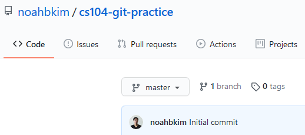
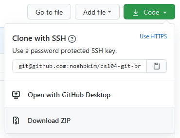
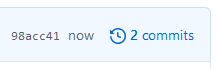

# Introduction to Git


[Git](http://git-scm.com/) is a distributed source code version control system.
When you place your code under version control, you record the changes you make to your files over time and you can recall the history of each of your file changes at will.
We will be using git extensively this semester in homework assignments.

[GitHub](https://github.com/) is a development ecosystem based around git.
In this course, we will be using GitHub to host our git repositories and we will take advantage of other GitHub features such as the issue tracker and wiki.

**If you have not done [Lab 0]({{ site.baseurl }}/labs/lab0) to set up your GitHub account or install Docker or a VM, please do so now.**

**Important**: in order to complete this lab, make sure you are using the correct terminal.
If you are using Docker to compile and test, you should **not** be using the `manage shell` to run `git` commands.
Instead, you should be using the normal terminal you open on your operating system (Terminal on macOS, git bash or CMD on Windows).
If you are using the VM, you should use the Terminal inside the VM.


## Create a Repository

A git repository, sometimes referred to just as a repository, is basically just a version-controlled directory.
Repositories are most often used for code, as git is generally only effective at maintaining plain text. 
You'll find that git can't efficiently or meaningfully track changes in things like Word documents or images because they're stored in complicated binary formats.

A git repository can be stored anywhere.
For example, when you eventually work on your homework, you'll be editing a local version of the repository, which will behave exactly like a normal folder with subdirectories and files.
When you use Github, a remote version of your repository is created and stored on the Github servers.
You can then sync changes you make on your local copy to the remote, allowing you to access the up-to-date code from anywhere.

To create a new repository, go to GitHub's [create a new repository](https://github.com/new) page and enter the following information:

- **Set yourself as the owner** and not any organization you belong to.
  The owner of the repository sets ownership permission and corresponds to the account the repository URL ends up under.
- **Make the repository name something reasonable** and self-explanatory, such as `cs104-git-practice`.
- **You can make the repository public** since it's just for learning git.
  You can make repositories for your personal projects `private` if you don't want other people to be able to see the contents.
- **Initialize this repository with a `README`**.
  This will save you some trouble during the initial push.
- **Add C++ `.gitignore`**.
  We will explain what this is later.
- **Do not add a license**.
  No need for now!

Click `Create Repository` and you should be taken to the newly-created repository's page.

- [ ] Log into Github and create a new repository.


## Clone Your Repository

By creating the repository on Github, we've created the `remote` version of our repository.
We now need to download, or `clone`, a local version of the repository to work with it.

### Find the SSH URL

You'll need to **get the URL of the repository by looking through its page on the GitHub** website.
The SSH URL of a repository on Github is always `git@github.com:owner-username/repository-name.git`, so if you remember those details you can write it yourself rather than copying it from the website.

<div class="showcase">
    
    <span class="caption">Click on the code tab to see the <code>Code</code> button.</span>
</div>

<div class="showcase">
    
    <span class="caption">Click on the <code>Code</code> button in the top right to see URLs.</span>
</div>

We use SSH rather than HTTPS because it's more secure.
Additionally, Github requires you to use SSH if 2FA is enable, which we recommend you set up.

- [ ] Find the SSH URL of your repository.

### Run Git Clone

Now, open a terminal and write the following commands to `clone` the repository to your home directory.
Note that the setup you did in the previous lab is required, otherwise this won't work.
Additionally, skim our <a href="/wiki/linux/" target="_blank">Linux cheatsheet</a> if you want to review how paths and basic commands work.

```shell
# This is a comment, which you don't have to type in your terminal

# Go to your home directory, ~
cd

# Clone the repository replacing our dummy URL with your own
git clone git@github.com:owner-username/repository-name.git
```

If you see the following dialog in your command line, type `yes` and press `enter`.
It's basically asking if you want to trust `github.com` as an SSH server.

```
The authenticity of host 'github.com (192.30.255.112)' can't be established.
RSA key fingerprint is SHA256:nThbg6kXUpJWGl7E1IGOCspRomTxdCARLviKw6E5SY8.
Are you sure you want to continue connecting (yes/no)?
```

You should see something like this, which will indicate that git is done cloning:

```
remote: Counting objects: 4, done.
remote: Compressing objects: 100% (3/3), done.
remote: Total 4 (delta 0), reused 0 (delta 0), pack-reused 0
Receiving objects: 100% (4/4), done.
Checking connectivity... done.
```

Now you have your repository on your local machine.

- [ ] Clone the repository to your home directory.


## Hello, world!

Using your editor of choice, write a basic `hello_world.cpp` in the the root directory of your repository.
It might look something like this:

```c++
#include <iostream>

int main()
{
    std::cout << "Hello, world!" << std::endl;
}
```

- [ ] Create the `hello_world.cpp` file in your repository.


## Check the Repository Status

Since we've now made changes in our repository, it's a good idea to save and sync those changes to our remote.
To see what files changed, you run the following command in your terminal.

```shell
git status
```

Upon doing so, you'll see something like this:

```
On branch master
Your branch is up-to-date with 'origin/master'.

Untracked files:
  (use "git add <file>..." to include in what will be committed)

        hello_world.cpp

nothing added to commit but untracked files present (use "git add" to track)
```

In the above status message, git is telling you that you have one file, `hello_world.cpp`, is not currently tracked by your repository.
If you want to add the file to your repository, you'll need to use the `git add` command.
Here is an explanation of the some of the terms:

- `master` refers to the default branch in your repository.
  Branches allow you to separate the series' of changes you make to your code into threads, which you can eventually merge back in.
  Right now there are no other branches.
- `origin/master` refers to the master on your GitHub remote.
- `Your branch is up-to-date with 'origin/master'` means that your local repository is in sync with the GitHub server.
  This might be confusing because you just made changes, but think of it this way: as far as git knows, before you made changes you started with the most up-to-date version of the code the remote has.
- `untracked files` are files that are not part of the repository and have not yet been added.

- [ ] Check the status of your repository.


## Commit the File

To track `hello_world.cpp`, use `git add`:

```shell
git add hello_world.cpp
```

- [ ] Stage the newly created `hello_world.cpp`

This tell git to start paying attention to this file.
If we modify, rename, or delete it, the next time we invoke `git` it will see this and behave accordingly.
For example, we can see that the status of our repository has changed; run `git status` again and you'll see something like:

```
On branch master
Your branch is up-to-date with 'origin/master'.

Changes to be committed:
  (use "git reset HEAD <file>..." to unstage)

        new file:   hello_world.cpp
```

Instead of being `untracked`, our `hello_world.cpp` is now considered `staged` and will be committed if we use `git commit`.
You can continue working on other files and you can stage them too.
You can also still edit, rename, or delete `hello_world.cpp`, though you will have to `git add` it again after.  

You can think of a commit as a snapshot of the repository.
As it stands, the only snapshot of this repository we currently have in our version is the commit the `README.md` was created with.
If we make a new commit right now, that new commit will also contain `hello_world.cpp`, and will be added to the series of commits that make up this repository:

```shell
# The message after -m can contain whatever you want, though it's good to use
# descriptive commit messages in case you need to revert to a previous commit.
# Either way, each commit must have a message, and if you don't use -m, the
# editor you set while configuring git will pop open for you to write one.
git commit -m "Add hello_world.cpp with some code"
```

- [ ] Commit `hello_world.cpp`.

To see recent commits, you can use `git log`.
Upon running that in your terminal, you should something like this:

```
commit df7cd3feda8a856de9cb2dc4bc132f15f7842bb1
Author: Tommy Trojan <ttrojan@usc.edu>
Date:   Tue Jan 14 17:42:52 2014 -0800

    Add hello_world.cpp with some code

commit 6d9fe80012ff9bf5b43120a87dc61bf196fec313
Author: Tommy Trojan <ttrojan@usc.edu>
Date:   Tue Jan 14 15:57:08 2014 -0800

    Initial commit
```

- [ ] Check out your recent commits.

**We recommend you commit often**. 
As we will show you later, you can easily revert to previous commits in case what you're trying to do doesn't work.
By committing frequently, you give yourself options to avoid redoing work you've already done in case you want to go back to a previous method or design.
You might commit when:

- You've laid out the base structure for an assignment.
- You finish a class declaration, function, or section of logic.
- You fix a bug or get to a point where your code compiles.
- You complete a problem or part of a problem in an assignment.

Oh, and:

- [ ] Read the above again because it'll help you down the line.


## Push to Remote

Now that we committed successfully, let's check the status of our repository using `git status`
You'll notice the message you get is a little bit different:

```
On branch master
Your branch is ahead of 'origin/master' by 1 commit.
  (use "git push" to publish your local commits)

nothing to commit, working directory clean
```

- [ ] Check the status of the repository again

According to git, **we are ahead of 'origin/master' by 1 commit**.
If you go back to your repository page in GitHub, you will find that it only has one commit as opposed to the two you have locally.
This is what it means for git to be "distributed"; you can work on the same repository from different locations or machines and merge/synchronize the changes with a remote.
The tools git provides for merging (including branching, which we mentioned earlier), are why many developers use git to collaborate on code.

To synchronize your code with the remote on Github, use `git push`.
Because we know we're up to date, this will work with no issue:

```shell
git push
```

Once that's done, check the commits in your repository by clicking on the commit count in the top right of your repository.
You should see the commit you just pushed.

<div class="showcase">
    
    <span class="caption">Click the recent commits in the top right to see the commit history.</span>
</div>

- [ ] Push the code to Github
- [ ] Look at the commit history on Github


## Pull from Remote

Since git is distributed, it is possible to have multiple copies of the repository on multiple machines.
This makes it important to make sure your local copy of the repository is up to date.

### Modify the Remote

Let's set up this scenario by editing our `hello_world.cpp` directly on GitHub, which will affect the remote but not our downstream version.

1. Go back to the code tab on GitHub.
2. Click on `hello_world.cpp` in the file browser.
3. Click on the pencil above and to the right of the file contents to edit the file online.
4. Change the string `"Hello, world!"` to `"Fight on!"`.
5. Click `Commit changes`.

- [ ] Edit `hello_world.cpp` using the online Github editor.
- [ ] Promise you won't edit your code using the online Github editor.

If we return to our terminal and run `git status` we'll still see the following message:

```
On branch master
nothing to commit, working directory clean
```

- [ ] Check the repository status.

If you check the `git log`, you'll also still see that there are only two commits.
This is because your local git repository only knows about the state of the server from when we last asked, which in our case is when we ran `git push`.

### Pull From Remote

To pull down the latest changes to our current branch from the remote to our copy of the repository, we run:

```shell
git pull
```

Upon doing so, you'll see something like this:

```
remote: Enumerating objects: 5, done.
remote: Counting objects: 100% (5/5), done.
remote: Compressing objects: 100% (3/3), done.
remote: Total 3 (delta 0), reused 0 (delta 0), pack-reused 0
Unpacking objects: 100% (3/3), 730 bytes | 66.00 KiB/s, done.
From github.com:noahbkim/cs104-git-practice
   98acc41..bbd614b  master     -> origin/master
Updating 98acc41..bbd614b
Fast-forward
 hello_world.cpp | 2 +-
 1 file changed, 1 insertion(+), 1 deletion(-)
```

Here, git is telling you:

- It is updating from our remote, `git@github.com:noahbkim/cs104-git-practice.git`
- It updated master on our remote
- The update was from commit 98acc41 to commit bbd614b
    - The file `hello_world.cpp` has two changes: one insertion and one deletion
    - There was one file changed
    - There was one line inserted
    - There was one line deleted

If you want to see in detail what the changes in the last commit were, you can run:

```shell
git log -p -1
```

It will show you a more comprehensive explanation of all the changes you made.
See if you can piece together what each thing means.

```text
commit bbd614b071e90aeaa69ff39db785f64237f32a46 (HEAD -> master, origin/master, origin/HEAD)
Author: Noah Kim <noahbkim@gmail.com>
Date:   Fri Aug 7 23:00:39 2020 -0400

    Update hello_world.cpp

diff --git a/hello_world.cpp b/hello_world.cpp
index e6cc4c4..9292d4c 100644
--- a/hello_world.cpp
+++ b/hello_world.cpp
@@ -2,5 +2,5 @@

 int main()
 {
-    std::cout << "Hello, world!" << std::endl;
+    std::cout << "Fight on!" << std::endl;
 }
```


## Ignoring Files

Generally speaking, we only want to include the minimal amount of content we need in a repository.
When working on a programming project, you may get a number of different files such as: object files, executables, log files and sometimes compiled header or library files.
**These are all redundant files, as we can easily generate them again by recompiling**.
As such, we want to ignore them to keep our repository light and the diffs in each commit concise and readable.

We can do this by using a `.gitignore` file, which marks files for `git` to ignore when using `git status`, `git add`, etc.
Since we asked Github to give us a `C++`-based `.gitignore` when we created our repository, we can take a look at it to see what kinds of things it ignores.

- [ ] Look at the contents of the `.gitignore`

### Create Untracked File

Each line of a `.gitignore` file specifies a file name or pattern to ignore, with `*` as a wildcard operator.
For example `*.o` ignores all files that have extension `.o`, e.g. `binary.o` or `hello_world.o`.
But say we want to name our binary something else.
Run the following command to compile `hello_world.cpp` to binary executable `hello_world`.

```
g++ hello_world.cpp -o hello_world
```

Now we have an executable called `hello_world` with no extension, which means that our `.gitignore` doesn't cover it.
We can demonstrate that git still sees `hello_world` by checking `git status`.

- [ ] Run `git status` to see the untracked `hello_world` binary.

### Ignore the Binary

To rectify this, we can simply edit our `.gitignore` file and add a new line with the contents `hello_world`.
Now, any file named `hello_world` in our repository will not be tracked.
Note that since we edited `.gitignore`, we can expect it to show up in `git status` since we're already tracking it.

- [ ] Add a new line with contents `hello_world` to the `.gitignore`.
- [ ] Check `git status` to see that `hello_world` has disappeared from untracked files.  

Let's go ahead and commit and push our changes to `.gitignore` for good measure.

```
git add .gitignore
git commit -m "Added hello_world to .gitignore"
git push
```

- [ ] Push the changes to the `.gitignore`.

When you turn in your homework through Github, **you should not add any binary or otherwise redundant files to your repository**.
This includes executables and object files (more on this later in the class).
You will lose points for turning in these files.
As a general rule of thumb, **anything that you write or that we write and give you as a resource should be included**. 
**Anything that we can generate by running compiling commands should be ignored**.

- [ ] Reread the above paragraph so that we don't have to download a billion extraneous files while grading.


## In Closing

There are tons of git cheatsheets all over the web.
Here's [one by Tower](https://www.git-tower.com/blog/git-cheat-sheet/) and [another by Atlassian](https://www.atlassian.com/git/tutorials/atlassian-git-cheatsheet).
You can use one of these your make your own; git has a bit of a learning curve and at the end of the day comes down to memorizing the most useful commands and what they do.
Don't worry if it takes a little while.

As for this class, the main repositories you will interact with are as follows:

- `hw-username`, with your USC username instead of "username", will be your homework repository.
  You will write and submit your code for assignments from that repository.
  Once you register with Curricula, which you will have already done by now, your repository will be created.
- `resources` will contain any skeleton code, tests, or other files you will need for homework and labs.
  Keep this repository up to date so you're always working with our most recent changes.

Both of these are accessible from the [course Github page]({{ site.data.urls.github }}).
If you've registered with Curricula and do not have access to these, please contact the course staff.
Otherwise, **go ahead and clone both repositories** and check out their current contents.
You'll probably want them adjacent in a 104-specific directory; `/work` is fine in Docker, maybe `~/cs104` or `~/Desktop/cs104` in the VM.
Whatever you do, **do not clone one inside the other**, as this will cause problems. 

- [ ] Clone my homework repository wherever I keep 104 stuff.
- [ ] Clone `resources` in the same directory.
- [ ] Congratulate yourself.
      This is the longest damn lab ever.


