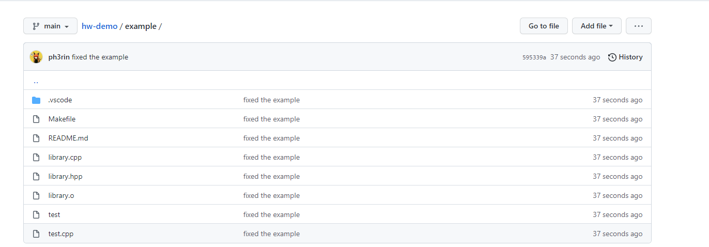
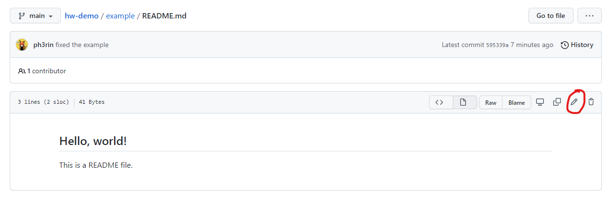

# Introduction to Git

[Git](http://git-scm.com/) is a distributed source code version control system.
When you place your code under version control, you record the changes you make to your files over time and you can recall the history of each of your file changes at will.

[GitHub](https://github.com/) is a development ecosystem based around git.
In this course, we will be using GitHub to host our lab git repository and help you save versions of your homework.

**If you have not done [Lab 0]({{ site.baseurl }}/labs/lab0) to set up your GitHub account or install Docker or a VM, please do so now.**

## Important: Using the correct terminal

In order to complete this lab, make sure you are using the correct terminal to run commands:

* If you are running Docker, then there are two types of terminals you are going to interact with:
  - The **Windows terminal** refers to the terminal provided by Windows, not docker. On Windows, type
    `Win + R` and then `powershell` to start it.
  - On **MacOS** you can use the built in Terminal app (search Terminal), or install an app like [https://iterm2.com/](iTerm2){:target="_blank"}. At this time, on MacOS we assume you are using Docker. (Fully native development **is** possible, just not supported by the course staff)
  - If the instructions specify **native** terminal, these commands are to be issued in either the MacOS or Windows terminal.
  - The **docker terminal** refers to the terminal you obtain by typing the following in your **native terminal**:

```shell
ch start csci104
ch shell csci104
```

From now on, every sequence of command we show you would be annotated with either *`[native]`* or *`[docker]`*. This denotes the
terminal you should be running the command from if you are using Docker. (If you are using the VM, then always use the VM terminal).

Examples (You do **NOT** need to run these commands):

*`[native]`*
```shell
notepad.exe cat.txt
```

The above command shall be ran from your **native terminal**.

*`[docker]`*
```shell
vim cat.txt
```

The above command shall be ran from your **Docker terminal**.

* If you are running the course VM (through Virtual Box), then **all commands** (both native and docker) from this lab shall be ran from
  the terminal within the VM. To open a terminal in the VM, press `Ctrl + Alt + T` (Windows) or `Cmd + Option + T` (Mac).
  Alternatively, you could open it by searching for "terminal" in the quick launcher:

<div style="text-align:center"></div>

## Creating a GitHub repo and obtaining the example files

### The Concept of the *working directory*

Every open terminal has a *working directory*. When you run a command inside that terminal,
the command would interpret paths and filenames to be relative to that working directory, for example:

```
mkdir sub
```

creates the subdirectory named `sub` under the current *working directory*. If the *working directory* is `/usr/root/parent`, then this will
create the directory `/usr/root/parent/sub`.

### Step 1. Changing working directory to Docker's assigned `/work` directory

First open your **native terminal**. Then, change the working directory to the
directory you [assigned to Docker during setup](https://github.com/csci104/docker#step-5-set-your-working-directory).

If you are working on the course VM, you may use any directory you like on the VM (e.g. `~/csci104`).

The command for changing the working directory is `cd` (which stands for "**c**hange **d**irectory"). In my case, the path to change to is:
`C:\Users\rin\Documents\csci104\home` (yours might be different, depending on how you configured your docker), therefore I just type:

*`[native]`*
```shell
cd C:\Users\rin\Documents\csci104\home
```

**Note: You will need double quotes around the path if your path contains space, e.g. `cd "C:\My Documents\Home"`**

If you have forgotten which path you have assigned to Docker, you could check it by typing:

*`[native]`*
```shell
ch list
```

And you will see an output that looks like:

```
Name:   csci104
        Image:  usccsci104/docker:20.04
        Volume: C:\Users\rin\Documents\csci104\home:/work
        SecOpt: seccomp:unconfined
        CapAdd: SYS_PTRACE
        Port:   :2222
```

The path after `Volume: ` (excluding `:/work`) is what you are looking for. The idea is that when you open and edit files in your native editor (VSCode, Xcode, Notepad++, TextMate, etc.) they will be saved in the working directory of the Docker image. Then when you run commands in Docker the files will be there.

### Step 2: Creating a GitHub repo and downloading the example resources

These step assumes that you have already finished the git, GitHub, Codio integration and SSH key setup from Lab 0. If you haven't done [lab 0](../lab0/) yet, do it now.

#### Step 2.1 Create a GitHub repo for this lab (for practice)

Navigate to [GitHub](https://github.com){:target="_blank"} and click the green "New" button. Or you can link there [directly](https://github.com/new){:target="_blank"}

- Make sure the "Owner" is set to your GitHub user and **not** any GitHub organizations you might be part of.
- Give the repo a good name like "104-practice" or "example".
- Make the repo private
- Don't add a README, a .gitignore or a license

Click "Create Repository"

When the repo is created GitHub will show the repo "URL" (either HTTPS or SSH). Copy the SSH version to your clipboard (there is a button for that).

#### Step 2.2 Creating an new repo on your development environment and connecting to GitHub

Once you are inside the correct working directory (i.e. within your csci104 folder that has the docker repo within it), type the following commands (**replace the `GHUSERNAME` with your GitHub username and `REPONAME` with the name of your repository**)

*`[native]`*
```shell
git clone git@github.com:GHUSERNAME/REPONAME.git (this is the thing you copied)
cd REPONAME
echo "# Lab 1 Git Practice" > README.md
git add README.md
git commit -m "first commit"
git branch -M main
git push -u origin main
```

#### Step 2.3 Getting the Resources from the Lab Repository

This lab looks a little different from the rest of the labs you will be doing this semester, as we made you create your own GitHub repository to practice with for this one. Usually, you can just code directly in the sp24-labs repository without having to do any copying, but for the sake of this assignment so everyone can practice pushing, there will be some copying.

In your terminal, change directories from the folder that you just made for your practice repo to the sp24-labs folder. For example, for me:

*`[native]`*
```shell
pwd
    --> /Users/bridgetbell/desktop/code/usc/cp104/practice
cd ..
pwd
    --> /Users/bridgetbell/desktop/code/usc/cp104
cd sp24-labs
pwd
    --> /Users/bridgetbell/desktop/code/usc/cp104/sp24-labs
```

The pwd command shows the full path of your current directory. `cd` with a space and two periods after it goes back a directory.

Now, pull the resources!
*`[native]`*
```shell
git pull
```

You should see something come up about a lab1 folder.

### Step 2.4 Copying the Files to Your Practice Repo

Now, we will copy the **lab1 folder** from the sp24-labs folder over to the practice repository we created. While we could do this with our computer GUI by dragging and dropping the files, let's practice it through the command line!

This is the general command:

*`[native]`*
```shell
cp /path/of/source/folder /path/of/destination/folder
```

For me, this would then be:
*`[native]`*
```shell
cp -r /Users/bridgetbell/desktop/code/usc/cp104/sp24-labs/lab1 /Users/bridgetbell/desktop/code/usc/cp104/practice
```
You may have to change this based on the name of your folders.Modify this command above so it works for you, then within the *destination* folder (the practice repo), type

*`[native]`*
```shell
ls
```

Now you should see a folder called lab1!

## Running the Code

The lab 1 code you just copied over is great for testing whether you have the correct environment setup to compile the rest of the labs (and homeworks if you so choose). Make sure you follow the steps below and the output on your terminal matches the ones on this page.


### Step 3. Building the  project

Let's get docker up and running so we can test the code.

*`[native]`*
```shell
ch start csci104
ch shell csci104
```

This will take you to the csci104 folder you mounted. You *should* see the sp24-labs folder in this folder if you cloned it there. If you cloned this repo somewhere else, it needs to be accessible to docker!!! i.e. a subdirectory of wherever the mount point was.

Navigate to your example repo and the lab1 folder:
*`[docker]`*
```
cd example/lab1
```
**Note:** this assumes your example repo is at the root where your shell launches (i.e. the csci104 folder). If you get a error like `no such file or directory` then your shell isn't in the right place. Practice navigating around on the command line using `cd` to get to the right place.

Then, run the following command within the new lab1 folder:

*`[docker]`*
```
make run
```

If the build is successful, you should see something like this:

```
Running main() from /build/googletest-j5yxiC/googletest-1.10.0/googletest/src/gtest_main.cc
[==========] Running 3 tests from 2 test suites.
[----------] Global test environment set-up.
[----------] 2 tests from SimpleReturnTest
[ RUN      ] SimpleReturnTest.Returns42
[       OK ] SimpleReturnTest.Returns42 (0 ms)
[ RUN      ] SimpleReturnTest.Returns37
test.cpp:12: Failure
Expected equality of these values:
  returns_37()
    Which is: 36
  37
[  FAILED  ] SimpleReturnTest.Returns37 (0 ms)
[----------] 2 tests from SimpleReturnTest (0 ms total)

[----------] 1 test from SummationTest
[ RUN      ] SummationTest.SumsAreEqual
[       OK ] SummationTest.SumsAreEqual (0 ms)
[----------] 1 test from SummationTest (0 ms total)

[----------] Global test environment tear-down
[==========] 3 tests from 2 test suites ran. (0 ms total)
[  PASSED  ] 2 tests.
[  FAILED  ] 1 test, listed below:
[  FAILED  ] SimpleReturnTest.Returns37

 1 FAILED TEST
make: *** [Makefile:8: run] Error 1
```

You **don't** have to worry about the red `[FAILED]` message as long as it shows up (it is intentional),
but in case it does not show up, please ask for help from your lab instructor.

### Step 4. Fixing the FAILED test case

What you have just seen above is an example of an automated test. We run automated tests to grade your
assignments, and you will learn more about them in later labs. For now, you could just think of them
as programs that feeds some input into your assignment code and test whether they produce the correct
output.

Obviously, it is not good to have a FAILED test case! (You would lose points in an actual assignment if your
program fail our test cases) So let's fix it!

Open `library.cpp` and look at the function `int returns_37()`. As you can see it returns `36` instead of
the suggested `37`. If you look at the FAILED test case carefully you would see:

```
Expected equality of these values:
  returns_37()
    Which is: 36
  37
```

which points to exactly the same issue.

Therefore, change the return value to `37` and run `make run` again. This time every test should pass.

### Step 5. Committing and pushing your changes

Now that you have finished the work locally, you would also want to push the changes to GitHub.

To do so, open your **native** terminal (you can exit docker by typing `exit`) , and change
the working directory to the root of your practice repo. Then type

*`[native]`*
```
git status
```

The output should look like this:

```
Your branch is up to date with 'origin/main'.

Untracked files:
  (use "git add <file>..." to include in what will be committed)
        lab1/
```

which means that nothing from your `lab1` directory is tracked by git.

To track those files run the following command:

*`[native]`*
```
git add .
```

This command tells git to track all modification you have done to the repo (adding a new file, modifying a file, deleting a file, renaming a file, etc.). You could also specify individual files to track by providing their name instead of `.` (e.g. `git add library.cpp`).

Now, if you check `git status`, you would see:

```
On branch main
Your branch is up to date with 'origin/main'.

Changes to be committed:
  (use "git restore --staged <file>..." to unstage)
        new file:   lab1/.vscode/launch.json
        new file:   lab1/.vscode/settings.json
        new file:   lab1/.vscode/tasks.json
        new file:   lab1/Makefile
        new file:   lab1/README.md
        new file:   lab1/library.cpp
        new file:   lab1/library.hpp
        new file:   lab1/library.o
        new file:   lab1/test
        new file:   lab1/test.cpp
```

(you may or may not have the .vscode folder and files, depending on your editor and settings; if you don't see it, no worries! )

All the changes are now ready to be *committed*. You could now run the following command:

*`[native]`*
```
git commit -m "fixed the example"
```

This tells git to create a snapshot of the repository that reflects the changes you just asked it to track.
The snapshot is called a **commit**. Each commit must have a message, as specified by the `-m` option. It can be anything,
but it's a good practice to keep it informative of what changes you have made.


Now, if you type `git status`, you would see:

```
On branch main
Your branch is ahead of 'origin/main' by 1 commit.
  (use "git push" to publish your local commits)

nothing to commit, working directory clean
```

This tells that your local repo has one commit that the remote does not have. To
upload the commit, simply type:

*`[native]`*
```
git push
```

Now, if you everything runs successfully, the changes you have made would be synced to GitHub. Go to
the repo page on GitHub, and navigate to `example`, you should see the following files:

<div style="text-align:center"></div>

If you read the `library.cpp` file, you should be able to see the code you have just modified.

However, if you look at the `example` directory (in the image above), you would see the file `test`. That is the binary files created by the `make run` command while building
the project. As a good practice you should never push anything generated by a build process. We would deduct
points if you submitted your assignment with those files (unless otherwise specified).

**NOTE: You may not be able to see the `library.o` file on GitHub, that is to be expected
with the homework repository.**

### Step 6. Removing the extra files from your repo

To tell git to remove the file from the repo, then type the following:

```
git rm lab1/test
```

This will remove the two files from the directory and ask git to track the removal.

### Step 7. Prevent accidentally adding files with .gitignore

The `git rm` command only solves the problem temporarily. What if in the future you run `make run` again and
generated the files again? It would be an annoyance to run `git rm` every time you push.

Fortunately, git offers a way to prevent files from being tracked by the `git add` command. To achieve this,
create a file called `.gitignore` (with no extensions) in your `lab1` directory, and open it in a text editor or IDE.

**NOTE: a file or directory starting with `.` is hidden by default on most systems. To make your system show
those files, follow these instructions:**

* [Windows](https://support.microsoft.com/en-us/windows/view-hidden-files-and-folders-in-windows-97fbc472-c603-9d90-91d0-1166d1d9f4b5#WindowsVersion=Windows_10),
* [Mac](https://www.pcmag.com/how-to/how-to-access-your-macs-hidden-files)

Once you are inside the text editor, add the following lines:

```
test
*.o
```

The first line tells git to ignore any file
named `test`. The second line tells git to ignore all files with a .o extension.

Note that since the `.gitignore` file is placed under
the `example` directory, the rules would only be enforced
there. In general you would want separate `.gitignore` files
for each of your assignment.

*`[native]`*
```
git add .
git status
```

you would see something like:

```
Your branch is up to date with 'origin/main'.

Changes to be committed:
  (use "git restore --staged <file>..." to unstage)
        new file:   .gitignore
        deleted:    test
```

You could then commit and push the changes to GitHub:

*`[native]`*
```
git commit -m "removed extra files and added .gitignore"
git push
```

If you now go to the GitHub repo page, you would see that `test` is no longer there.


### Step 8. Modifying a file on GitHub

Finally we'll practice another pull by modifying files on the webiste.

First navigate to the `README.md` file in your `lab1` GitHub repo page, and
click the pencil icon (see the image below):

<div style="text-align:center"></div>

Then make an edit to the markdown file (any edit will do), and click `Commit Changes`:

<div style="text-align:center"></div>

** Note in general we do not recommend modifying files directly on GitHub, it is used
here just for demonstration purposes **

### Step 9. Pulling the change

Now change your directory into `lab1` in your local terminal, and then type:

*`[native]`*
```
git pull
```

The output should look like this:

```
remote: Enumerating objects: 7, done.
remote: Counting objects: 100% (7/7), done.
remote: Compressing objects: 100% (3/3), done.
remote: Total 4 (delta 1), reused 0 (delta 0), pack-reused 0
Unpacking objects: 100% (4/4), 742 bytes | 32.00 KiB/s, done.
From github.com:ph3rin/hw-demo
   dcdcc61..eb57bef  main       -> origin/main
Updating dcdcc61..eb57bef
Fast-forward
 example/README.md | 2 +-
 1 file changed, 1 insertion(+), 1 deletion(-)
```

Now if you read the `lab1/example/README.md` file on your local machine, it should
match the one on GitHub!

## In Closing

There are tons of git cheatsheets all over the web.
Here's [one by Tower](https://www.git-tower.com/blog/git-cheat-sheet/) and [another by Atlassian](https://www.atlassian.com/git/tutorials/atlassian-git-cheatsheet).
You can use one of these your make your own; git has a bit of a learning curve and at the end of the day comes down to memorizing the most useful commands and what they do.
Don't worry if it takes a little while.