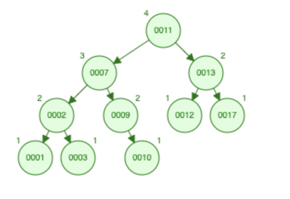
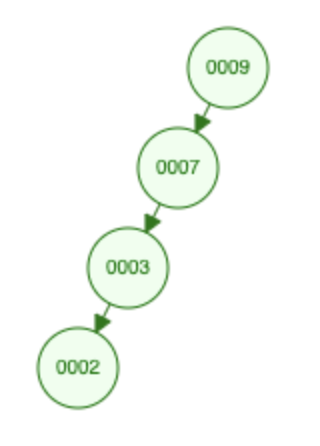

## Midterm Review

### Introduction

This lab will be covered during lab sections between Wednesday, March 24 and Tuesday, March 30, 2021. **There is no checkoff for this lab.**

The midterm will take place on **Thursday, April 1st** (THIS IS NOT A JOKE!) If you need time zone accommodations, please email Prof. Cote.

You won't be tested on any programming tools that you've gone over in lab but not lecture (e.g. gdb, Makefiles). This lab is to help you review and will mostly cover problems taken or modified from the sample midterms and quizzes under the [Resources](https://bytes.usc.edu/cs104/resources) page, as well as labs from previous semesters. If there's a topic you want to skip, or a topic that's not included here that you really want to go over, let us know! As long as this lab is, it is by no means exhaustive, so remember to go back and review lecture slides as well.

### Binary Tree Recursion

Given a binary tree, return true if the tree is symmetric and false if it is not. We will define a symmetric tree to be one where the left & right subtrees are mirror images of one another. An empty tree is symmetrical.

Example of a symmetrical tree:
```
             1
            /  \
           2    2 
          / \   / \
         4   3  3  4 
```
Examples of asymmetrical trees:
```
             1
            /  \
           3    2 
          / \   / \
         4   3  3  4 

             1
            /  \
           2    2 
            \   / \
             3  3  4 
```

- [ ] Implement `isSymmetrical` in `symmetrical.cpp`

### AVL Trees

<div style="text-align:center"></div>

Draw the tree representation of the AVL tree after each of the following operations, using the method presented in class (if appropriate when deleting, choose your successor to swap with). Your operations are done in sequence.

- [ ] Insert 4
- [ ] Insert 19
- [ ] Remove 1
- [ ] Insert 5
- [ ] Delete 13
- [ ] Delete 2

### Splay Trees

<div style="text-align:center"></div>

Draw the tree representation of the splay tree after performing the following operations:

- [ ] Insert 1
- [ ] Find 3
- [ ] Remove 3

### Counting

For these questions, you do not need to simplify your answers/plug things into a calculator.
- [ ] One of the many talents of our CP, Clement, is his ability to sing the ABCs backwards. Let’s challenge Clement to sing the alphabet song in a different order. How many ways can we arrange the 26 letters of the alphabet? For brownie points, turn on your mic and demonstrate how to sing one of these “ways.”
- [ ] How many ways can we arrange the 26 letters of the alphabet, such that A always comes before Z?
- [ ] You draw 4 cards from a standard deck (52 cards, no Jokers). In how many ways can you get 2 pairs? KKQQ is the same as QQKK.
- [ ] How many nonnegative integer solutions are there to `x1 + x2 + x3 + x4 + x5 + x6 + x7 = 99`? 

