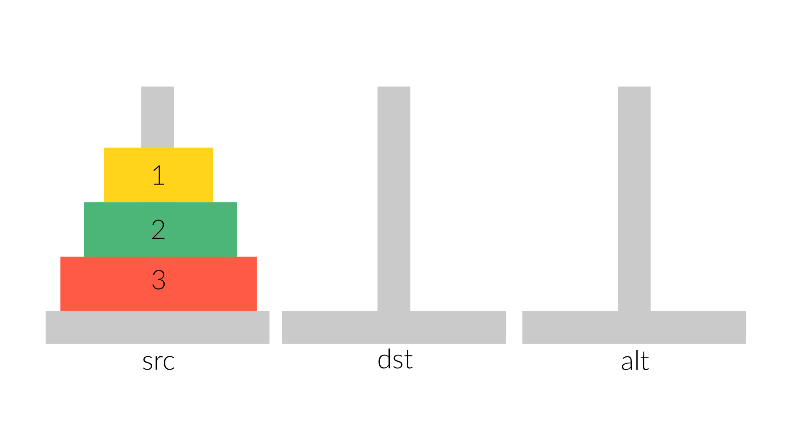
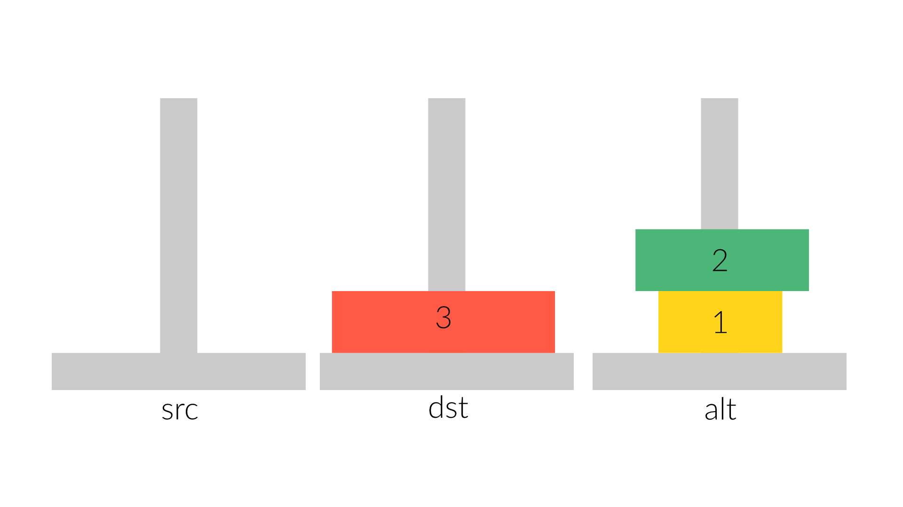
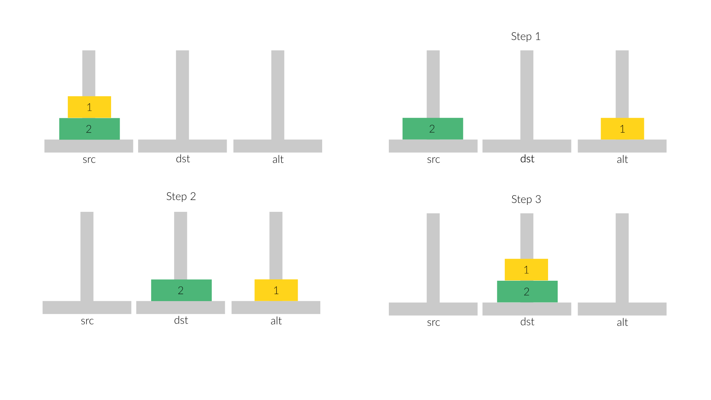
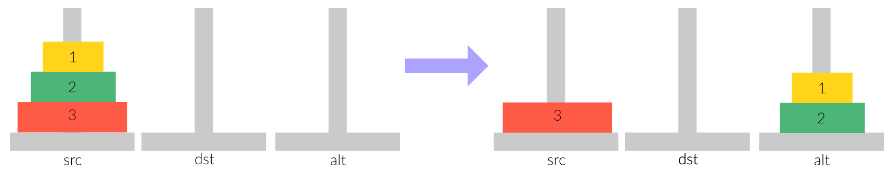
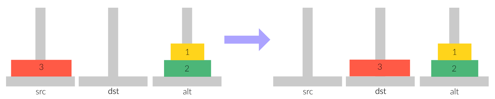
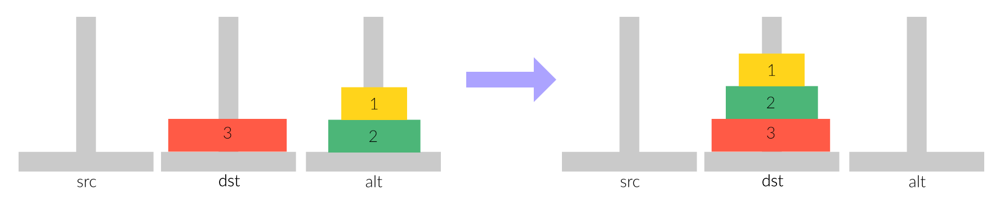

## Recursion Review

### Tower of Hanoi

This week, we will be going over another classic problem in recursion: the Tower of Hanoi puzzle.

The Tower of Hanoi is a game involving three pegs (or "towers") and `n` discs of varying size. We'll label our discs 1 to `n` and we'll name our towers `src` (for "source"), `dst` (for "destination"), and `alt` for ("alternative").

Here's what the game looks like with three discs:
<div style="text-align:center"> </div> 

In the beginning of the game, all of the discs are stacked on one peg (the "source" peg) in order of largest to smallest. In other words, the largest disc (disc `n`) is on the bottom and the smallest disc (disc 1) is on the top, as shown above. The goal of the game is to move the entire stack from the source tower to another "destination" tower, while obeying 2 rules:
1. You cannot place a larger disc on top of a smaller disc.
2. You can only move one disc at a time.

For example, this is not allowed:
<div style="text-align:center"> </div>

To illustrate, here are a few examples.

#### Example 1: One Disc
Let's start with a pretty trivial example, with a game of 1 disc. Hopefully, you can tell that this can be solved by simply moving (1) from `src` to `dst`.

#### Example 2: Two Discs
Now, let's run through an example using 2 discs. This puzzle can be solved by moving (1) to `alt`, (2) to `dst`, and (1) to `dst` for a total of 3 moves. 

<div style="text-align:center"> </div>

#### Example 3: Three Discs
Finally, here's another example with 3 discs. We've already established above that we can move 2 discs, so let's move the smallest two discs out of the way to `alt`, for a total of 3 moves. 

<div style="text-align:center"> </div>
With (1) and (2) out of the way, we are now free to move (3). We'll move (3) to `dst`.

<div style="text-align:center"> </div>

Note how when we only have one disc remaining in `src`, and an empty `dst` tower, the problem becomes trivial. After moving (3) to `dst`, we just have to move discs (1) and (2) to `dst`. 
+ Again, we've already established that we can do this with 3 moves (ie, (1) to `src`, (2) to `dst`, and (1) to `dst` to solve the puzzle for a total of 7 moves.)

<div style="text-align:center"> </div>

### Recursion

Recall that recursion is particularly useful when the problem we want to solve can be broken down into smaller subproblems. You may have noticed that in the above example, solving a game where with `n = 3` discs can be broken down into 3 steps:
1. Move  `n - 1 = 2` discs from `src` to `alt`
2. Move disc `n = 3` from `src` to `dst`
3. Move `n - 1 = 2` discs from `alt` to `dst`

We can generalize the 3 steps above for any `n` number of discs. For example, if we have 4 discs, we can first move discs (1) to (3) from `src` to `alt`, then move disc (4) to `src`, then move discs (1) to (3) from `alt` to `src`. The puzzle for `n = 4` can be solved in a total of 7 + 1 + 7 = 15 moves.

As you can probably tell by now, this makes recursion a great way to solve the Tower of Hanoi puzzle. Let's go through it together!

#### Pseudocode
First, we need to ask ourselves: what is our base case? What is our recursive case?

Based on the above examples, you may have observed that disc (1) is always movable. We'll let `n == 1` be our base case. Here's the pseudocode for solving Towers of Hanoi:
```
// Base Case
if (n == 1) {
	// Move disc 1 from src to dst
}
// Recursive Case
else {
	// Move n - 1 discs from src to alt
	// Move disc n from src to dst
	// Move n - 1 discs from alt to dst
}
```

### Class Exercise: Implement solveTowers
Our first task for today is to implement `solveTowers` recursively. Let's replace the pseudocode above with real code!

- [ ] Implement `solveTowers` in `hanoi.cpp`
+ You can compile it with `g++ -g -Wall -std=c++11 hanoi.cpp -o hanoi`

### Runtime
What is the runtime of `solveTowers`? Let's set up the recurrence relationship. `T(1)` is easy, because that's our base case. For our recursive cases, `T(n)`, we'll go through the three steps outlined in the pseudocode: move `n-1` discs from `src` to `alt`, move disc `n` from `src` to `dst`, and move `n-1` discs from `alt` to `dst`. We can write our recurrence relationship like so:
```
T(1) = 1
T(n) = T(n - 1) + 1 + T(n - 1) = 2T(n - 1) + 1
```

There are different ways to solve this recurrence relationship, but let's try unrolling it to see if we can find a pattern. To unroll, keep replacing `T(n)` with the right hand side of the recurrence relationship until you hit the base case, `n = 1`.
```
T(n) = 2T(n - 1) + 1 // note how T(n - 1) = 2T(n - 2) + 1
= 2[2T(n - 2) + 1] + 1 = 4T(n - 2) + 1 + 2
= 4[2T(n - 3) + 1] + 2 + 1 = 8T(n - 3) + 1 + 2 + 4
= 2^k * T(n - k) + 1 + 2 + 2^2 + ... + 2^(k - 1)
```
Since our base case is when `n = 1`, we want to stop when `n - k = 1`, or when `k = n - 1`. Substituting this for `k`, we get:
```
T(n) = 2^(n - 1) * T(1) + 1 + 2 + 2^2 + ... + 2^(n - 2)
```

Using this, can you write a closed form solution? Hint: you will probably need to use the geometric series!

### Checkoff: More Recursion!
For checkoff, we have two more very exciting recursion problems for you. Recursion is not easy, but it can be mastered with practice!

#### Is Symmetrical
Given a *binary tree*, return true if the tree is symmetric and false if it is not. We will define a symmetric tree to be one where the left & right subtrees are mirror images of one another. An empty tree is symmetrical.

Example of a symmetrical tree:
```
             1
            /  \
           2    2 
          / \   / \
         4   3  3  4 
```
Examples of asymmetrical trees:
```
             1
            /  \
           3    2 
          / \   / \
         4   3  3  4 

             1
            /  \
           2    2 
            \   / \
             3  3  4 
```

- [ ] Implement `bool isSymmetrical(Node *root)`
  + To test, run `make SymmetricalTest`
  + Feel free to use helper functions!
- [ ] In a file named `lab11.txt`, **trace** the recursive calls of `isSymmetrical` when it is given the following *asymmetrical* tree:
```
             1
            /  \
           3    3 
          / \   / \
         4   3  2  4
```

#### All Letter Combinations
Given a set of characters in a vector called `letters` and an integer length `n`, find all the n-length combinations of letters.

For example, if `n = 2` and letters contains: U S C, your output vector should have the following strings:
```
UU
US
UC
SU
SS
SC
CU
CS
CC
```
- [ ] Implement `vector<string> allCombos(const vector<char>& letters, int n);`
  + To test, run `make AllCombosTest`
  + Feel free to use helper functions!


