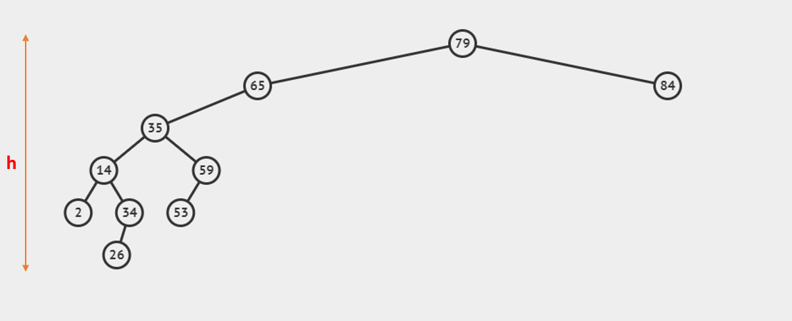
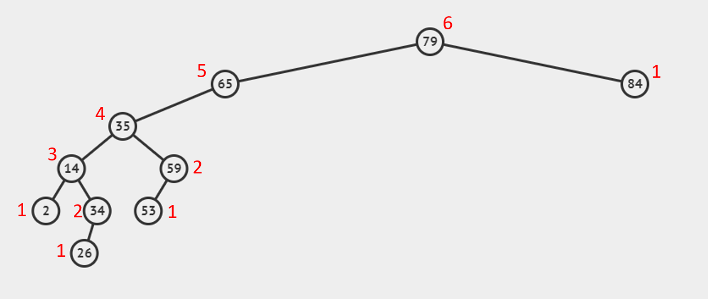
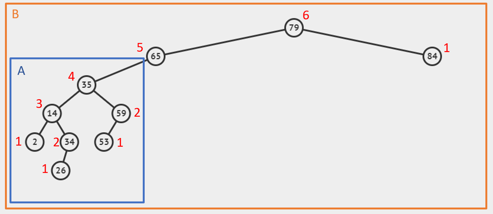
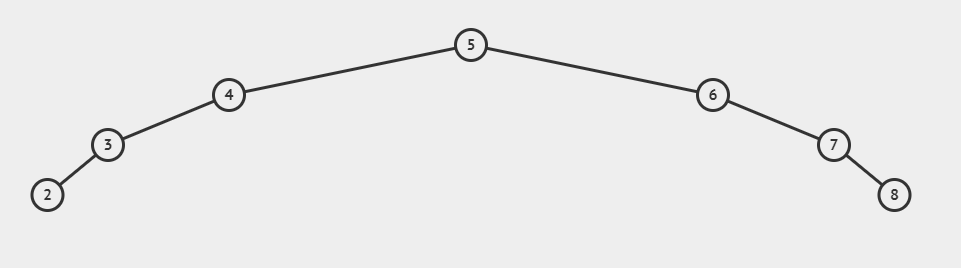
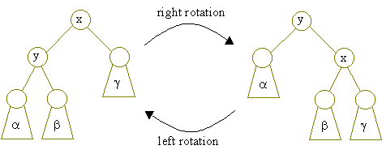
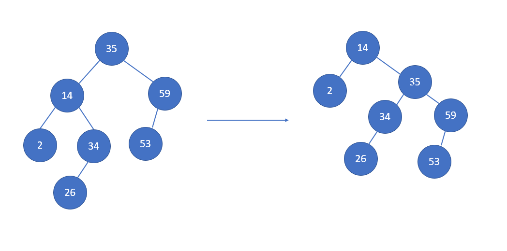

---

**Due Fri, Nov 19 @ 7pm**

This lab would be covered during sections on Nov 9, Nov 10, Nov 18, and Nov 19.

---

## Height of a binary tree

Intuitively speaking, the height of a binary tree is the distance between the root node and the leaf nodes at the deepest level.

 

Why is it important? Because when you are finding something in a BST you walk down the tree from the root until you find the element (or become sure that it is not in the tree). In the worst case, you would have to walk all the way down to the deepest level. The height of the tree would tell you how many steps you'd have to walk.

## Calculating the height

Here is how you calculate the height of a tree:

```
Height of tree =
    0, if tree is empty;
    max(height of left subtree, height of right subtree) + 1;
```

For example, the height of the tree above is as followed. **Every number labeled next to a node denotes the height of the subtree whose root is that node**.

 

## Balanced binary tree

A binary search tree is said to be balanced if

* It's empty, or
* Both it's left and right subtree are balanced, and their height differ by no more than 1.

In a balanced binary tree, the height of the tree is $O(\log n)$, where $n$ is the number of nodes in the tree.

For example, tree A in the below image is balanced, while tree B is not.

<div style="text-align:center"></div>

As another example, the tree below is unbalanced, since even if it looks like the left subtree and right subtree are of the same height, they themselves are unbalanced.


<div style="text-align:center"></div>

## Binary search tree rotation

A rotation changes the local structure of a binary tree without changing its ordering. This means that in between rotations, the BST property is still maintained.

Rotations can be broken up into left and right rotations which are just inversions of each other.

<div style="text-align:center"></div>

As a convention, we call the above right rotation "a right rotation at node x", and the left rotation "a right rotation at node y".

As an example, the following operation is a right rotation at node 35.

<div style="text-align:center"></div>

Why is rotation important? Because you can make an unbalanced binary search tree balanced by doing a sequence of rotations!

## Exercises

Find a sequence of rotations that would make the following tree balanced:

<div style="text-align:center"></div>

- [ ] To get checked off, show a CP your solution. If you are checking off via Piazza, also include your USC email and USC ID.