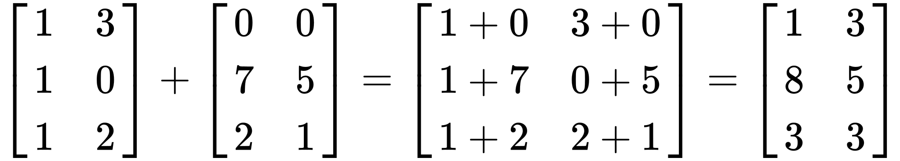
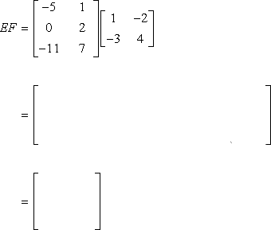

# The Rule of Three


In this lab we will go over <b>destructors, copy constructors, copy assignment operators</b>, and why we need <b>the rule of three</b>.
We will get hands-on experience experimenting with the rule of three on a simple `Array` class and a more complex `Matrix` class.
Before we introduce the rule of three, we first need to review how memory is allocated:

## Review: Memory

C++ supports two basic types of memory allocation, allocation on the stack and allocation on the heap.
A more detailed explanation of the difference between the stack and the heap can be found <a href="https://www.gribblelab.org/CBootCamp/7_Memory_Stack_vs_Heap.html">here</a>.

### Stack Allocation

Allocation on the stack does not require the use of the `new` keyword.
Variables created without `new` are allocated on the stack:

```c++
int func() {
	// a, b and c are allocated on the stack
	int a = 10;
	int b = 20;
	int c = 30;
	return a + b + c;
}
```

For allocation on the stack:

- The size of the variable must be known at compile time.
- Memory is automatically allocated on the stack when the variable is declared.
  It is automatically deallocated when they fall out of scope. 
  The variables `a`, `b`, and `c` in the above function fall out of scope once execution exits the function, and that is when they are automatically deallocated.

### Heap Allocation

Allocation on the heap (a.k.a. dynamic memory allocation) involves the use of the `new` keyword.
Memory allocated on the heap stays on a separate memory storage base (the heap) until it is deallocated, or once we `delete` it. 


## Array

To get started, let's look at an example array class provided in part 1:

```c++
class Array {
public:
	Array();
	~Array();
	Array(const Array& other);
	Array& operator=(const Array& other);

	Array operator+(const Array& other) const;

	int at(size_t index) const;
	size_t size() const;
	void push(int value);

private:
	int* data;
	size_t _size;
};
```

A shallow copy of an object copies all of the member field values.
For example, all that a shallow copy of our `Array` class would do is copy over the only member field, `int* data;`.

```c++
Array copy_shallow(const Array& original) {
	Array copy;
	copy.data = original.data;
	return copy;
}
```

A deep copy copies all fields, and makes copies of dynamically allocated memory pointed to by the fields.
A deep copy of our `Array` class will not copy the memory address of the original `Array` object's data pointer, but the actual array values pointed to by the data pointer:

```c++
Array copy_deep(const Array& original) {
	Array copy;
	copy.data = new int[original.size];
	copy.size = original.size;
	for (size_t i = 0; i < original.size; i++) {
		copy.data[i] = original.data[i];
	}
	return copy;
}
```

### The Rule of Three

The Rule of Three is a rule in C++ to protect code against exceptions.
**If a C++ class defines one of the following it should probably explicitly define all three**:

- **Destructor**
- **Copy constructor**
- **Copy assignment operator**

If you have no idea what every one of them means right now, don't worry. We are about to go over each and see why we need it in our `Array` class.  

By default, all three function are commented out (unimplemented). 

### Destructor

A destructor is used to destruct an object and free any resources it holds.
For example, if an object holds dynamic memory, you would want to free that memory when the object is destroyed.
An example of a destructor for our `Array` class should delete the memory stored inside `int* data;`:

```c++
Array::~Array() {
	delete[] this->data;
}
```

Let's run `make`, which will run the tests through Valgrind and determine whether memory is being leaked, and if so, how much.
The commands to make and run are:

```
make tests
```

- [ ] Run `Make` on the array files.

You should see something like this at the bottom:

```
==3601== HEAP SUMMARY:
==3601==     in use at exit: 72,768 bytes in 4 blocks
==3601==   total heap usage: 193 allocs, 189 frees, 118,287 bytes allocated
==3601== 
==3601== LEAK SUMMARY:
==3601==    definitely lost: 64 bytes in 3 blocks
==3601==    indirectly lost: 0 bytes in 0 blocks
==3601==      possibly lost: 0 bytes in 0 blocks
==3601==    still reachable: 0 bytes in 0 blocks
==3601==         suppressed: 72,704 bytes in 1 blocks
==3601== Rerun with --leak-check=full to see details of leaked memory
```

We passed all the tests but we have memory leaks.
This is because we haven't implemented our destructor.
Without the destructor we cannot handle memory leaks, so we have to implement the destructor.
Let's go into `array.h` and `array.cpp` and uncomment the destructor.

- [ ] Uncomment the destructor.

### Copy Constructor

A class constructor that is used for creating a new object as a copy of an existing object.
For example, a copy constructor for our `Array` class should copy all the data in the existing `Array`:

```c++
Array::Array(const Array& other) {
	this->data = new int[other._size];
	this->_size = other._size;
	for (size_t i = 0; i < other._size; ++i) {
		this->data[i] = other.data[i];
	}
}
```

Now that we have the destructor, let's pretend to be lazy and not follow the rule of three.
Let's leave the copy constructor and copy assignment operator commented (unimplemented), and again make and run the tests through Valgrind.

```
Delete called on memory address: 0x2403c90
Delete called on memory address: 0x2403c90
*** Error in `./main': double free or corruption (fasttop): 0x0000000002403c90 ***
...
```

It looks looks like we called `delete` twice on the same memory address, hence the warning about a double free.
How did it happen?

By default and without us overloading it, the compiler generates a copy constructor for us that does a <b>shallow copy</b>, similar to this:

```c++
Array::Array(const Array& other) {
	this->data = other.data;
}
```

Can you see a potential problem it will have with our Array?
Take a second look at what our destructor does:

```c++
Array::~Array() {
	delete[] data;
}
```

So if we leave out the copy constructor and use the default shallow copy constructor, the objects we are copying from and to will share the same memory address.
This means that `delete` will be invoked twice on that same memory address when these two objects get destroyed, hence the `double free` memory corruption and the segfault.

What would happen if we overload the copy constructor and do a **deep copy** instead? 

As we can see in the copy constructor code for the `Array` class above, a different piece of memory is allocated and its address given to `this->data`.
`this->data` and `other.data` no longer point to the same memory address, but they still have the same content as we used a for loop to copy the values in `other.data` to `this->data`.
When the destructors get called, `delete` will be called once on each of the two memory addresses. 

This is why we need the copy constructor.
Uncomment the copy constructor from `array.h` and `array.cpp` and rerun the tests.

- [ ] Uncomment the copy constructor.
- [ ] Rerun the tests with `make`.

```
[ RUN      ] ArrayTest.CopyConstructor
Delete called on memory address: 0x5ce0090
Delete called on memory address: 0x5ce0030
[       OK ] ArrayTest.CopyConstructor (3 ms)
```

We still fail the last test which uses copy assignment operators, but we now pass the test using copy constructors.
Also notice how delete is being called on different memory addresses now that we overloaded the copy constructor.

### Operator Overloading

There are many symbols that denote certain functions in C++, like addition (+) or subtraction (-).
A programming language knows to output `4` when you pass it `2+2` or even `"catdog"` for `"cat" + "dog"`, but how would it react to an addition between two instances of our homemade `Array` class?
Operator overloading allows the programmer to specify what should happen in these situations.
In our `Array` class, we may assume that adding two arrays means concatenating them:

```c++
Array Array::operator+(const Array& other) {
	Array result;
	result._size = this->_size + other._size;
	result.data = new int[result._size];

	// Copy this
	for (size_t i = 0; i < this->_size; i++) {
		result.data[i] = this->data[i];
	}

	// Copy other
	for (size_t i = 0; i < other._size; i++) {
		result.data[i + this->_size] = other.data[i];
	}

	return result;
}
```

Operator overloading works for the `*`, `=`, and all of the other operators available in C++.
Just replace the `+` symbol with `*` or `=`, etc.

### Copy Assignment Operator

When we do operator overloading for the `=` symbol, we are overloading the copy assignment operator.
The copy assignment operator is invoked when the user of our class does something like `Array a; Array b; ...; a = b;`.
After `a = b`, whatever `a` contains before `a = b` should go away and be replaced by what `b` contains.
In other words, the copy assignment operator needs to: 

- wipe old data, and
- overwrite it with data of the variable after the `=` sign.

A copy assignment operator also needs to return a reference to the object itself to allow for operations like `a = (b = c)`, which is equivalent to `b = c; a = b;`.

```c++
Array& Array::operator=(const Array& other) {
	delete[] this->data;  // wipe old data
	this->data = new int[other._size];
	this->_size = other._size;  // replace with data from other
	for (size_t i = 0; i < other._size; ++i) {
		this->data[i] = other.data[i];
	}
	return *this;
}
```

Just as with copy constructors, the default copy assignment operators the compiler provided for us does a **shallow copy**.
This will lead us to the same problem we have before: calling `delete` on the same memory address more than once.
The consequence, as we see in our test results, is another segfault.
To fix that, we will employ the same methodology and overload the copy assignment operator to do a deep copy.

- [ ] Uncomment the assignment implementation.

Note that different from our implementation of the copy constructor, we have a `delete` statement on `this->data` before we do the deep copy.
This is because if we do the deep copy right away, we will lose reference to what is still left in `this->data` and cause a memory leak. 
You should now see all the tests pass.

## Tips for Implementation

Before we dive into implementation, here are some tips in implementing the rule of three:

- Destructor:
	- Make sure to free every pointer in the destructor.
	- For example in a 2d array, which is stored as an array of pointers, we need to first free every pointer inside the array then free the array itself.
- Copy constructor:
	- Make sure that you do a deep copy for all the pointers and a shallow copy for the non-pointer values.
	- It is pretty easy to miss the shallow copy on the non-pointer values when we are focusing on the deep copy for the pointers.
- Copy assignment operator:
	- Wipe all the data contained in `this`.
	- Do the deep copy as in the copy constructor.
	- `return *this;`.


## Matrix

"Matrix" is a mathematical term for a rectangular, 2-dimensional array of numbers, symbols, or expressions arranged in rows and columns.
Application of matrices can be found in many scientific fields.
In computer science they are widely used in machine learning, computer graphics and even within Google's PageRank algorithm!

### Matrix Addition

Matrix Addition is rather trivial.
It only works on matrices with the same number of rows and columns.
**We will not ask you to add matrices of different sizes**.
The sum of matrix A and B is computed by adding up corresponding elements of A and B, as demonstrated:

<div class="showcase">
	
</div>

### Matrix Multiplication

Matrix Multiplication only works when the number of columns in the first matrix is equal to the number of rows in the second matrix.
If you multiply a matrix of `n` x `k` by `k` x `m` size you'll get a new one of size `n` x `m`.
**We will not give you unmultipliable matrices to multiply**.
To compute the element at the `i`th row, `j`th column of the resulting matrix, you take the `i`th row of the first matrix and the `j`th column of the second matrix, which should both be of length `k`, then multiply them element-wise before summing up the result of each multiplication. 
The following animation shows how matrix multiplication works:

<div class="showcase">
	
</div>

If you are more comfortable with formulas, a formal definition of matrix multiplication is on <a href="https://en.wikipedia.org/wiki/Matrix_multiplication">Wikipedia</a>.

### What We Implemented For You

- We have implemented the **default constructor** and the **constructor using initializer lists**.
  Initializer lists are outside the scope of CSCI 104, so for now consider the implementation a blackbox.
  Please do not fiddle with it before you finish the lab.
- We have overloaded **the `==` operator** so that we can test the results of your implementation.
  It goes through each element in the `data` array of the objects being compared to see if they are the same.
- To make the matrix easily displayable we overloaded **the `<<` operator** of `Matrix`.
  This means that you can do `std::cout << matrix << std::endl;` to print out the matrix.
  It also works with `GTest` so when a test fails it will output the actual and expected matrix.

### Your Task

Your task today will be to implement the:

- destructor,
- copy constructor, and
- copy assignment operator 

of a `Matrix` class. You will also overload the

 - `+` operator for matrix addition and
 - `*` operator for matrix multiplication.

All matrices given will be valid for operations according to the rules we explained above for matrix addition and multiplication.
Here again are the commands to make and run the tests:

```
make tests
```

You can also run `make clean` to clear all the executables.
We recommend that you implement the rule of three before diving into operator overloading.
If you implement the rule of three correctly, you should pass the first three tests without memory leaks. 

- [ ] Implement the constructor, destructor, and copy constructor.
- [ ] Implement the additional operators.

Once you pass all the tests, you have just made a matrix class that can be used in C++ for a variety of different projects.
This is definitely not an easy lab, so kudos!
Show your work and the test results to a CP or TA to get checked off!

- [ ] Pass the tests.
- [ ] Get checked off by a TA.


