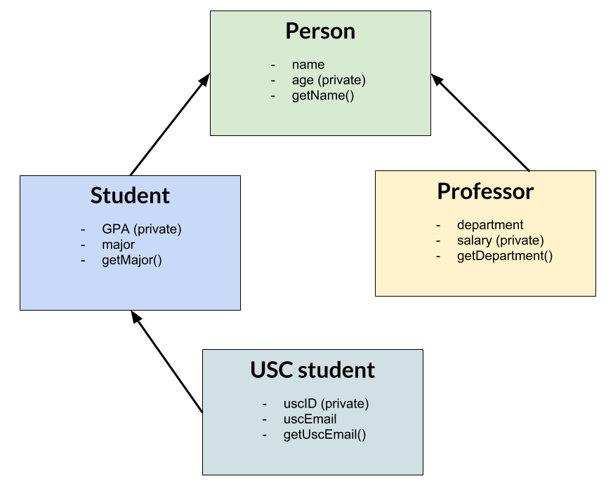

---

**Due at the end of your registered lab section**

---

## Inheritance and STL

### Why do we use inheritance?

You've learned in your intro CS classes that copying and pasting code is an indication that you could be doing something better. For example, if you're iterating through an array of three elements, instead of typing:

```c++
cout << arr[0] << endl;

cout << arr[1] << endl;

cout << arr[2] << endl;
```

you would use a for loop. Not only is this a lot cleaner, it's also easier to make changes. For example, if you decide later on that you want to print out both the value and its index, you would only have to change one line of code to ```cout << i + " : " + arr[i]```, instead of three.

Similarly, if you're doing a task multiple times with different inputs, you'll want to abstract out the repeated code into a function, and pass in different parameters. 

You already have a lot of experience with loops and functions, and today we're going to talk about another aspect of code reuse that's just as fundamental: inheritance.

### What is inheritance?

Inheritance is the major principle of object orientated programming. 

If Class B inherits from Class A, it automatically copies all the data members and functions. Class B, which is called the child class, can create new functions and data members, as well as overwrite functions defined in Class A, which is called the parent or base class.

The syntax looks something like this:

```c++
class B : public A
{
	// ...
}

```

Think about how you could you could implement this without using inheritance. What are the cons of this approach?

### What does inheritance look like?

Let's take a look at a more concrete example. Imagine you have a database of different people, and you want to print some information about them. 

We have two types of people in our database: students and professors. For the students, we'd like to print out their majors, and for the professors, we'd like to print out their department. For everyone, we'd like to print out their name. 

We could write our classes like this: 

**NOTE:** Normally, we would only have one class per header file for better organization, but for this simple example, we're going to keep everything together.

```
class Student {
	public:
		Student(std::string name, std::string major);
		std::string getName();
		std::string getMajor();
	private:
		std::string mName;
		std::string mMajor;
};

class Professor {
	public:
		Professor(std::string name, std::string department);
		std::string getName();
		std::string getDepartment();
	private:
		std::string mName;
		std::string mDepartment;
};

```

This would work, but note the repetition — students and professors both have mName data members and getName functions. Every person has a name, so instead of writing the same function in both classes, we can have Student and Professor inherit from a third class, a Person class. We're also going to add some additional functions and data members, so that our classes looks like this diagram.

<div style="text-align:center"> </div>


```c++
class Person {
	public:
		Person(std::string name);
		std::string getName();
	private:
		std::string mName;
		int mAge;
};

class Professor : public Person {
	public:
		Professor(std::string name, std::string department);
		std::string getDepartment();
	private:
		int mSalary;
		std::string mDepartment;
};

class Student : public Person {
	public:
		Student(std::string name, std::string major);
		std::string getMajor();
	private:
		std::string mMajor;
};

class UscStudent : public Student {
	public:
		UscStudent(std::string name, std::string major);
		std::string getUscEmail();
	private:
		int mUscID;
		std::string mUscEmail;
};

```

Now, Professor, Student and UscStudent all have the function getName(), and the data member mName, but we didn't have to write those out three times, because these classes inherit from Person. 

In this example, we have both Professor and Student inheriting from Person, but we only have one class inheriting from Student. What's the point of the student class? Shouldn't we just have a UscStudent class?

#### Constructors

Let's try to compile this code. Run ``` make ``` in the part1 folder and see what happens.

We get a ton of errors. Let's start with this one: `"no matching function for call to 'Person::Person()'"`.

What does this error message mean? You've probably seen an error message like this before, like if you passed in the wrong argument to a function. Here, the compiler is confused because when you inherit from the Person object, you need to call a constructor, and since we didn't do that, the default constructor is implicitly called. But there is no default constructor for Person! To fix this error, we need to explicitly call our Person constructor, which takes in a name. 

This will look like this: 

```c++
Student::Student(std::string name, std::string major) : Person(name) {
	// rest of student constructor
}
```

Make these changes (to Student, Professor, and UscStudent), and now your code should compile.

#### Private, protected, public

Now, let's add some additional functionality to our UscStudent class. 

Write a public function called printTranscript(), which will print out (and nicely format) the name of the school, the student's name, their GPA, and their major. 

What problem pops up when you try to compile this function?

How can we resolve this?

We need to change the access level of the GPA data member. We don't want to make it public (although that would allow the program to compile), but we do want to be able to access it from the UscStudent class. To allow inherited classes to access a data member, you can make it **protected**. Change GPA to protected, and test out your function.

What's another way we could solve this problem while leaving mGpa private?

#### Inheritance and visibility

Private, protected and public also apply to the type of inheritance. Look back at this line: 

`class Student : public Person {`

Putting the word public in front of Person means that we are using **public inheritance**. That is, every function and data member in Person has the same level of protection in Student. This will *not* make every element in A public — if an element was protected in A, it will be protected in B, and if an element was private in A, it will be private in B. 

**Protected inheritance** means that all private and protected elements in A will remain at the same access level in B, but all public elements will now be protected in B. This means that every element in B that was in inherited from A is now either protected or private.


Finally, **private inheritance** means that all elements inherited from A in B are private. 

When would you use these types of inheritance? Let's take a look back at our UscStudent class. A UscStudent is a type of Student, and needs to have the same data members as Student. However, imagine that is someone is using our UscStudent class, we only want them to have access to a few functions, like printTranscript() and getUscEmail(), and we don't want them to have access to the setGPA() function. We can make UscStudent protectedly inherit from Student. 

`class UscStudent : protected Student {`

Now, uncomment the line 8 in tests.cpp, and `make`.

We get the error `void Student::setGPA(double)’ is inaccessible in this context`. We can't publicly call the setGPA() function for a USCStudent object, even though it was a public function in Student.

Now, let's go over a few more important parts of inheritance.

#### Polymorphism

If a child and base class both implement a function, what code gets executed? This concept, of determining which version of a function to use, is called **polymorphism**, and there are two types: dynamic binding and static binding.

Let's say we have a printTitle() function in (a simplified version of) all of our classes. Here's the header file.

```c++
class Person {
  public:
    printTitle(); // prints "Person"
};

class Professor {
  public:
    printTitle(); // prints "Professor"
};

class Student {
  public:
    printTitle(); // prints "Student"
};

class UscStudent {
  public:
   printTitle(); // prints "USC Student"
};

```

If we call printTitle() on the object UscStudent, it will print out "USC Student".

``` 
UscStudent* u = new UscStudent(); 
u->printTitle(); // will print "USC Student"
```

But what if we our code looks like this instead?

```c++
Person* p = new UscStudent();
p->printTitle();
```

What gets printed? This time it's less clear. 

Does "USC Student" get printed, or "Person"?

In this case, it will print "Person", because the compile time type of the object is Person. This is called **static binding**, because the version of the function that is called is based on the static (can't change) type of the pointer. If you're familiar with Java, this is a difference between the two languages, because Java will execute the function of the runtime object.

Now, what if we *do* want to print "USC Student"?

We add the **virtual** keyword to the function in the base class. 

```c++
class Person {
  public:
    virtual void printTitle(); // prints "Person"
};

class Professor {
  public:
    void printTitle(); // prints "Professor"
};

class Student {
  public:
    virtual void printTitle(); // prints "Student"
};

class UscStudent {
  public:
   void printTitle(); // prints "USC Student"
};

```

Now, when we run the same code snippet, we had earlier, it will print "USC Student".

```c++
Person* p = new UscStudent();
p->printTitle(); // USC Student
```

This is called **dynamic binding**, because the function that is called is based on the type of object that is being pointed to, which can change. 

All base classes should have a virtual destructor. Why do you think this is?

#### Abstract classes

Let's take a look at another classic example of inheritance: shapes. 

Consider the following shapes: square, rectangle, circle, and triangle. All of these shapes should have a getName() function, and a name data member, which indicates that they should probably inherit from a Shape base class that implements this function. 

Aditionally, we want the to call getArea() and getPerimeter() functions on the shapes, but these values are not calculated the same way for each type. We're going to need a different implementation for square, rectangle, circle, and triangle.

But what does the Shape class do for getArea() and getPerimeter()? In this case, we declare these functions in our base class, but we don't implement them, because we don't know which formula to apply for an arbitrary shape. In Shape.h, our functions will look like this:

```c++
class Shape {
	public:
		virtual double getArea() = 0; // = 0 indicates that this class doesn't implement this function
		virtual double getPerimeter() = 0; 
}
```

These functions are called **pure virtual functions**, and this call is now an **abstract class**. If a class has at least one pure virtual function, it cannot be instantiated. That is, we can't do this:

``` Shape s = new Shape(); ```

If we try, we get the following error message:

```invalid new-expression of abstract class type 'Shape' because the following virtual functions are pure virtual ```

If we wanted to instantiate this class, we'd have to implement all the functions.

## STL

To get checked off this week, you're going to add some functionality to an assignment scheduler. Our scheduler is going to use STL, so let's go over the basics. You will also be using STL in your homework.

#### STL Maps

C++ STL stands for Standard Template Library. STL is a set of classes that provide common data structures like lists, arrays, stacks and more. We've written stacks from scratch in this class, but in practice, you would just use STL stack. 

Today, we're going to be using the STL map and set.

As you know, maps are data structures that contain key-value pairs of items, where each key is unique. In the STL map, the following operations are all logarithmic: search, removal and insertion. This may be surprising — shouldn't we have to look at all the elements to see if a key is present (which would make the runtime linear)? You'll learn later in the semester how the STL map achieves this logarithimic runtime, but for now, just remember that these operations are ```O(log(n))```.

#### Iterators

What if we need to get every item in our map (which you will need to do for checkoff today)? We could do n searches, but then we would need to know all the keys ahead of time. And even if we do have all the keys, our runtime would be ```nlog(n)```. Can we iterate through every element in linear time if we don't have all the keys?

Yes! We use an iterator. If we want to loop through every element, our code will look something like this: 

```c++
std::map<std::string, std::string>::iterator it;
for(it = myMap.begin(); it != myMap.end(); ++it)   
{
  std::cout << it->first << std::endl;
  std::cout << it->second << std::endl;
}
```
This for loop will take linear time.

Note that this isn't too different from the for loop you'd write to iterate through an array. Instead of starting at index 0, though, we start at the first element in the map data structure by using the `begin()` function.

STL Iterators also overload the operator '++', which moves an iterator to the next element. 

Note that our terminate condition of the for loop is ``` it != myMap.end() ```. myMap.end() points past the last element in your map so that your loop stops at the last element. Incrementing or deferencing `end()` will cause undefined behavior, because it's not pointing at an actual element in your map. 

#### Inserting into a Map

There are two basic ways we can insert into a map. There is `insert()` , which only adds the specified element if the key is not already in the map. If the key does exist, insert() does nothing.

We can also insert using the overloaded `operator[]` to index into the map. Unlike `insert()`, using `operator[]` will overwrite the value if the key exists. 

Here's an example of both ways to insert.

```c++
myMap.insert(std::make_pair("Key", "Value")); // Inserts the pair
myMap["Key"] = "Overwrites Previous Value"; // Overwrites "Value"
myMap.insert(std::make_pair("Key", "This should do nothing")); // Does nothing, because "Key" was already in the map
``` 

#### Finding Elements in a Map

To find an element, we can use the `find()` function. This returns an iterator pointing to the key-value pair, if found. If it wasn't found, it returns a pointer to `end()`. For example:

```c++
std::map<std::string, std::string>::iterator it = myMap.find("Key");
if (it != myMap.end()) // we found the element
{
  std::cout << it->first << " has value " << it->second << std::endl; 
}
```

We can also use the `operator[]` to retrieve the element if the key exists. If the key does not exist, this will insert a new element into the map with the given key. For example:

```c++
std::string var = myMap["Key"];
```

#### Removing Elements in a Map

To remove a single element, we use the `erase()` function. This accepts an iterator or a key as a parameter. 

We can remove like this:

```c++
myMap.erase(myMap.find("Key")); 
```

find() returns an iterator pointing to the object containing "Key". There is undefined behavior if iterator is invalid (i.e. end()), so don't call erase unless you know that the key is in the set.

or, we can just do:

```c++
// This first searches for an object containing "Key", then removes it
myMap.erase("Key");
```

To remove all elements, use the clear() function.

**NOTE:** Successfully erasing or inserting an item from a map will change the map's internal structure and therefore invalidate the iterator pointing to the removed element. In other words, we can't use an iterator that we passed into erase in order to look at the next element.

```c++
myMap.insert(std::make_pair("K1", "V1"));
myMap.insert(std::make_pair("K2", "V2"));
std::map<std::string, std::string>::iterator it = myMap.find("K1"); // it points to a valid position in myMap
myMap.erase(it);
++it; // !!! UNDEFINED BEHAVIOR !!! it is no longer valid after its element has been removed from myMap
```

### STL Sets

The STL set class is similar to a map, but we only have keys (no values). Keys are unique, and again, we can use insert(), erase(), and find(). We can also use iterators to walk through all the elements in a set. Again, find() is logarithmic, and iterating through the set is linear. Here's a code snippet.

```c++
// insert into the set
set<string> radioStations;
radioStations.insert("KCRW");
radioStations.insert("KXSC");
string stationName = "KPWR";
radioStations.insert(stationName);

// iterating through the set
for(set<string>::iterator it = radioStations.begin(); it != radioStations.end(); ++it)
{
  // note that we don't have the concept of it->first or it->second, because there are no values, only keys
  cout << "Station: " << *it << endl;
}

stationName = "KPWR";

// find an element
if(radioStations.find(stationName) != radioStations.end()) {
  cout << stationName + " is a radio station!" << endl;
}
else {
  cout << "Couldn't find this station!" << endl;
}

radioStations.erase("KCRW"); // remove KCRW from the set of names
// if we try to find "KCRW" now, find() will return radioStations.end()

```

## Assignment

That was a lot of information! Let's apply it.

Take a look at the files in part 2. 

**Tip: If you're using Sublime Text, and you want to open the whole folder at once, you can type ```subl directoryName``` into terminal (in this case, subl part2).**

We have three major classes: Schedule, Assignment, and Course.

Schedule has a collection of Courses (a map of String -> Course object). Each Course has a set of Assignments, and each Assignment has some basic information.
The functions in Assignment and Course are all complete (though you will have to make a small change to Assignment in order to pass all the test cases!). You need to implement the following functions in Schedule:

```c++
bool Schedule::addCourse(Course* c)
{
    // TO DO: if the course was already in the map, return false
    // otherwise, add it to the map and return true!

    return false;
}
```

```c++
bool Schedule::dropCourse(std::string name)
{
    // TO DO: if the course was not already in the map, return false
    // otherwise, remove it from the map and return true!

    return false;
}
```

```c++
void Schedule::printAllAssignments()
{
    // TO DO: print out the name of each course, followed by the set of assignments.
    // for each assignment, display its name, its type (essay vs hw vs exam), and whether or not it was completed.
    // formatting is up to you, but make sure it's easy to read!
}
```

``` make ``` will run the tests for you. 

## Additional info about maps and runtime

At this point, you don't need to know how to find the runtime of maps — just understand that maps are the best way to find key/value pairs. For now, assume that the find function is `O(log(n))` — later in the semester, you'll learn how to we can reduce that `O(1)`!

We've learned that we can find elements in a map using 'myMap.find("Key")'.
 
Take a look at the following code snippet. Let's say we want to return true if a certain key is in the map.

```c++
std::map<std::string, std::string>::iterator it;
for(it = myMap.begin(); it != myMap.end(); ++it)   
{
  if (it->first == "myKey") {
  	return true;
  }
}

return false;
```

Does this code work? What is the runtime? What are the major problems with this approach? What is a better way to solve this problem?

## Checking off

To get checked off for this lab, show your passing test results
for the scheduler to a CP/TA, by running `make tests` in `lab4/part2`.
