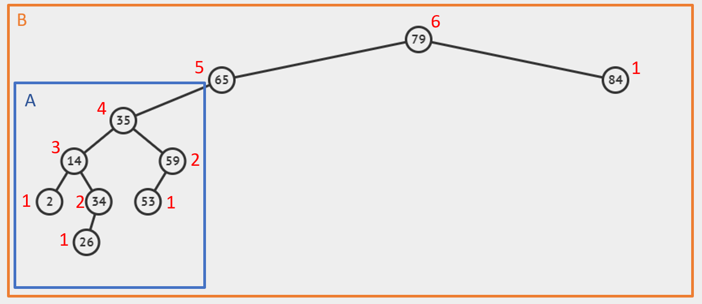

---

**Due at the end of your registered lab section**

---

## BST Traversal and Searching

### 1 - Binary Search Trees

A *Binary Search Tree* is a specific type of binary tree. In a BST, left children (the left subtree) hold values that are *less than* the parent's value, and right children (the right subtree) hold values *greater than* the parent's value. 

### 2 - Traversals

A traversal is a methodology for stepping through a structure (such as using Breadth-First Traversal as opposed to Depth-First Traversal on a graph). BFS is sometimes called "Level-Order Traversal". In the case of DFS, there are a few different ways we can traverse.

The three main DFS traversals are **Pre-Order Traversal, In-Order Traversal, and Post-Order Traversal**. In each of these traversals, we must eventually operate on every node. The difference between these traversals is lies in the *order* nodes are operated on.

**Pre-Order Traversal**

```
// Operate on current node
// Recurse left
// Recurse right
// return
```

**In-Order Traversal**

```
// Recurse left
// Operate on current node
// Recurse right
// return
```

**Post-Order Traversal**

```
// Recurse left
// Recurse right
// Operate on current node
// return
```

Or, in C++, it would look like this:

```c++
void pre_order(Node* node) {
    if (node == nullptr) return;
    print(node);
    pre_order(node->left);
    pre_order(node->right);
}

void in_order(Node* node) {
    if (node == nullptr) return;
    in_order(node->left);
    print(node);
    in_order(node->right);
}

void post_order(Node* node) {
    if (node == nullptr) return;
    post_order(node->left);
    post_order(node->right);
    print(node);
}
```

Here is a simple way to remeber this:
 - "Pre" : visit the parent "pre-" (before) visiting left and right sub-trees.
 - "In"  : visit the parent "in"-between visiting left and right sub-trees.
 - "Post": visit the parent "post-" (after) visiting left and right sub-trees.


### 3 - Searching

The **Binary Search Tree Property** (BST) states that all nodes in the left subtree must have key values less than or equal to the root and all of the nodes in the right subtree must have key values greater than the root. Usually, if key values are distinct, we do not worry about equality. BSTs exist to enable (potentially) fast searches. 

+ For a BST, what is special about operating on elements using an in-order traversal? If we were printing integers using this traversal, what would the output look like? 

+ Why do we say potentially? Can someone think of an example in which the search is really slow, even if we have a valid BST?

Our search function will simply return true or false depending on whether or not our search parameter exists in the tree. Another reasonable return value of a search function could be an iterator pointing to the found element (see std::map find).

To search for key `X` in a BST, we compare *X* to the current node.

  - If the current node is null, `X` must not reside in the tree.
  - If `X`is equal to the current node, simply return the current node.
  - If it is less than the current node, we check the left subtree.
  - Else, it must be greater than the current node, so we check the right subtree.

Or, in code:

```c++
// Finds the node with value == val inside the bst. Returns nullptr if not found
Node* find(Node* root, int val) {
    if (root == nullptr) return nullptr;
    if (root->val == val) return root;
    if (root->val > val) return find(root->left, val);
    return find(root->right, val);
}
```

#### 3.1 - Example

Take a look at this example:


Operation: `find(6)` // We begin at the root 

Let's walk through this:

+ Current node = 8, 6 < 8, therefore go left.
+ Current node = 3, 6 > 3, therefore go right.
+ Current node = 6, 6 = 6, we've found the node.

Now, here's an example where we try to find a node that does not exist in the tree:

Operation: `find(0)` // We begin at the root

Let's walk through this one too:

+ Current node = 8, 0 < 8, therefore go left.
+ Current node = 3, 0 < 3, therefore go left.
+ Current node = 1, 0 < 1, therefore go left.
+ Current node = null. 0 is not in the tree.

The worst-case runtime for searching in a BST is proportional to the height of the tree. Therefore, you could have a tree that looks like: 


And your binary search tree would have a poor performance (your search runtime would be equivalent to that of a linked list).

For that purpose, we want our binary search trees to be "balanced", defined below.

### What's a balanced Binary Tree?

A balanced  binary trees is a tree that ensures that the height of each subtree differs by no more than 1 node. When binary trees maintain balance, the binary tree keeps its height logarithmic in n where n is the total number of nodes in the tree for a sequence of insertions and deletions. This structure provide efficient implementations for abstract data structures.  *Any binary tree can be balanced or not. You can check this property (as demonstrated in this lab's exercises.)*

A tree is considered balanced if it conforms to the **Height-Balancing Property**: A node in a tree is height-balanced if the heights of its subtrees differ by no more than 1. 

As we will see in a few weeks, most operations on a BST take time directly proportional to the height of the tree, so we want to keep the height balanced .

Here is an example of balanced vs. non balanced trees. (A is balanced, while B is not. The numbers next to the nodes are their height)

<div style="text-align:center"> </div>

### 3 - Exercise

You could find the source files for this exercise in the resources repo. The function you are going to implement is inside `bst.cpp`.

Write a function to determine whether a binary tree is height-balanced or not.

+ A binary tree in which the depth of the two subtrees of every node never differs by more than 1.

**IMPORTANT NOTE:** Since this exercise is part of the homework, please refrain from working in groups. You
are encouraged to work through this during lab (and we are here to help), but you are not required to complete
it in order to get checked off.

```c++
bool isBalanced(Node *root)
```

### Checking off

To get checked off, show your results for the exercise to a CP or TA. This should include:

- ~~The result of running `make BSTTest`.~~