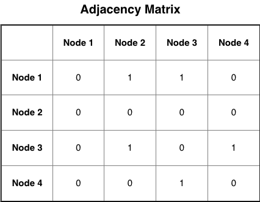
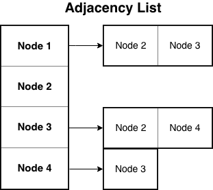
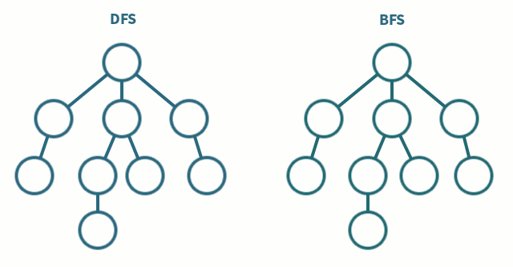

## Introduction

Graphs are very important when it comes to your success as a Software Engineer. Many problems within combinatorics, discrete math and general engineering can be solved or represented using graphs. The key take away is that graphs represent relationships.

Consider Facebook: your network of friends can easily be represented by a graph. Each person is a node and a "friend" is represented as an edge. The same logic can be applied to Linkedin. The cool thing about Linkedin is that it shows you what your "distance" is from another person. Pretty cool huh?

In this lab we will be looking at implementations of graphs and then implementing the basic search algorithms.

### 1 - How do you represent a graph?

The relationships between nodes in a graph can be represented with an Adjacency Matrix or an Adjacency List. Both represent directed edges, a connection between two nodes is a one way relationship. 

For the sake of explanation, we will use this example of a graph:


When determining how to choose which graph implementation to use, one must consider a few things:

1. Memory or space needed
2. Time needed to find an edge (i, j)
3. Time needed to find all neighbors of given node

These topics will be discussed in the following sections.

#### 1.1 - Adjacency Matrix

An adjacency matrix is a square matrix used to represent a finite graph. The idea is also simple - imagine an n by n grid, where each row and each column represents a vertex. At the ith row and jth column, we store the edge weight of an edge from the vertex i to vertex j. If such edge doesn't exist, we store zero.

Below is a visualization:



In code, an adjacency matrix would be a two dimentional array, as shown below:

```
vector<vector<int> > adjacency_matrix =
{
    {0, 1, 1, 0},
    {0, 0, 0, 0},
    {0, 0, 0, 1},
    {0, 0, 1, 0}
};
```

Pros:

1. Finding an edge is fast. It requires O(1) time. Ex. adjacency_matrix[i][j]

Cons:

1. Space needed is O(n^2). Every possible node -> node relationship is represented.
2. Time needed to find all neighbors in O(n). Traverse an entire row to find adjacent nodes.

#### 1.2 - Adjacency List

The next implementation, adjacency list, is also very common. Most of the time, when you have an adjacency list, you will have a Node or Vertex struct that stores some information about a vertex as well as a list of vertices to which the current vertex has an outgoing edge.

Below is a visualization:



In code, an adjacency list would be a vector or array of Nodes, as shown below:

```
struct Node
{
    std::vector<Node*> neighbors;
};
```

Pros:

1. Space needed to store O(e), where e is the number of edges within the graph. Only what is needed is stored.
2. Time needed to find all adjacent nodes or neighbors is O(a), where a is the number of adjacent nodes.

Cons:

1. Time needed to find an edge is O(i), where i is the number of adjacent nodes of node i. You must traverse i's entire adjacency list in order to determine if edge (i, j) exists. 

### 2 - Search Algorithms

There are two basic types of graph search algorithms: depth-first and breadth-first.



#### 2.1 - Depth First Search (DFS)

The algorithm starts at the root node and explores as far as possible along each branch before backtracking.

```
DFS(start node ) {
    push node u
    while the stack is not empty {
        pop the next node v
        for all outgoing edges (v,w) from v {
            if we haven’t yet visited w {
                push node w
            }
        }
    }
}
```

#### 2.2 - Breadth First Search (BFS)

It starts at the tree root and explores all of the neighbor nodes at the present depth prior to moving on to the nodes at the next depth level.

```
BFS(start node) {
    enqueue node u
    while the queue is not empty {
        dequeue the next node v
        for all outgoing edges (v,w) from v {
            if we haven’t yet visited w {
                enqueue node w
            }
        }
    }
}
```

*NOTICE THE DIFFERENCE BETWEEN THE TWO ALGORITHMS!* **WHAT CHANGED?**

### Assignment/Check Off

You will be implementing DFS and BFS to determine if there is a connection between two nodes in a graph. This means that you will preform BFS or DFS on the start node until you find the end node or traverse all connected nodes. Because the two search algorithms are so similar, you will be implementing DFS on an Adjacency List and BFS on an Adjacency Matrix.

Make all of your changed in `graph.cpp`. Do not mess with the function declarations. You can follow the general DFS and BFS algorithms above but you will need to make some small changes to match the use case.

#### DFS on Adjacency List

```
bool DFS(Node* start, Node* end) {

}
```

Tips:

* Uses a Stack
* Nodes are represented as Node pointers
* Each Node has a vector of adjacent Node pointers
* Each Node has a `visited` flag to determine if it has been visited or not.
* Do you need to check if an edge exists?

#### BFS on Adjacency Matrix

```
bool BFS(vector<vector<int> > adjacency_matrix, int start, int end) {

}
```

Tips:

* Uses a Queue
* Nodes are represented as ints (0 -> adjacency_matrix.size() - 1)
* The adjacency matrix is passed in as a double vector.
* The matrix is square, so rows == cols. 
* How will you determine if a Node has been visited or not? What kind of data structure can you use?
* How will you check if an edge exists?

**Running `make` will run both tests.**

- [ ] Implement DFS and BFS. Run `make GraphTest` and show a CP/TA to get checked off!

### Optional
A lot of students recommended practice interview questions, so for this lab, we've included an optional problem based on [this LeetCode question](https://leetcode.com/problems/friend-circles/). There are many ways to solve this... but can you think of a way that uses DFS?

- [ ] **Optional**: implement `findCircleNum` in `friend_circles.cpp`. You can run `make FriendCirclesTest` to compile and run a few basic tests on your code.
