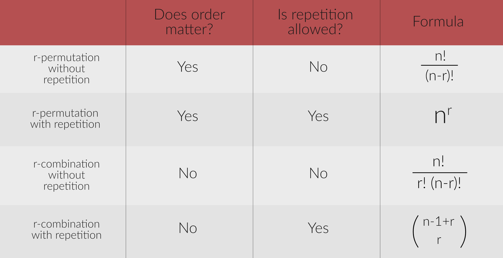

## Counting

This lab will be covered during lab sections between March 16 - March 19, 2021. **You need to get checked off during a lab sesson on or before March 19th.**

This week's lecture will go over the fine art of counting! We'll review the concepts covered in lecture, go over a few practice examples, and then give you some exercises to do on your own. As it turns out, counting is not always as easy as 1-2-3!

*For this lab, you will need to write down the answers to the practice problems and share your solutions with a CP/TA to get checked off. You are expected to do all the exercises, and your CP/TA will randomly select two questions to check your understanding (this means you have to show your work!)* Don't worry, we'll go through examples together!

### Basic Counting

Recall the Product, Sum, Subtraction, and Division Rules, and use them to solve the following questions.

#### Product Rule
The **Product Rule** states that if a procedure can be broken up into a sequence of **k** tasks, and there are **n1** ways to do the first task, **n2** ways to do the second task, ..., and **nk** ways to execute the kth task, then there are **n1 * n2 * ... * nk** ways to do the procedure. 

Another way of thinking about the product rule is to consider two finite sets, &#124;A&#124; and &#124;B&#124;. The cartesian product &#124;A × B&#124; = &#124;A&#124; × &#124;B&#124;.

#### Example
There's an old English nursery rhyme that goes like this:

> As I was going to St Ives,
> 
> Upon the road I met seven wives;
> 
> Every wife had seven sacks,
> 
> Every sack had seven cats,
> 
> Every cat had seven kits:
> 
> Kits, cats, sacks, and wives,
> 
> How many were going to St Ives?

Spoiler: there was only only one person going to St. Ives--you, the speaker/reader/narrator! But how many kits, cats, sacks, and wives are there coming *from* St. Ives?

**Solution**: 

+ There are 7 wives 
+ There are 7 * 7 = 49 sacks
+ There are 49 * 7 = 343 cats
+ There are 343 * 7 = 2401 kits 🐈

#### Sum Rule
The **Sum Rule** states that if a task can be done in one of **n1** ways or in one of **n2** ways, where none of the set of **n1** ways is the same as any of the set of **n2** ways, then there are **n1 + n2** ways to do the task.

Another way of thinking about the sum rule is to consider two finite and disjoint sets (meaning &#124;A ∩ B&#124; = 0), &#124;A&#124; and &#124;B&#124;. &#124;A ∪ B&#124; = &#124;A&#124; + &#124;B&#124;.

#### Example
Remember your trip to St. Ives? Well, on your trip, you decide to adopt not one, but two felines! One of the wives tells you to draw 2 cats out of her sack. Recall that there are 49 felines in the sack (7 cats, and for each cat, 7 kittens). Of the 49 felines, 17 are black, 21 are tabbies, and 11 are calicos. In how many ways can you draw exactly 1 black cat or exactly 1 calico cat? (Using B to denote black, T to denote tabby, and C to denote calico, any one of the following arrangements has exactly 1 black or 1 calico cat: BT, BC, CT.)

**Solution**: 

+ The number of ways we can get 1 black and 1 tabby cat is: 17 * 21 = 367
+ The number of ways we can get 1 black and 1 calico cat is: 17 * 11 = 187
+ The number of ways we can get 1 calico and 1 tabby cat is: 11 * 21 = 231

The number of ways we can get exactly 1 black or 1 calico cat is: 367 + 187 + 231 = **785**

#### Subtraction Rule
The **Subtraction Rule** states that if a task can be done in either one of **n1** ways or one of **n2** ways, and there is an overlap between these two methods of **n3** common ways, then the number of ways to do the task is **n1 + n2 – n3**.

Another way of thinking about the subtraction rule is to consider two finite sets, &#124;A&#124; and &#124;B&#124;. &#124;A ∪ B&#124; = &#124;A&#124; + &#124;B&#124; - &#124;A ∩ B&#124;. 

#### Example
You've arrived at St. Ives and now visit the local cat cafe. Here, you decide to inspect each cat's paws. Every cat has black or pink paws. 41 cats have black paws, 50 cats have pink paws, and 21 cats have black AND pink paws. How many cats are in the cat cafe?

**Solution**: 41 + 50 - 21 = **70 cats** 🐱

#### Division Rule
**Division Rule**: there are n/d ways to do a task which can be done in one of n different ways, but for each specific way, it is identical to d-1 other ways.

#### Example
How many distinct ways can we arrange the letters in "KITTEN"?

**Solution**: there are 6 characters in "KITTEN", and 6! ways to arrange 6 characters (we have 6 choices for the first character, 5 for the second, 4 for the third, etc.) 

However, "KITTEN" has 2 T's, T1 and T2. This means every arrangment has an identical other arrangement in which T1 and T2 are swapped: KIT1T2EN and KIT2T1EN are the same word! 

Given that there are  2 * 1 = 2! ways to arrange the 2 T's, and that we want DISTINCT arrangements, the answer is **6!/2!**

### Permutations & Combinations
Recall from lecture that an **r-permutation** is an **ordered** arrangement of r elements from a set of n, denoted as:

An **r-combination** is an **unordered** arrangement of r elements from a set of size n, and is commonly spoken as “n choose r”:

#### Example: Permutations
The Pied Piper Duck Fashion Show takes place in Sydney, Asutralia every year. Since we can't fly to Australia, let's suppose we are hosting our own CS104 exclusive duck fashion show. There are 30 ducks, and 3 prizes: gold, silver, and bronze. How many ways can we award gold, silver, and bronze among our 30 fashionable ducks?

**Solution:** first, we want to ask ourselves: does order matter here? The answer is yes--suppose we had ducks Donald, Daisy, and Scrooge. Donald winning gold, Daisy winning silver, and Scrooge winning bronze is NOT the same as Scrooge winning gold, Donald winning silver, and Daisy winning bronze. 

Suppose we chose our gold winner first, followed by our silver winner, followed by our bronze winner. 
+ We have 30 ducks to choose from for gold.
+ After selecting our golden duck, we have 29 ducks to choose from for silver.
+ After selecting our silver duck, we have 28 ducks to choose from for bronze.

There are thus **30 * 29 * 28** ways of selecting our winning ducks out of our 30 contestants. This is equivalent to 30!/[(30-3)!]

#### Example: Combinations
There are 10 people in a chess match. How many games do they need to play to guarantee that each person plays with everyone exactly once?

**Solution**: first, we want to ask ourselves: does order matter here? The answer is no: A playing against B is no different from B playing against A. Given 10 players, there are "10 choose 2" ways of selecting 2 players, so our answer is 10 choose 2 = **45 games**

### With or Without Repetition?
The above two examples are examples of permutations and combinations *without* repetition. Once a duck is selected for gold, we do not reconsider that duck for silver. Player A cannot play against him/herself in a chess match. 

However, sometimes we do allow for repetition. Recall from lecture that the number of r-permutations of a set of n objects, where repetition is allowed, is **nr**. 

The number of r-combinations of a set of n objects, where repetition is allowed, is:

#### Example: Permutations with Repetition
How many different 4-digit PINs are possible?

**Solution**: here, order does matter (1234 is a different PIN from 4321), and repetition is allowed (1111 is a valid PIN.) There are therefore **104** possible PINs.

#### Example: Combinations with Repetition
You walk into a cereal bar and build an epic cereal bowl. You are allowed to choose 3 servings of cereal, and there are 6 cereals to choose from: Apple Jacks, Cinnamon Toast Crunch, Fruit Loops, Honey Nut Cheerios, Lucky Charms, and Rice Krispies. How many different combinations of epic cereal bowls can you make?

**Solution**: here, order does not matter and repetitions are allowed (you might go all in and make a bowl with 3 servings of Lucky Charms, for example.) The number of possible cereal bowls is: **8!/3!5!**

### Indistinguishable Objects Over Distinguishable Boxes
As it turns out, the number of combinations of **n** objects selected **r** at a time with repetition is equivalent to the number of ways to distribute **r** indistinguishable objects into **n** distinguishable boxes.

#### Example
How many ways can we distribute 12 cans of dog food among 3 dogs?

**Solution**: here, n = 3 and r = 12. The answer is: **14!/12!2!**

### Summary of Important Formulas

### Exercises
1. You are making another trek to St. Ives, but this time, you want to bring 5 friends, including at least 2 Computer Science majors. Let's say you have 21 friends to choose from, and exactly 7 of them are CS majors. How many different groups of 5 can you select? 
2. How many 32-bit strings have exactly 23 ones and 9 zeros?
3. The average pig litter consists of 7 piglets. In how many ways can a mother pig of 7 piglets have exactly 2 girls? (Denoting B for boy and G for girl, GGBBBB is one "way" and BBBBGG is another "way".)
4. How many anagrams can we make from the word "BOOKKEEPERS"? (Fun trivia fact: bookkeeper(s) is the only word in the English language with three consecutive repeated letters!) How does this change if we require S to always follow R?
5. (Updated on Wednesday, March 17): we have 5 breakout rooms and 30 *distinct* students in lab. How many ways can we distribute 30 *distinct* students into the 5 breakout rooms? (Breakout rooms can be empty.)
+ How many ways can we distribute 30 *identical* students into the 5 breakout rooms? (If 30 identical students bothers you, an equivalent question would be: how many ways can we distribute 30 *distinct* chairs into 5 classrooms?)

- [ ] Share your answers with a CP/TA to get checked off. **You need to get checked off during a lab sesson on or before March 19th.**