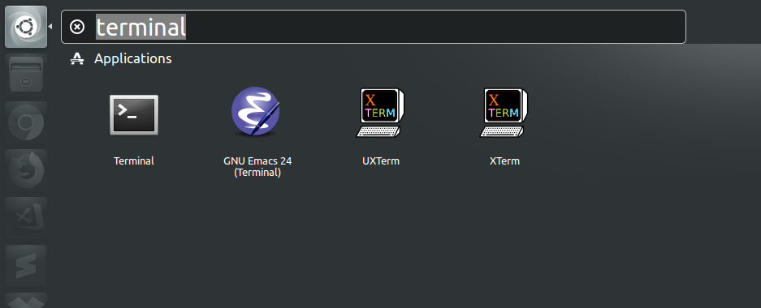
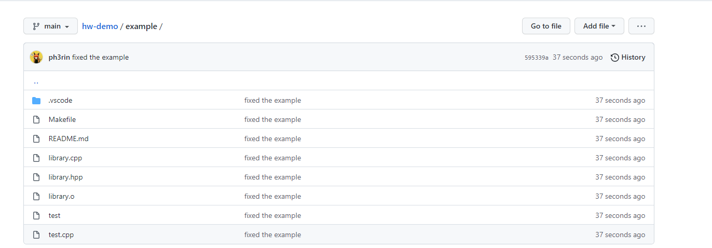
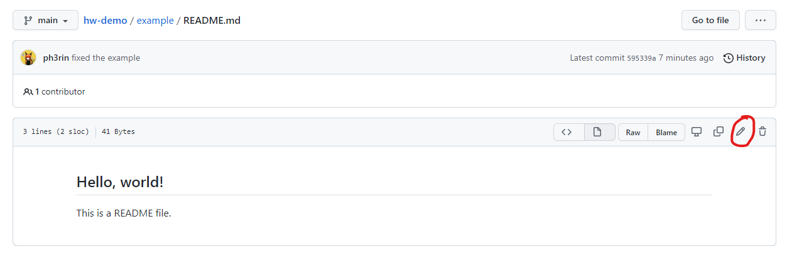
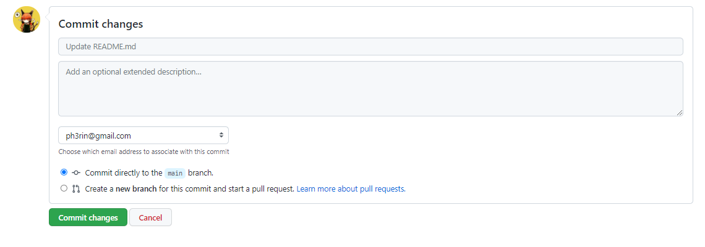

# Introduction to Git

[Git](http://git-scm.com/) is a distributed source code version control system. 
When you place your code under version control, you record the changes you make to your files over time and you can recall the history of each of your file changes at will.
We will be using git extensively this semester in homework assignments.

[GitHub](https://github.com/) is a development ecosystem based around git.
In this course, we will be using GitHub to host our git repositories and we will take advantage of other GitHub features such as the issue tracker and wiki.

**If you have not done [Lab 0]({{ site.baseurl }}/labs/lab0) to set up your GitHub account or install Docker or a VM, please do so now.**

## Important: Using the correct terminal

In order to complete this lab, make sure you are using the correct terminal to run commands:

* If you are running Docker, then there are two types of terminals you are going to interact with:
  - The **native terminal** refers to the terminal provided by your native OS, not docker. On Windows, type
    `Win + R` and then `powershell` to start it. On Mac, open you app launcher and search for "terminal".
  - The **docker terminal** refers to the terminal you obtain by typing the following in your **native terminal**:

```shell
ch start csci104
ch shell csci104
```

From now on, every sequence of command we show you would be annotated with either *`[native]`* or *`[docker]`*. This denotes the
terminal you should be running the command from if you are using Docker. (If you are using the VM, then always use the VM terminal).

Examples (You do **NOT** need to run these commands):

*`[native]`*
```shell
notepad.exe cat.txt
```

The above command shall be ran from your **native terminal**.

*`[docker]`*
```shell
vim cat.txt
```

The above command shall be ran from your **Docker terminal**.

* If you are running the course VM (through Virtual Box), then **all commands** from this lab shall be ran from
  the terminal within the VM. To open a terminal in the VM, press `Ctrl + Alt + T` (Windows) or `Cmd + Option + T` (Mac).
  Alternatively, you could open it by searching for "terminal" in the quick launcher:

<div style="text-align:center;">  </div>

## Cloning the `resource` and `hw-username` repositories

### The Concept of the *working directory*

Every open terminal has a *working directory*. When you run a command inside that terminal,
the command would interpret paths and filenames to be relative to that working directory, for example:

```
mkdir sub
```

creates the subdirectory named `sub` under the current *working directory*. If the *working directory* is `/usr/root/parent`, then this will
create the directory `/usr/root/parent/sub`.

### Step 1. Changing working directory to Docker's assigned `/work` directory

First open your **native terminal**. Then, change the working directory to the
directory you [assigned to Docker during setup](https://github.com/csci104/docker#step-5-set-your-working-directory).

If you are working on the course VM, you may use any directory you like on the VM (e.g. `~/csci104`).

The command for changing the working directory is `cd` (which stands for "**c**hange **d**irectory"). In my case, the path to change to is:
`C:\Users\rin\Documents\csci104\home` (yours might be different, depending on how you configured your docker), therefore I just type:

*`[native]`*
```shell
cd C:\Users\rin\Documents\csci104\home
```

**Note: You will need double quotes around the path if your path contains space, e.g. `cd "C:\My Documents\Home"`**

If you have forgotten which path you have assigned to Docker, you could check it by typing:

*`[native]`*
```shell
ch list
```

And you will see an output that looks like:

```
Name:   csci104
        Image:  usccsci104/docker:20.04
        Volume: C:\Users\rin\Documents\csci104\home:/work
        SecOpt: seccomp:unconfined
        CapAdd: SYS_PTRACE
        Port:   :2222
```

The path after `Volume: ` (excluding `:/work`) is what you are looking for.

### Step 2. Obtaining clones of the `hw-username` and `resources` repositories

This step assumes that you have already finished the git, GitHub, and SSH key setup from Lab 0.

Once you are inside the correct working directory, type the following commands (**replace the `username` in `hw-username` with your actual USC Net Id, the same goes for everything that follows. Your USC NetId is your USC email address without the "@usc.edu" part, not the 10-digit Student ID**):


*`[native]`*
```shell
git clone git@github.com:{{site.data.urls.github_org}}/hw-username.git
git clone git@github.com:{{site.data.urls.github_org}}/resources.git
```

If you see the following dialog in your command line, type `yes` and press `enter`.
It's basically asking if you want to trust `github.com` as an SSH server.

```
The authenticity of host 'github.com (192.30.255.112)' can't be established.
RSA key fingerprint is SHA256:nThbg6kXUpJWGl7E1IGOCspRomTxdCARLviKw6E5SY8.
Are you sure you want to continue connecting (yes/no)?
```

After every clone command, you should see something like this (exact output might be different):

```
remote: Counting objects: 4, done.
remote: Compressing objects: 100% (3/3), done.
remote: Total 4 (delta 0), reused 0 (delta 0), pack-reused 0
Receiving objects: 100% (4/4), done.
Checking connectivity... done.
```

A few notes about cloning:
 - **Never clone a Git repository** into a Dropbox or other sync'ed folder (Google Drive, etc.).
 - **Never clone a Git repository** under another repository folder. They should be at the same level.
 
## Running the Example Project

We have provided an `example` project to test whether you have the correct environment setup to compile our homeworks. Make sure you follow the steps below and the output on your terminal matches the ones on this page.

### Step 3. Copy the `example` dirctory to your `hw-username` directory

For every assignment from this class, we would provide the it's skeleton code inside the `resources` repository, and you need to copy it into your
`hw-username` directory when you start the assignment. You should then do all of your work in your `hw-username` repo instead of the 
`resources` repo.

The `example` project is also provided in the `resources` repo. To copy it, first start the **docker terminal** if you are using Docker:

*`[native]`*
```
ch start csci104
ch shell csci104
```

Then, make sure your working directory is where you put the `hw-username` and `resources` clones. You could check this by typing:

*`[docker]`*
```
ls
```

and you should see `hw-username` and `resources` in the output.

If not, you have to use `cd` to change to the correct working directory.

To copy the directory, type:

*`[docker]`*
```
cp -r resources/example hw-username/example
```

where `cp` stands for "copy" and the `-r` standard for "recursive" which allows copying of directories.

### Step 4. Building the example project

Now, go into your `hw-username/example` directory by typing:

*`[docker]`*
```
cd hw-username/example
```

Then, run the following command:

*`[docker]`*
```
make run
```

If the build is successful, you should see something like this:

```
Running main() from /build/googletest-j5yxiC/googletest-1.10.0/googletest/src/gtest_main.cc
[==========] Running 3 tests from 2 test suites.
[----------] Global test environment set-up.
[----------] 2 tests from SimpleReturnTest
[ RUN      ] SimpleReturnTest.Returns42
[       OK ] SimpleReturnTest.Returns42 (0 ms)
[ RUN      ] SimpleReturnTest.Returns37
test.cpp:12: Failure
Expected equality of these values:
  returns_37()
    Which is: 36
  37
[  FAILED  ] SimpleReturnTest.Returns37 (0 ms)
[----------] 2 tests from SimpleReturnTest (0 ms total)

[----------] 1 test from SummationTest
[ RUN      ] SummationTest.SumsAreEqual
[       OK ] SummationTest.SumsAreEqual (0 ms)
[----------] 1 test from SummationTest (0 ms total)

[----------] Global test environment tear-down
[==========] 3 tests from 2 test suites ran. (0 ms total)
[  PASSED  ] 2 tests.
[  FAILED  ] 1 test, listed below:
[  FAILED  ] SimpleReturnTest.Returns37

 1 FAILED TEST
make: *** [Makefile:8: run] Error 1
```

You **don't** have to worry about the red `[FAILED]` message as long as it shows up (it is intentional), 
but in case it does not show up, please ask for help from your lab instructor.

### Step 5. Fixing the FAILED test case

What you have just seen above is an example of an automated test. We run automated tests to grade your
assignments, and you will learn more about them in later labs. For now, you could just think of them
as programs that feeds some input into your assignment code and test whether they produce the correct
output.

Obviously, it is not good to have a FAILED test case! (You would lose points in an actual assignment if your
program fail our test cases) So let's fix it!

Open `library.cpp` and look at the function `int returns_37()`. As you can see it returns `36` instead of
the suggested `37`. If you look at the FAILED test case carefully you would see:

```
Expected equality of these values:
  returns_37()
    Which is: 36
  37
```

which points to exactly the same issue.

Therefore, change the return value to `37` and run `make run` again. This time every test should pass.

### Step 6. Committing and pushing to your homework repository

Now that you have finished the work locally, you would also want to push the changes to GitHub.

To do so, open your **native** terminal (or the VM terminal is you are using the course VM) and change
the working directory to `hw-username`. Then type

*`[native]`*
```
git status
```

The output should look like this:

```
Your branch is up to date with 'origin/main'.

Untracked files:
  (use "git add <file>..." to include in what will be committed)
        example/
```

which means that nothing from your `example` directory is tracked by git.

To track those files run the following command:

*`[native]`*
```
git add .
```

This command tells git to track all modification you have done to the repo (adding a new file, modifying a file, deleting a file, renaming a file, etc.). You could also specify individual files to track by providing their name instead of `.` (e.g. `git add library.cpp`).

Now, if you check `git status`, you would see:

```
On branch main
Your branch is up to date with 'origin/main'.

Changes to be committed:
  (use "git restore --staged <file>..." to unstage)
        new file:   example/.vscode/launch.json
        new file:   example/.vscode/settings.json
        new file:   example/.vscode/tasks.json
        new file:   example/Makefile
        new file:   example/README.md
        new file:   example/library.cpp
        new file:   example/library.hpp
        new file:   example/library.o
        new file:   example/test
        new file:   example/test.cpp
```

All the changes are now ready to be *committed*. You could now run the following command:

*`[native]`*
```
git commit -m "fixed the example"
```

This tells git to create a snapshot of the repository that reflects the changes you just asked it to track.
The snapshot is called a **commit**. Each commit must have a message, as specified by the `-m` option. It can be anything,
but it's a good practice to keep it informative of what changes you have made.


Now, if you type `git status`, you would see:

```
On branch main
Your branch is ahead of 'origin/main' by 1 commit.
  (use "git push" to publish your local commits)

nothing to commit, working directory clean
```

This tells that your local repo has one commit that the remote does not have. To
upload the commit, simply type:

*`[native]`*
```
git push
```

Now, if you everything runs successfully, the changes you have made would be synced to GitHub. Go to
the repo page on GitHub (it should be at https://github.com/usc-csci104-spring2022/hw-username, with `username`
replaced with your actual Net ID), and navigate to `example`, you should see the following files:

<div style="text-align:center;"></div>

If you read the `library.cpp` file, you should be able to see the code you have just modified.

However, if you look at the `example` directory (in the image above), you would see the file `test`. Those are the binary files created by the `make run` command while building
the project. As a good practice you should never push anything generated by a build process. We would deduct
points if you submitted your assignment with those files (unless otherwise specified).

**NOTE: You may not be able to see the `library.o` file on GitHub, that is to be expected
with the homework repository.**

### Step 7. Removing the extra files from your repo

To tell git to remove those files from the repo, first go back to your native terminal and change directory
to `hw-username/example`. Then type the following:

```
git rm test
```

This will remove the two files from the directory and ask git to track the removal.

### Step 8. Prevent accidentally adding files with .gitignore

The `git rm` command only solves the problem temporarily. What if in the future you run `make run` again and
generated the files again? It would be an annoyance to run `git rm` every time you push.

Fortunately, git offers a way to prevent files from being tracked by the `git add` command. To achieve this,
create a file called `.gitignore` (with no extensions) in your `hw-username/example` directory, and open it in a text editor.

**NOTE: a file or directory starting with `.` is hidden by default on most systems. To make your system show
those files, follow these instructions:**

* [Windows](https://support.microsoft.com/en-us/windows/view-hidden-files-and-folders-in-windows-97fbc472-c603-9d90-91d0-1166d1d9f4b5#WindowsVersion=Windows_10), 
* [Mac](https://www.pcmag.com/how-to/how-to-access-your-macs-hidden-files)

Once you are inside the text editor, add the following lines:

```
test
```

This line tells git to ignore any file
named `test`.

Note that since the `.gitignore` file is placed under
the `example` directory, the rules would only be enforced
there. In general you would want separate `.gitignore` files
for each of your assignment.

The `library.o` file is being ignored because it is included in the `.gitignore` file at the root
of the homework repository.

Now, if you type 

*`[native]`*
```
git add .
git status
```

you would see something like:

```
Your branch is up to date with 'origin/main'.

Changes to be committed:
  (use "git restore --staged <file>..." to unstage)
        new file:   .gitignore
        deleted:    test
```

You could then commit and push the changes to GitHub:

*`[native]`*
```
git commit -m "removed extra file and added .gitignore"
git push
```

If you now go to the GitHub repo page, you would see that `test`
and `library.o` are no longer there.


## Pulling changes from GitHub

Sometimes you would like to download changes from the remote repo because
someone else (or even you from another machine) modified the remote repo.
This is the case when we release the skeleton code in the `resources` repo
for a new assignment and you would like to download it.

This won't happen until assignment 1 of course, so let's do this to your `hw-username`
repo instead.

### Step 9. Modifying a file on GitHub

First navigate to the `example/README.md` file in your `hw-username` GitHub repo page, and
click the pencil icon (see the image below):

<div style="text-align:center;"></div>

Then make an edit to the markdown file (any edit will do), and click `Commit Changes`:

<div style="text-align:center;"></div>

**Note in general we do not recommend modifying files directly on GitHub, it is used
here just for demonstration purposes**

### Step 10. Pulling the change

Now change your directory into `hw-username` in your local terminal, and then type:

*`[native]`*
```
git pull
```

The output should look like this:

```
remote: Enumerating objects: 7, done.
remote: Counting objects: 100% (7/7), done.
remote: Compressing objects: 100% (3/3), done.
remote: Total 4 (delta 1), reused 0 (delta 0), pack-reused 0
Unpacking objects: 100% (4/4), 742 bytes | 32.00 KiB/s, done.
From github.com:ph3rin/hw-demo
   dcdcc61..eb57bef  main       -> origin/main
Updating dcdcc61..eb57bef
Fast-forward
 example/README.md | 2 +-
 1 file changed, 1 insertion(+), 1 deletion(-)
```

Now if you read the `hw-username/example/README.md` file on your local machine, it should
match the one on GitHub.

## In Closing

There are tons of git cheatsheets all over the web.
Here's [one by Tower](https://www.git-tower.com/blog/git-cheat-sheet/) and [another by Atlassian](https://www.atlassian.com/git/tutorials/atlassian-git-cheatsheet).
You can use one of these your make your own; git has a bit of a learning curve and at the end of the day comes down to memorizing the most useful commands and what they do.
Don't worry if it takes a little while.
